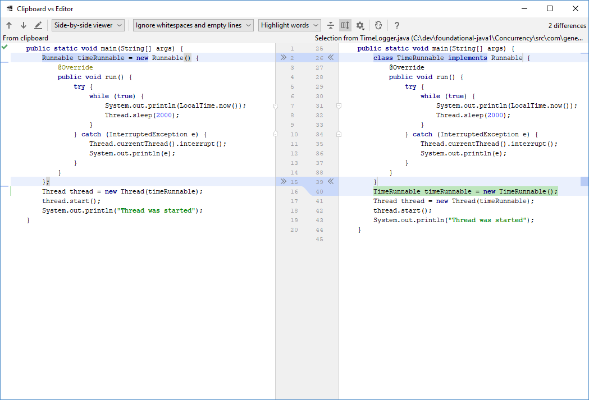
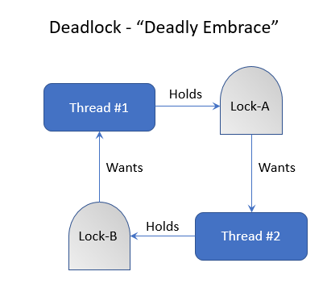

| Title | Type | Duration | Creator |
| --- | -- | -- | --- |
| Intro to Concurrency | Lesson | 2:50 | Victor Grazi, NYC |

#  Intro to Concurrency

### Learning Objectives

At the end of this lesson, you'll be able to:
- Explain the fundamentals of concurrency in Java.
- Create and launch a thread using `Thread` or by implementing the `Runnable` interface.
- Handle thread contention.

### Lesson Guide

| Timing  | Type  | Topic  |
|:---:|---|---|
| 5 min  | Opening  | Learning Objectives |
| 10 min | Introduction  | What's The Big Deal? |
| 20 min | Demo  | Overriding the `Thread` Class |
| 20 min | Demo  | The `Runnable` Interface  |
| 30 min | Independent Practice | Memory and Time |
| 20 min | Demo | Race Condition |
| 20 min | Demo | The `synchronized` Keyword |
| 20 min | Demo | Signalling Threads |
| 20 min | Discussion  | Concurrency Considerations |
| 5 min  | Conclusion  | Review/Recap |

## Opening (5 min)

Until now, we've covered basic programs and program flow. We've seen how to control the flow of a program using things like `if` statements and `for` loops. All of these programs have been **synchronous**: They run step by step, consecutively, from beginning to end.

Today's computers have powers far beyond what we've seen or used thus far. Even the simplest computers have multiple CPUs and dozens or hundreds of cores. Even within a single core, Java spins "threads" to perform parallel processes. That's what we mean by concurrency — many threads working at the same time.

> Fun history lesson: The designers of Java included concurrency in the core JDK, making it perhaps the first language to do so.

So, let's turn our programs up by introducing them to concurrency.

--- 

## What's The Big Deal? (10 min)

Before we dive in, let's think: Why would we ever need to have multiple threads performing concurrent work?

Amazon, for example, might have dozens (or millions) of customers using the site at the same time. Many of them are trying to perform a similar task: purchase a shiny new gadget. To complete the purchase, users certainly don't want to wait in line until all previous users are done; that's why they're shopping online! We expect the web application to handle these requests **concurrently**.

Similarly, think of an application that requires a lot of database queries, file reads and writes, and service calls over a network. Do we want each outgoing request to wait for the other to return before it starts? Wouldn't it be better to have all requests process concurrently?

### Threads

The backbone of Java concurrency are **threads**. A thread is a lightweight process that has its own call stack but can access shared data of other threads in the same process.

Threads are easy to create, but with great simplicity comes great responsibility. We'll discuss some of the common pitfalls in a little while — for now, let's jump straight into creating and starting our first thread.

There are two popular ways to create a thread, and you'll see both heavily used:
* **Override the `Thread` class**, implementing the `run()` method.
* **Implement the `Runnable` interface**, implementing its `run()` method and passing that `Runnable` to a `Thread`.

Let's use both of these approaches to start a thread that's tasked with the job of writing the current time to system output every two seconds.

----

## Overriding the Thread Class (20 min)

In this approach, we'll create a new class that **extends** `Thread` and **overrides** that thread's `run()` method. 

The `Thread` class has a `public void run()` method that's called implicitly when you start your thread. Once we override `Thread.run()`, we'll call our class' `start()` method, which will start the thread and implicitly call `run()`. 
 
 > **Reminder**: Be sure to get this clearly: You **implement** `run()` but you **call** `start()`. 

Let's walk through an example. Remember: We're starting a thread that will print the current time every two seconds.

### `TimeLogger`: Extending the `Thread` Class
 
```java
import java.time.LocalTime;

public class TimeLogger extends Thread {
    @Override
    public void run() {
        try {
            while (true) {
                System.out.println(LocalTime.now());
                Thread.sleep(2000);
            }
        } catch (InterruptedException e) {
            Thread.currentThread().interrupt();
            System.out.println(e);
        }
    }

    public static void main(String[] args) {
        TimeLogger timeLogger = new TimeLogger();
        timeLogger.start();
        System.out.println("Thread was started");
    }
}
```

There's a lot going on here, so let's walk through it.

#### Step 1

First, we imported the `LocalTime` class, which is a convenient class for capturing time information and has nothing to do with threading itself:

```java
import java.time.LocalTime;
```

#### Step 2

Next, we implemented our `TimeLogger` class, which extends `Thread`:

```java
public class TimeLogger extends Thread {
	}
```

#### Step 3

Now comes the meat: We overrode the `Thread` class' `run()` method:

```java
@Override
public void run() {
        try {
            while (true) {
                System.out.println(LocalTime.now());
                Thread.sleep(2000);
            }
        } catch (InterruptedException e) {
            Thread.currentThread().interrupt();
            System.out.println(e);
        }
}
```

The first thing the `run()` method does is to declare a `try-catch` block. We surround code that can throw an exception with the `try` portion and make some code to gracefully handle the exception in the `catch` portion.

`Thread.run` normally does its job and then exits, terminating the `Thread`. But, in our case, we don't want it to just print once and exit; we want it to keep printing the current time, so we use a `while` loop to continuously execute our output statement. 

Next, we create a new `LocalTime` object, which refers to the current time (`now()`) at the time of instantiation.

Because all of that is happening in a `while` loop, it will continue to loop forever without pause. But the requirement was to display the time every two seconds, so we must sleep for two seconds between loop iterations. To do that, we call the `Thread.sleep()` method, supplying the number of milliseconds to sleep — in this case, two seconds is 2,000 ms, so we call `Thread.sleep(2000)`. 

#### Step 4

Finally, we define the `main()` method, which launches our program. It starts our new thread by calling the `start()` method, which implicitly calls the `run()` method in a new thread:

```java
public static void main(String[] args) {
        TimeLogger timeLogger = new TimeLogger();
        timeLogger.start();
        System.out.println("Thread was started");
}
```    

> **Note**: We get the implementation of the `start()` method from the `Thread` class, which we're extending. That's why we don't have to write it ourselves.

#### What About That `try-catch` Block?

Notice that `Thread.sleep()` throws an `InterruptedException`. That exception is thrown when the thread's `interrupt()` method is called (usually by frameworks or application servers) to initiate a smooth shutdown of the threads. Because `InterruptedException` is a checked exception, by definition, you **must** catch it. One side effect of catching an `InterruptedException` is that the thread's `interrupt` flag is reset, meaning it's no longer interrupted and the container shutdown will be aborted.

To propagate the interrupt back to the calling thread (so the application server or container can continue its clean shutdown), we must set the `interrupt` flag once again, which is why we call `Thread.currentThread().interrupt()`. 

That being said, it's not critical to understand the inner workings here. Just remember to follow the recipe: 

> **Whenever you catch an `InterruptedException`, call `Thread.currentThread().interrupt()` before exiting the `catch` block.**

Also, notice that we enclosed the `while` loop **inside the `try-catch`block**. A common mistake even advanced programmers make is to do the opposite, enclosing the `try-catch` block inside the `while` loop. Why is that wrong?

Think about it: If the `try-catch` block was inside the `while` loop, imagine what would happen if someone calls the `interrupt()` method. The exception would trap the interrupt, set the `interrupt` flag, and then loop again. The program would never end, even after an interrupt. So, we fix that by including the `while` loop inside the `try-catch` block. If an interrupt occurs, the `while` loop exits and the `catch` block takes over — setting the `interrupt` flag and exiting — thereby returning control to the caller.

> **Hint**: This is a common concept in Java concurrency: Execute some activity in a loop, sleep, and catch the `InterruptedException` **outside** the loop.

#### Make It Run

Let's execute that program using the keyboard shortcut `ctrl+shift+F10` in IntelliJ. Notice that our `while(true)` statement will never exit, so the only way to exit this program is to **kill** it (using `ctrl+F2` or `command+F2` in IntelliJ) or pull the plug.

The output looks like this:

```text
Thread was started
11:57:16.913
11:57:18.963
11:57:20.964
11:57:22.964
```

> **Knowledge Check**: Do you see anything funny there?

Notice that, in our `main()` method, the first thing we did was to start our thread. Then, we printed out `"Thread was started"`. However, in the output, we can see that `"Thread was started"` was logged first, even though it was declared last.

**Why did that happen?**

Keep in mind that everything in Java runs in a thread. Even if you're creating a little "Hello, World" application, Java implicitly spins up a thread called the **main thread** and executes the program in that thread.

Once the main thread calls our `Thread` `start()` method, it launches a new thread that runs in its own time. Then, our main thread resumes, printing out the `"Thread was started"` message. Meanwhile, back at the ranch, our new thread was preparing itself before it got into action and began its business of printing the current time.

-----

## The Runnable Interface (20 min)

The second approach is to recognize that the `Thread` class has a constructor that accepts a `Runnable` instance. 

`Runnable` is an interface with one method: `public void run()`. Using this approach, you construct a new `Thread` instance by passing a `Runnable` instance to the constructor, then call your thread's `start()` method, which will call your `Runnable` in a new thread.

> **Tip**: A `Runnable` instance is an instance of a class that **implements** the `Runnable` interface.

**Here's how we could refactor our time program:**

```java
public static void main(String[] args) {
    class TimeRunnable implements Runnable {
        @Override
        public void run() {
            try {
                while (true) {
                    System.out.println(LocalTime.now());
                    Thread.sleep(2000);
                }
            } catch (InterruptedException e) {
                Thread.currentThread().interrupt();
                System.out.println(e);
            }
        }

    }

    TimeRunnable timeRunnable = new TimeRunnable();
    Thread thread = new Thread(timeRunnable);
    thread.start();
    System.out.println("Thread was started");
}
``` 

> **Knowledge Check: What's going on here? What differences between the two approaches do you see right off the bat?

1. We create a class that implements `Runnable`. 
1. We construct a new instance, supplying a `run()` method and passing that to the `Thread` constructor. 
1. Then, we start the thread.
1. When we run it, we'll get the same result as the first approach.

### Which One Wins?

This approach is roughly similar to the previous approach. **So why use one over the other?**

There are several advantages to the `Runnable` approach:
- It can have slightly less overhead.
- Even more importantly, there are other ways to launch `Runnable` instances using frameworks such as Java's built-in `Executors` framework, which we'll see soon.

### Using Anonymous Inner Classes

There's another common concept you should be aware of for creating threads using the `Runnable` interface: using **anonymous inner classes**. We won't be looking at this approach in much detail, but you'll see the syntax in your development work, so you should be aware of it.

The idea behind anonymous inner classes is that we shouldn't need to assign a name to a class that we're only ever going to use once in a limited context. For such cases, Java allows you to create anonymous inner classes, which are declared and used in line without having to name them.

> **Aside**: You may have seen anonymous functions in a language like JavaScript. The motivation for doing so here is exactly the same.

In our second thread example, we created a new class called `TimeRunnable` and instantiated it, then passed in that instance to the `Thread` class. 

Contrast this code, which uses an anonymous inner class, to the previous `TimeRunnable` version:

```java
public static void main(String[] args) {
    Runnable timeRunnable = new Runnable() {
        @Override
        public void run() {
            try {
                while (true) {
                    System.out.println(LocalTime.now());
                    Thread.sleep(2000);
                }
            } catch (InterruptedException e) {
                Thread.currentThread().interrupt();
                System.out.println(e);
            }
        }
    };

    Thread thread = new Thread(timeRunnable);
    thread.start();
    System.out.println("Thread was started");
}
```

> **Knowledge Check**: What jumps out at you here?

The syntax looks a bit tricky at first glance. Basically, the first line of the `main()` method is declaring a new `Runnable` instance, but we're calling an anonymous constructor (`new Runnable()`) formed by implementing the `Runnable.run()` method.

To highlight the difference, compare the two versions. You can copy and paste the first version into IntelliJ, then copy the second version into your clipboard, right click, and choose "Compare to Clipboard."




Study the two lines that are different and compare the syntax.

----

## Independent Practice: Memory and Time (30 min)

We want to capture some metrics in our logs to ensure our application is properly executing and there's enough memory.

**Your task:**

* Create an application that spins two extra threads. 
* The first thread logs the system time every six seconds. 
* The second thread logs the total memory and free memory every 1.5 seconds.

**Challenge**: Most seasoned developers are allergic to copy-and-paste code, so try not to use any that's duplicated. 

> **Hint**: To get the current time, call `LocalTime.now()`. To get the free memory, call `Runtime.getRuntime().freeMemory()`. To get the total memory, call `Runtime.getRuntime().totalMemory()`. 

<details>
<summary>Solution: Memory and Time Threads</summary>

```java
public class FreeMemoryAndTime {
    public static void main(String[] args) {
        spinThread(new TimePrinter(), 6_000);
	spinThread(new MemoryPrinter(), 1_500);
    }

    interface Printer {
        void printMessage();
    }
    
    static class TimePrinter implements Printer {
        @Override
        public void printMessage() {
            System.out.println("Current time: " + LocalTime.now());
        }
    }
    
    static class MemoryPrinter implements Printer {
        @Override
        public void printMessage() {
            System.out.println("Free memory: " + Runtime.getRuntime().freeMemory() + " Total memory: " + Runtime.getRuntime().totalMemory());
        }
    }
    
    private static void spinThread(Printer printer, long delay) {
        Thread thread = new Thread(new Runnable() {
            @Override
            public void run() {
                while (true) {
                    printer.printMessage();
                    
		    try {
                        Thread.sleep(delay);
                    } catch (InterruptedException e) {
                        Thread.currentThread().interrupt();
                    }
                }
            }
        });
        
	thread.start();
    }
}

```

**What are those underscores?**

Underscores in numeric literals are ignored in Java and used for readability. In the code above, the `delay` is a time in milliseconds, which is difficult to read. Putting the underscore in allows us to easily identify that the sleep timer of the threads waits for 60 and 15 seconds, respectively, on each iteration.

</details>

----

## Race Condition (20 min)

It's entirely possible that our time-printing thread could have started before our main thread got around to printing the `"Thread was started"` message. If that happened, `"Thread was started"` would have printed as the second message instead of the first. 

Each thread operates independently, so the intercalation is unpredictable. In plain English, this means we can't know the order they will happen ahead of time. This is known as a **race condition**, which sometimes makes testing threaded code difficult. A race condition essentially means different threads execute independently, so they can appear to randomly execute their steps in different orders.

This can have some interesting side effects, especially when trying to assign and access a shared variable from different threads.


<!-- Image taken from https://image.slidesharecdn.com/intro2concurrency-180306214554/95/brief-introduction-to-concurrent-programming-15-638.jpg. -->

### Code-Along: Race Conditions

Let's set up two threads, which each changes the value of a shared variable and then inspects the variable to see if it's the value as set:

<!-- code in com.generalassembly.concurrency.RaceCondition -->
```java
public class RaceCondition {
    private long someSharedVariable;
    
    private void launch() {
        Thread thread1 = new Thread(new Runnable() {
            @Override
            public void run() {
                while (true) {
                    someSharedVariable = 0;
                    
		    if (someSharedVariable != 0) {
                    	System.out.println("Expected " + 0 + " but got " + 0 + "!");
                    }
                }
            }
        });

        Thread thread2 = new Thread(new Runnable() {
            @Override
            public void run() {
                while (true) {
                    someSharedVariable = -1;
                    
		    if (someSharedVariable != -1) {
                    	System.out.println("Expected " + -1 + " but got " + -1 + "!");
                    }
                }
            }
        });
        
	thread1.start();
        thread2.start();
    }

    public static void main(String[] args) {
        new RaceCondition().launch();
    }
}
```

The output might look something like this:

```text
Expected 0 but got 1!
Expected 0 but got 0!
Expected 0 but got 1!
Expected 0 but got 0!
Expected 0 but got 0!
Expected 0 but got 1!
Expected 0 but got 1!
Expected 0 but got 0!
```

**What's going on?** Up is down? Left is right? Zero is one?

Don't worry, there's actually a logical explanation for this behavior. You have to realize that `thread1` is continually setting `someSharedVariable` to `0`, and `thread2` — operating at the same time — is trying to set it to `-1`. At any given time, we don't know who touched the shared variable last. So, it's less of a logical contradiction so much as two siblings who are fighting over who gets to play with a toy. But it's clear even from this small example that threading and concurrency can lead to some trippy behavior.

----

## The `synchronized` Keyword (20 min)

When you want to make absolutely sure that two threads cannot execute at the same time, you can **lock** those calls. The low-level way to do that is using the `synchronized` keyword. 

> History lesson: That was in fact the only way until Java 5, and it is common. 

The other way is to use the `java.util.concurrent` package introduced in Java 5, which we'll get to later. Let's first take a look at the `synchronized` keyword.

When you declare methods as `synchronized`, that ensures **only one thread at a time** can be executing any of the synchronized methods on any given object. This works because every object instance has a built-in "intrinsic lock."

When a thread enters a `synchronized` method, it automatically grabs that lock. If any other threads try to access a `synchronized` method while one thread already has the lock, then the other threads must **block** until the current thread relinquishes the lock by exiting the `synchronized` block.

When a thread is blocked, there's no way for it to move until the lock is relinquished or the program ends. If many threads are waiting for the lock on an object, there's no guarantee they'll acquire the locks fairly, and it's possible that any given thread will have to wait indefinitely, depending on the volume of threads. 

So be careful how you synchronize, and try to visualize all the execution paths. 

**Seems a little unfair, doesn't it?**


Have you ever been in a grocery line trying to buy one item behind someone buying 100 items? Or, have you been waiting in a customer service line while whoever is in front of you had a complex problem? You were left waiting indefinitely and, if the person in front of you felt like taking more time, you'd have no choice but to keep waiting.

It turns out, we don't like our Java threads to wait on hold either. Java has a `ReentrantLock` that allows you to lock in a fair way. For more information, see the [`ReentrantLock` Java docs](https://docs.oracle.com/javase/8/docs/api/java/util/concurrent/locks/ReentrantLock.html).

There's one more important note about the intrinsic lock. Let's say you have two methods, both `synchronized`:

```text
public synchronized void myFirstMethod() {...}
public synchronized void myOtherMethod() {...}
``` 

If some Thread A comes along and calls `myFirstMethod()` and Thread B comes along and calls `myOtherMethod()` while Thread A is holding the lock, then Thread B will block, as we said. However, let's say `myFirstMethod()` calls `myOtherMethod()`, and they're both synchronized. Then, even though Thread B will block when it calls `myOtherMethod()`, Thread A can still call `myOtherMethod()` without blocking because it already has the lock, so the `synchronized` keyword in that case has no effect.

<details>
<summary>Intrinsic lock is reentrant.</summary>

```java
public synchronized void myFirstMethod() {
    // Other contents
    myOtherMethod();
    // More contents
}

public synchronized void myOtherMethod() {
    // Thread A can enter myOtherMethod() even though it's in the synchronized method myFirstMethod()
}
```
</details>

### Mutex

One final note on the `synchronized` syntax: When you add `synchronized` to a method, you're saying, "Lock on this object." However, you can choose to lock on different objects using the related syntax `synchronized(someObject)`.

When we create an object solely for the purpose of using its lock, we call such an object a **mutex**. Be sure that when you're using an object as a mutex, that variable isn't going to change its value, because the lock belongs to the value — not the variable. Generally, you want to declare those mutex variables to be `final` to prevent any reassignment and capitalize the entire variable name to indicate that it's `final` (as we mentioned in our "Data Types and Variables" lesson).

Let's modify our class above to use `synchronized` and see how it works:

<!-- code in com.generalassembly.concurrency.SynchronizedRaceCondition-->
```java
    private long someSharedVariable;
    private final Object MUTEX = new Object();
    
    private void launch() {
        Thread thread1 = new Thread(new Runnable() {
            @Override
            public void run() {
                synchronized (MUTEX) {
                    while (true) {
                        someSharedVariable = 0;
                        
			if (someSharedVariable != 0) {
                            System.out.println("Expected " + 0 + " but got " + 0 + "!");
                        }
                    }
                }
            }
        });

        Thread thread2 = new Thread(new Runnable() {
            @Override
            public void run() {
                synchronized (MUTEX) {
                    while (true) {
                        someSharedVariable = -1;
                        
			if (someSharedVariable != -1) {
                            System.out.println("huh? Expected " + -1 + " but got " + -1 + "!");
                        }
                    }
                }
            }
        });
        
	thread1.start();
        thread2.start();
    }

```

In this code, we declare a mutex object. Note that the variable name `MUTEX` is capitalized to indicate that it's `final`.

This is common practice: We declare a mutex variable, then all code that accesses the shared variable synchronizes on the mutex, ensuring those accesses cannot run concurrently, preventing the race condition.

Thankfully, when we synchronize, our updates and accesses are guaranteed to occur atomically (in the same thread), so there's no surprise output like we saw in the initial version.

Note that, when using the `synchronized` method approach, if you have different instances of that class, it's entirely permissible for different threads to access those methods on **different** object instances. If you want to lock a method across **all** object instances of that class, then you can make the mutex static. There are a few variations, but in this course, we won't look further into those.

### Side Note: Being Atomic

Atomic is a common word in computer science. It refers to a set of two or more events that all must either happen or not happen. A common example would be a credit card transaction: A user goes online, orders a book, and their credit card is denied, or their credit card is debited but the book is out of stock.    

Now you might ask, "Why not just check that the book is in stock and there's enough available credit before executing the transaction?" But when you think about it, that won't help. What happens if, just after you check, the last copy of the book gets sold or the last dollar of credit gets used up? For these cases, we need to ensure the events are **atomic** — they happen all or nothing.

The two events — ordering the book and debiting the credit card — must occur atomically. You don't ever want a situation where the merchandise gets shipped but the credit card was rejected — or worse, the credit card was billed but the order was never shipped. Atomic transactions ensure that in a multi-step transaction such as this, either all of the steps of the transaction complete, or none of them do (i.e., they all "roll back").

-----
 
## Signalling Threads (20 min)

We just learned about grabbing an intrinsic lock on an object. There's another useful concept we need to learn that will help us in situations where some thread must wait for another thread to complete before continuing. In such cases, we can use Java's built-in `wait-notify` mechanism. Methods `wait` and `notify` are both from the `Object` class, so every Java class inherits those, and they should never be overridden.

### `Object.wait()`

If a thread owns the intrinsic lock on a mutex and wants to wait for some condition to be true before resuming, then it can call the `wait()` method on the mutex, which will send the calling thread into a **waiting** state. 

There are two flavors of `wait()`:
- The first takes no arguments and will wait forever (until notified, as we will see shortly). 
- The second takes a long argument, which represents the number of milliseconds to wait. If the time lapses, our thread exits the wait state and is now runnable. (Passing in a value of `0` is equivalent to the no-parameter version and will wait forever.)

We said earlier that, when a thread grabs an intrinsic lock, no other thread can enter that synchronized block (or any block that is synchronized on that object). We need to refine that statement slightly. When a thread is in the wait state, it **temporarily forfeits the lock** it's waiting on, and the lock becomes available for another thread to take.

So, if a thread is in the timed wait state and the time lapses, we said our thread exits the wait state and is now runnable. Again, we need to refine that slightly, because if another thread is already holding the lock then, when our thread exits the wait state, the thread enters the **blocked state** until the lock becomes available again.


### `notify` and `notifyAll`

Now, let's say our thread is moving merrily along until it comes to a point where it needs to wait for some data to be available from another thread. This is a common concurrency problem, and Java provides the `notify` and `notifyAll` keywords to solve it.

It's easier to see it in an example. Let's say we have two threads: one that reads file data (the **reader** thread) and another that formats and displays that data (the **writer** thread). There's no reason for the writer to write anything until the reader has read something. So the reader must have a way to signal the writer that data is available. This is where `notify` comes in handy.

Copy and paste the code below into a single Java source file named `ReaderWriterExample` in package `com.generalassembly.concurrency`. This program will start two threads: The first will read three popular books in turn and then notify the second thread to start processing, while the second thread will wake and display the contents of each:

```java
package com.generalassembly.concurrency;

import java.io.File;
import java.io.IOException;
import java.nio.file.Files;
import java.nio.file.Paths;

public class ReaderWriterExample {
    private final Object MUTEX = new Object();
    private volatile int index = 0;
    String[] files = {
        "Concurrency/resources/flatland.txt",
        "Concurrency/resources/war-and-peace.txt",
        "Concurrency/resources/sherlock-holmes.txt",
    };
    String[] values = new String[3]; // Allocate 3 slots, but for now, leave them null
    
    public void launch() {
        System.out.println(new File(".").getAbsolutePath());
        
	Thread reader = new Thread(new Runnable() {
            @Override
            public void run() {
                for(index = 0; index < files.length; index++) {
                    try {
                        byte[] strings = Files.readAllBytes(Paths.get(files[index]));
                        String string = new String(strings);
                        values[index] = string;
                        
			synchronized (MUTEX) {
                            MUTEX.notify();
                        }
                        
			Thread.sleep(2000);
                    } catch (IOException e) {
                        e.printStackTrace();
                    } catch (InterruptedException e) {
                        Thread.currentThread().interrupt();
                    }
                }
                
		System.exit(0);
             }
        });
        
	Thread writer = new Thread(new Runnable() {
            @Override
            public void run() {
                while(true) {
                    try {
                        synchronized (MUTEX) {
                            MUTEX.wait();
                            System.out.println(values[index]);
                        }
                    } catch (InterruptedException e) {
                        Thread.currentThread().interrupt();
                    }
                }
            }
        });
        
	writer.start();
        reader.start();
    }

    public static void main(String[] args) {
        new ReaderWriterExample().launch();
    }
}
```

In this example, a reader thread reads a file then stores it in an array, storing the index to the array in a shared variable called `index`. Then, it sleeps for two seconds. 

Note that after the reader thread has read the file, it stores the result in the array and then **notifies** the writer thread to do its job. The call to `notify` immediately wakes up the writer thread, which then grabs the newly stored value, writes it to standard output, and goes back to the wait state until it's notified to wake up again.

In our example, the call to `notify` wakes up the waiting thread. This works perfectly because we only created one waiting thread. 

But what happens if you have many waiting threads? A call to `notify` will wake up one of the waiting threads at random, which is often what you want. However, there are times when you want all waiting threads to wake up — for example, when you have many threads, each of which performs some function where order doesn't matter. Perhaps we have one thread that enriches new data, another thread that captures the new data in a ledger, and another thread that notifies a librarian that new data has arrived. In that case, you would call `notifyAll`, which will notify each and every waiting thread to wake up. 

Incidentally, notice the keyword `volatile`, which is used before the declaration of the `index` variable. This is a deep concept. The JVM will generally make a local copy of variables that are used by each thread, and the thread has the right to assume that the value will not be changed by any other thread.

If one thread modifies that variable, due to a JVM optimization, Java makes no guarantees that the change will be seen by another thread unless we mark the variable `volatile`, which tells the JVM to read the value of the variable on every access instead of using the thread's local copy. The reason this is an optimization is because accessing memory by threads across CPUs and cores can be a relatively slow operation.

----

## Concurrency Considerations (20 min)

Reasoning about concurrency is hard, and it's easy to fall into traps like the dreaded deadlock or livelock.

Deadlock occurs when some Thread 1 holds some lock (say Lock-A) and another Thread 2 is holding some other lock (say Lock-B). That's not so bad... yet. But now let's say Thread 1 tries to acquire Lock-B at the same time as Thread 2 tries to acquire Lock-A. Neither one can ever succeed, because each will wait for the other before continuing.

### Dining Philosophers Problem

This is illustrated humorously (if not poignantly) through the classic "Dining Philosophers Problem."

Here are the rules:

 
<!-- borrowed from https://www.slideshare.net/YashMittal3/dining-philosophers-problem -->

> **Knowledge Check**: Turn to a partner and discuss the problem. What might some solutions be? 

You could say each philosopher should pick up the fork on their left and then the one on the right. However, what would happen if they all start at the exact same time? Each will be waiting forever for the right fork. That's "deadlock" — the application just stops and waits forever.

Let's say they apply an additional strategy: If we don't receive another fork after one minute, we'll put our current fork down, wait 10 seconds, and try again. That can **also** fail: If they all put down their forks at the same time, when they start again, they'll be in the same boat. That's "livelock" — the application is moving, but it can't proceed.

Another approach? You can introduce an arbiter — a waiter. To pick up the forks, a philosopher must ask permission from the waiter. Putting down a fork is always allowed. The waiter gives permission to only one philosopher at a time until the philosopher has picked up both of their forks. The waiter can be implemented as a mutex. 
 
> You can find more solutions on [Wikipedia](https://en.wikipedia.org/wiki/Dining_philosophers_problem#Resource_hierarchy_solution).

### Bringing It Back to Java

For our purposes, let's keep in mind that, if you're holding a lock on an object and trying to grab a lock on a different object, you're setting up a potential deadlock. This can happen if you call a synchronized method on Object 1 and that method calls another synchronized method on Object 2. If, at the same time, another thread is in another synchronized method on Object 2 and tries to enter a method that's synchronized on Object 1, a deadlock will occur. This is also known as a "deadly embrace."  


 
Perhaps setting a random timeout would alleviate the situation, but you can't set a timeout on a synchronized block. There are higher-level Java locks, such as `ReentrantLock`, that will forfeit the lock after a specified (possibly random) timeout. It's a deep and interesting problem, and I encourage you to learn more about it on your own.

 ---

## Conclusion (5 min)

Concurrency is a complex topic that makes even experienced developers shake in their boots. With a partner, take a few minutes to chat about these questions:

- What is concurrency?
- How does Java handle concurrency?
- What are the two methods for creating a thread?
- What are some ways to handle thread contention?

### Additional Resources

The classic books [Concurrent Programming in Java](https://www.amazon.com/Concurrent-Programming-Java%C2%99-Principles-Pattern/dp/0201310090/ref=asc_df_0201310090/) by Doug Lea (more theoretical) and [Java Concurrency in Practice](https://www.amazon.com/gp/product/0321349601/ref=dbs_a_def_rwt_bibl_vppi_i0) by Brian Goetz et al. (more practical) cover these and many other concurrency patterns in depth and are highly recommended.
