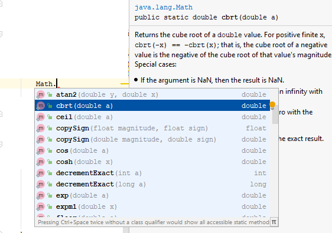
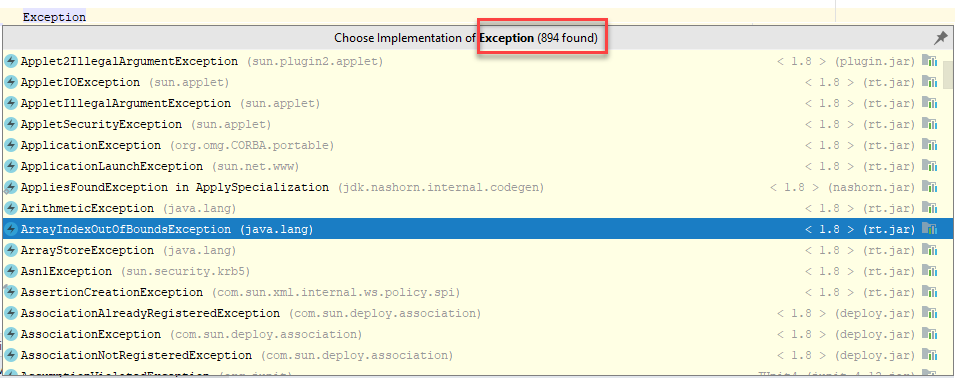
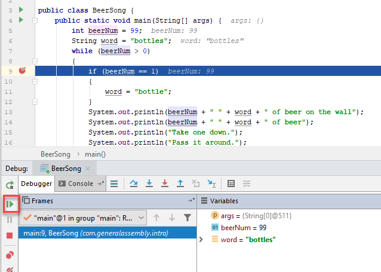
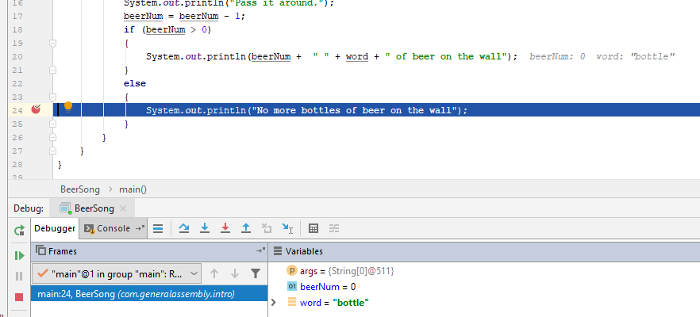

| Title       | Type   | Duration | Author        |
| ----------- | ------ | -------- |   ----------  |
| Java Basics | Lesson | 1:30     |  Victor Grazi |

### Anatomy of a class - Code structure in Java
Let's revisit our Hello, World program above.
```java
package com.generalassembly.oop.intro;

public class HelloWorld {
    public static void main(String[] args) {
        System.out.println("Hello, World!");
    }
}
```

Java programs live in "class" files that share a common structure, which we will now investigate.

The first line of a class file 
```package com.generalassembly.oop.intro;```
is called the package statement. This specifies the namespace for this class, and must be the first line of code in the file. (Technically, the package statement can be omitted, and the default package would be implied. However this is generally not considered a good coding practice, and you will rarely see it in professional enterprise code.)

Note that every statement in Java must end in a semicolon. (Blocks don't end in a semicolon, as we will see shortly.) 

The package statement is completely your choice. By convention, you want to make sure that your code does not conflict with someone else's (whether you're using theirs or they're using your's). The convention is to agree on a package name within your firm, and ensure that it does not conflict with anyone else's naming. If you have different projects, teams, or divisions within your enterprise, eahc of you should add something distinctive to your package name. For example, a technology company named Acme might use com.acme.engineering and com.acme.clientservices to distinguish their various departments.

Additionally, within your own code you will want to organize your code into packages, so for example you might have  
```com.acme.engineering.util```  
```com.acme.engineering.launch```  
```com.acme.engineering.launch.config```  
etc.

You can see from this how good naming will help you keep your code organized and more maintainable by other teams in the future (or by you two weeks from now! You would be surprised how many times I looked at my own code a few weeks after I wrote it and asked "did I write that - what was I thinking?)

Remember that we created that file in the directory src\com\generalassembly\intr, and contrast that to our package declation. the src\ directory is called our source base. Everything under that must corresponding to the package declaration, so the package ```com.generalassembly.oop.intro``` must exist in a directory com/generalassembly/oop/intro, directly under the source base. 

Next we have the class declaration, beginning with the line ````public class HelloWorld ```` followed by the class definition, surrounded in braces "{ }". This tells the compiler that we are defining a "public" class called "HelloWorld".

Note that the main class HelloWorld, must reside in the file named HelloWorld.java. The rule is that every public Java class must reside in a file that exactly matches the file name (minus the .java file type). (We will see an exception to this, when we learn about inner classes, classes that are nested inside of other classes, which may be public and generally don't share the name of the file.) So in our case, public class HelloWorld is the only public class defined in the file HelloWorld.java. (On the other hand, a file is not required to have any public classes.)

The canonical class name consists of the package and the class name, separated by a "." character, so in our case 'com.generalassembly.oop.intro.HelloWorld'. We will 

 
### Naming
Names of classes, variable, methods, etc can contain upper and lower case letters, digits, and the underscore character, provided that the first character is not a number.

 Observe that the class we named our class HelloWorld; camel case, first letter capitalized. Here we are following the Java convention of always starting a class name with a capital letter, and using camel case for the remainder of the class name. Following the same convention, variables will begin with lower case letters, and again, will use camel case. For example, ``` float arcSinPi = 0;```
 
We never use underscores for naming classes, functions, or variables. (One exception - class constants are conventionally named with all caps and use underscores to separate words, as we will see shortly.) Nothing will stop you from violating these conventions, but people might look at you funnny if you do!
 
### main() method as entry point into the program
In order for a program to run it must have a "main" method, which defines an entry point for your program. So if from a command prompt I call java com.generalassembly.oop.intro.HelloWorld, my runtime is expecting to find a class named HelloWorld in a directory called com/generalassembly/oop/intro, with a method named "main".

The main method must be public and static and must return void, and accept a String array as its one and only input parameter (and we will see what all that means soon).

I have used the word "method" several times already... what does that mean?
Well, I didn't pick that name, but in object oriented programming languages, they use the word method to mean a function that exists in a class. Since in Java every function must exist in a class, that implies that every function in Java is a method. (Contrast that to JavaScript, where you can have disembodied functions that are not methods.)

### Console output
One of the most common operations performed in code is logging. This is used to display any kinds of results.

There are generally two streams of output in any program, called: "standard out", which gets normal logging output, and "standard error", which gets error output. (There is also a standard in" for receiving user input.)

In order to log anything to "standard out", you must send output to Java's System.out stream. This is done above in the line: 
``` System.out.println("Hello, World!");```
System.out.println says that in the ```System``` object find the ```out``` object, and call its ```println``` method, supplying the parameter "Hello, World!". Every call to System.out.println("some value") will output the value to system out, followed by a new line.  

Note that System.out.println is commonly used for logging output in local development, but it is frowned upon in enterprise projects, which prefer the use of a logging framework such as Log4J, as we will see later in this course. Logging frameworks can still output to system out, but they can also output to files, handle file rolling, and can control the resolution of messages, so that say in production, we will only display warning and error messages, whereas in development we might display informational messages, and locally we would even display debugging messages.

### Running a program
In order to write a Java program, you pretty much must always follow the pattern able - create a package, add a class file, define your class, define, your main method, and execute the code. 

You can execute the code from your IDE, or you can compile it using the javac command, and execute it from the command line, by calling java my.package.MyClass.

Java 9 introduced the concept of a REPL, which lets you bypass some of the boilerplate for local development. Using a REPL, you can enter text directly in a Java shell, just like when we discussed interpreted languages, and each line would be evaluated after you hit enter.

### import statement
Remember above we said that a canonical class name consists of the package name dot the class name. That's a lot of stuff to type, every time you want to refer to a class. So Java has an "import" statement. For every class you want to refer to in your code, you declare one import statement. The import statement section must be at the top of the class file, immediately following the package statement.  (Except for white space and comments, which are ignored by the compiler.)

 So for example, if some other class wants to refer to our HelloWorld class, it can call it com.generalassembly.oop.intro.HelloWorld every time it uses it. Or it can simply add one import statement at the top of the file (after the package declaration) that says:  
 ```import com.generalassembly.oop.intro.HelloWorld;```
 
 Then, you can simply refer to that class as HelloWorld (leaving off the package name) anywhere in the file that contains that import statement.
 
 Note that classes in the same package are implicitly imported, so you don't need to expliclty import those. Also note, the core Java package java.lang contains many very common built-in classes, such as many of exception classes, all of the number wrappers, and low level concurrency classes, and is imported by default.
 
 If you would like to import all of the classes in a package, you can follow the package by a wildcard .*, for example
 ```import com.generalassembly.oop.intro.*;```
 This will import every class in the com.generalassembly.oop.intro package, but not recursively. So for example all classes in the com.generalassembly.oop.intro package will be imported, but classes in com.generalassembly.oop.intro.util would not be imported.
 
 In case of a clashing class name, there are several things you can do. An example would be the List class. In the Java core libraries there are two classes called List:
 java.util.List (which is a collection class), and java.awt.List which is a graphical list display class.
 
 If you are importing java.util.*, but you want to use the java.awt.List, you can import both java.util.* and java.awt.List. Then everything in the java.util package will be imported, but if you refer to List, that will refer not to the java.util.List but rather to the java.awt.List, since the explicit import beats out the wildcard.
 
 If you then want to refer to java.util.List in your code, you would need to specify the canonical name explicitly, for example `java.util.List someList;`
 
 If you are importing both java.util.* and java.awt.*, then you would need to refer to the canonical class name, java.util.List or java.awt.List explicitly. 
 
 Finally, imports do not instruct the JVM to actually load anything. So if you include unused import statements, the code won't actually take longer to run. However it is still a good practice not to import classes unless you are using them, and all of the modern IDEs provide warnings if you do so, and provide a feature to automatically clean those up.
 
 ## Visibility operators
We now understand how all of the lines in our HelloWorld class function. However there are a few keywords used there that we deftly bypassed. Let's cover those now.

Looking again at our class
```java
package com.generalassembly.oop.intro;

public class HelloWorld {
    public static void main(String[] args) {
        System.out.println("Hello, World!");
    }
}
```
there are a few uses of the word "public", and one reference to "static". What on earth do those mean?

Public is a scope visibility modifier. Java recognizes four scope visibilities, public, protected, private, and default. We will look at these in greater detail later, when we get to the in the section on object-oriented programming, but the short version is that public classes can be referenced by any other classes. 

private classes cannot be referenced by any other classes, except for ones defined in the file they are declared in. 

Default classes get no modifier (you would just say `class HelloWorld {}`, omitting the word `public` ) and can only be referenced by classes in the same package.

protected classes (`protected class HelloWorld` are visibile to other classes in the same package, as well as any subclases. More on subclasses in the OO section.)

The main method must be public, because it need to be visible to the runtime environment.

Next we come to the static modifier. We need some more background for a full explanation of static, but in a few words, non-static methods need an Object (an Object is an instance of a class), where as static methods can execute on the class itself, without creating an instance. Again, more on that in the OO lesson later.

The reason the main method needs to be static is that since the main method is the very first thing executed by your program, there by definition have not been any objects yet by the time. Therefore the Java runtime needs to be able to run on a class not an object.  

### Types
Data in Java must be of a _type_, for example, some variety of numeric, or text, or any bespoke type you can define using _classes_, as we discussed earlier.

Specifically, types are:
* built-in primitives, 
* objects (built-in, supplied, or user-defined), 
* or arrays of any of those.

Java has several built-in primitive types, which are 
* int
* float
* long
* double
* short
* byte
* boolean
* char  

Each one of those requires a specific amount of memory to contain its data, for example, int and float require 8 bytes, whereas long and double require 16 bytes.

int represents integer values +2,147,483,647 to -2,147,483,648. You can obtain these values using the fields Integer.MAX_VALUE and Integer.MIN_VALUE
```java
        System.out.println(Integer.MAX_VALUE); // prints 2147483647
``` 

If you exceed MAX_VALUE it wraps around
```java
        System.out.println(Integer.MAX_VALUE + 1); // prints -2147483648
``` 

A recent addition to Java is that numbers can include underscore characters at any position (except as the first or last position, or before or after a decimal point), and those underscores are ignored. So it helps with readability of the number. This works for any numeric type.

All of the following are legal numbers, and they represent the same number with the underscores removed:
```java
int ssNumber = 123_45_6789;
float f = 2_0f + 2.3_3f;
double pi = 3.141_593;

```

### Class types
Besides the primitive types, Java allows you to create (or download) custom types called 'classes', and also provides a robust collection of built-in classes that perform all of the functionality that makes Java great. For example, String is a built in class whose values are arbitrary text strings. All of the storage details are hidden away in the class, so for the application developer, it just functions as you would expect a text to function.

### Variables
Variables are used in just about every programming language to reference a location where values of arbitrary types are stored.

You can declare a variable, assign (or update) a variable, and you can retrieve the current value of a variable.

To declare a variable, you specify the type followed by the name. The name of the variable follows the naming conventions we listed earlier - starts with a letter or underscore, followed by any sequence of letters, numbers, and underscore.

For example, ```int myAge```declares a variable called myAge of type int. 

Once a variable is declared, it may not be declared again in the same scope (or in blocks under that scope. However a variable in a method may have the same name as a variable outside that method, just keep in mind they are referring to different locations and generally have nothing to do with one another).

To assign a value or update the value of a variable, use an = sign, for example:  
```myAge = 27;``` 

You can declare and assign a variable in one line, for example:  
```double myHeight = 6.1;```

To assign a variable that has already been declared, use the format variable=value, so  
```myHeight = 5.9;```

Sometimes you want to ensure that a variable will never be assigned again. For these you precede the declaration with the keyword 'final', for example:
```final String eyeColor="blue";```
Variables declared as final can never be reassigned. The instance they refer to when declared is the instance they will refer to for as long as they live.

### boolean
Another important type is boolean, which can take values `true` or `false`. Like any primitive booleans may not be null. Booleans are critical in looping and conditional branching, as we will see shortly.

### Arrays
Java also understands arrays, which are fixed-length collections of any type. An array of any type is declared just as any variable of that type, except that it is followed by "[]", which indicates it is an array type. For example:  
```int[]  myIntArray;```  
or  
``` private String[] myStringArray;```

There is an alternate syntax where you place the "[]" after the variable name instead of after the type.
This is perfectly valid but the development community seems to prefer the first version, considering it clearer that you are declaring an array type. So the above declaration is equivalent to:  
``` private String myStringArray[];```

There are several ways to assign a value to an array variable.

You can allocate an array of all empty values of a fixed size, using the syntax:  
```int[] myIntArray = int[100];```  
For numeric types (int, float, double, etc) this will allocate the value 0 to every element. For objects it will allocate nulls. For booleans, it will allocate false.


You can then assign specific values as:
```java
myIntArray[0] = 1;
myIntArray[20] = 2000;
// etc.
```  

and you can access values using the same syntax:
```java
int myValue = myIntArray[10]; // myValue = null
```

Arrays always start from element 0. The index of the last element in the array is always one less than the array length.

You can access an element of an array using the syntax:  
```myArray[index]``` where index is an int value between 0 and the length-1;

For example 
```java
System.out.println(myIntArray[99]) // prints null

System.out.println(myIntArray[100]) // error condition - 99 is the highest index for an array of length 100 
```

To get the length of an array get the array's 'length' property: 
```java
System.out.println(myIntArray.length) // prints 100
```

To assign all values to an array in one assignment, you can use the 'array literal' syntax, which comes in two flavors.
1. To declare and assign in the same statement, you can say something like
```java
int[] myArray = {1, 1,2, 3, 5, 8, 13};
```

2. Or to use String literal notation to assign an array to a variable that was already declared, you must use the 'new' keyword:
```java
myArray = new int[] {3,1,4,1};

```

### The String type
A word about the String type. String is one of Java's built in classes, and due to its popularity (Strings are a top contender for most used class in any application), it comes with its own special "string literal' shorthand syntax.

When you assign a String, you can just quote the value (using double quotes) and Java will underneath the hood create a new String object containing the value between the quotes, and assign that instance to your variable. We already saw an example of this above:  
```final String eyeColor="blue";```
You see that "blue" refers to a String class instance whose value is "blue".

The + operator can be applied to strings as well, and acts as a concatenation operator.

String concat = "Hello" + ", " + "world!";
System.out.println(concat);// displays Hello, world!

### Comments
No code is complete unless it is properly documented. Documentation comes in many flavors, including user documentation (usually found in a user's manual wiki-page, or website),  Javadocs that are added to your class members to generate API documentation, and in line comments to explain aspects about your code.

To include in-line comments in your code, you can use // syntax
Anything after a // is ignored by the compiler, until the end of the line.
```java
eyeColor = "hazel"; // my eyes change color in the sun
```

### Operators
Java provides a healthy supply of operators for performing arithmetic operations, logical operations, and bitwise arithmetic.
 
You can probably guess what the following do: 
+, -, *, /, 
Plus, minus, times, and divided by.

So
```java
double x = 3 * 4; // x = 12
``` 

### Number notation
There is usually some confusion about why you need numeric types at all, after all, a number is a number.

The reason we need to distinguish between ints, longs, floats, etc, has to do with storage size and precision. ints and longs have no decimal point, so if you need fractions consider using floats and doubles. When dealing with floats and doubles, the size of the data has a much larger range, but there is a limit to the precision.

Before we continue, please note that Java will use _Scientific Notation_ for large float or double values (around 10,000,000 or greater).
Scientific notation specifies a positive or negative number followed by e (or E) followed by another positive or negative number.

This is a common notation used in science and engineering, and just means multiply the number on the left, by 10 to the power of the number on the right. This is equivalent to moving the decimal point of the number on the left over by a number of places indicated by the number on the right. (Move the decimal to the right if the number on the right is > 0, or to the left if < 0).

Java also understand this as an input notation. So

    System.out.println(1.300e2); // displays 130.0
    
 The reason is that it starts with 1.300 and moves the decimal place two places to the right. Note that any trailing zeros after the decimal point may be omitted, as we learned in our basic arithmetic classes in grade school.  

So in Java, here are the allowable ranges:
  
Floats range from 3.402,823,5E+38 to 1.4E-45   
Doubles range from 1.797,693,134,862,315,7E+308 to 4.9E-324  
(The number of atoms in the universe is about 1.E+80)

With ints and longs, the precision is perfect, but the ranges is much smaller.
Ints range from +2,147,483,647 to -2,147,483,648
Longs range from +9,223,372,036,854,775,807 to -9,223,372,036,854,775,808

byte and short are also integer types, but their ranges are much smaller  
bytes range from +127 to -128    
shorts range from +32,767 to -32,768
char is a two byte representation of any character, and it also comes with a literal syntax:
```java
char letterA = 'a';
System.out.println(letterA); // prints the letter a
```

### Literals
To specify an int, simply type the int value
```java
int x = 2147483647;
``` 

To specify a long, you must append an L to the number
```java
long y = 2147483648L;
```

Note that a lower case L will work just as well, but you want to avoid that because it looks like a "1"!
```java
long y = 2147483648l;
```

To assign a double, you can specify any int, long, or decimal literal or variable.
You can add an option d (or D) at the end, for clarity, but it is not required.
Merely specifying a decimal point instructs the compiler that this is a double.
```java
double myDouble = 3.1416
```
is equivalent to 
```java
double myDouble = 3.1416D
```

If you exceed the int limit for an int literal, IntelliJ will underline that in red, and the compiler will fail with a message like the following:
```sbtshell
int x = 2147483648; // This is MAX_INTEGER+1
Error:(9, 17) java: integer number too large: 2147483648
```

### Casting

You can always assign a type to a larger type.
So this is perfectly valid:
```java
int i = 1;
long j = i;
```

Also, you can always assign an int type to a float or double, so the following are all legal:
        int i = 1;
        long j = i;
        System.out.println(j); // => prints 1

        long d = Long.MAX_VALUE; // => this represents the largest value for a long, 9_223_372_036_854_775_807 
        float f = d;
        System.out.println(d + "," + f);
Note that when you are specifying long strings of numbers, Java allows you to intersperse  underscores ("_") anywhere in the number. These are ignored by the compiler. I like to insert them where I would insert commas, i.e. every 3rd digit, going from right to left.

However you cannot directly assign a larger type to a smaller type, since that could result in a loss of precision. The following
   
    float f1 = d;
Is illegal. If you wish to make that assignment, you have to explicitly cast the value before assigning ti.

    float f1 = (float)d;

The standard algrebraic notation applies to operators. You probably learned the rule in grade school - Please Excuse My Dear Aunt Sally, a mnemonic for:
* **P**arentheses
* **E**xponents
* **M**ultiply/**D**ivide
* **A**dd/**S**ubtract

You might not have known that Dear Aunt Sally also teaches the order of operators in Java, although there are a lot more operators than that.

Java does not have a built in exponentiation operation, whereas it does provide a modulus operator "%": (8%3=2, since the remainder of 8 ÷ 3 = 2 ).

Here is the full list (borrowed from: http://www.cs.bilkent.edu.tr/~guvenir/courses/CS101/op_precedence.html); we will get to just about all of these in time.

<table border=1 cellspacing=1 cellpadding=2>
<tr><th>Precedence</th><th>Operator</th><th>Type</th><th>Associativity</th></tr>
<tr>
  <td align=center>15</td>
  <td align=center>()<br>[]<br>·</td>
  <td>Parentheses<br>Array subscript<br>Member selection<br></td>
  <td align=center>Left to Right</p></td>
</tr>
<tr>
  <td align=center>14</td>
  <td align=center>++<br>--</td>
  <td>Unary post-increment<br>Unary post-decrement</td>
  <td align=center>Right to left</td>
</tr>
 <tr>
  <td align=center>13</td>
  <td align=center>++<br>--<br>+<br>-<br>!<br>~<br>( <i>type</i> )</td>
  <td>Unary pre-increment<br>Unary pre-decrement<br>Unary plus<br>Unary minus<br>Unary logical negation<br>Unary bitwise complement<br>Unary type cast</td>
  <td align=center>Right to left</td>
</tr>
<tr>
  <td align=center>12</td>
  <td align=center> * <br> / <br> % </td>
  <td>Multiplication<br>Division<br>Modulus</td>
  <td align=center>Left to right</td>
</tr>
<tr>
  <td align=center>11</td>
  <td align=center>+<br>-<o:p></td>
  <td>Addition<br>Subtraction</td>
  <td align=center>Left to right</td>
</tr>
<tr>
  <td align=center>10</td>
  <td align=center>&lt;&lt;<br>&gt;&gt;<br>&gt;&gt;&gt;</td>
  <td>Bitwise left shift<br>Bitwise right shift with sign extension<br>Bitwise right shift with zero extension</td>
  <td align=center>Left to right</td>
</tr>
<tr>
  <td align=center>9</td>
  <td align=center>&lt;<br>&lt;=<br>&gt;<br>&gt;=<br>instanceof</td>
  <td>Relational less than<br>Relational less than or equal<br>Relational greater than<br>Relational greater than or equal<br>Type comparison (objects only)</td>
  <td align=center>Left to right</td>
</tr>
<tr>
  <td align=center>8</td>
  <td align=center>==<br>!=</td>
  <td>Relational is equal to<br>Relational is not equal to</td>
  <td align=center>Left to right</td>
</tr>
 <tr>
  <td align=center>7</td>
  <td align=center>&amp;</td>
  <td>Bitwise AND</td>
  <td align=center>Left to right</td>
</tr>
 <tr>
  <td align=center>6</td>
  <td align=center>^</td>
  <td>Bitwise exclusive OR</td>
  <td align=center>Left to right</td>
</tr>
<tr>
  <td align=center>5</td>
  <td align=center>|</td>
  <td>Bitwise inclusive OR</td>
  <td align=center>Left to right</td>
</tr>
<tr>
  <td align=center>4</td>
  <td align=center>&amp;&amp;</td>
  <td>Logical AND</p>
  </td>
  <td align=center>Left to right</td>
</tr>
 <tr>
  <td align=center>3</td>
  <td align=center>||</td>
  <td>Logical OR</td>
  <td align=center>Left to right</td>
</tr>
<tr>
  <td align=center>2</td>
  <td align=center>? :</td>
  <td>Ternary conditional</td>
  <td align=center>Right to left</td>
</tr>
<tr>
  <td align=center>1</td>
  <td align=center>=<br>+=<br>-=<br>*=<br>/=<br>%=</td>
  <td>Assignment<br>Addition assignment<br>Subtraction assignment<br>Multiplication assignment<br>Division assignment<br>Modulus assignment</td>
  <td align=center>Right to left</td>
</tr>
</table>

<p><i>Larger number means higher precedence</i>.</p>
Unary operators go before everything, so
        System.out.println(-3*-2); // => 6
        
Other unary operators are
```java
+ (+3 is the same as 3)
- (before a numeric value specifies negation)
++ (increment)
-- (decrement)
```

Note that the increment and decrement operators function exactly as they did in Java's great grandfather, the C programming language.

They can be placed before or after an integer variable (int, long, byte, char, short).
When ++ is placed after the variable, it means increment the variable _after_ it is used
When ++ is placed before the variable, it means increment the variable before_ it is used.

The following should clarify.
```java
         int x1 = 66;
         long x2 = 66;
         byte x3 = 66;
         char x4 = 66;
         short x5 = 66;
         System.out.println(x1++); // displays 66, then increments the variable
         System.out.println(x2++); // displays 66, then increments the variable
         System.out.println(x3++); // displays 66, then increments the variable
         System.out.println(x4++); // displays B, then increments the variable
         System.out.println(x5++); // displays 66, then increments the variable

         System.out.println(x1); // displays the new value of the variable showing the incremented value 67 
         System.out.println(x2); // displays the new value of the variable showing the incremented value 67 
         System.out.println(x3); // displays the new value of the variable showing the incremented value 67 
         System.out.println(x4); // displays the new value of the variable showing the incremented value C 
         System.out.println(x5); // displays the new value of the variable showing the incremented value 67 

         System.out.println(++x1); // displays 68, the new incremented value
         System.out.println(++x2); // displays 68, the new incremented value
         System.out.println(++x3); // displays 68, the new incremented value
         System.out.println(++x4); // displays D, the new incremented value
         System.out.println(++x5); // displays 68, the new incremented value
```
++ and -- only work on variables, not on literal, values. And again, they only work on the integer types.

Be aware of one notorious gotcha: If all of your arguments are ints, then all operations will be truncated to ints. For example

        System.out.println(13/3); // => 4
        System.out.println(14/3); // => 4
        System.out.println(99/100); // => 0

You perform all operations in parentheses first, then all of the times, divided by, and modules, in order from left to right. Then all of the addition and subtraction, from left to right.

Parentheses are used to change the default order of operations.

So for example:

    System.out.println(2*3 + 4*5); // => 26
    // since 2*3 =6 and 4*5=20 (perform the times first), then add 6+20=26
    
Other grandchildren of the C language are the += and -= operators.
These both function as assignment operators and so must be applied to variables; specifically variables that have already been previously declared and contain a value;

An example is worth a thousand words:
```java
x += 3;
```
is equivalent to 
```x = x + 3```

You can see that saves a little typing.

Similarly
`x -= 10` is equivalent to
`x = x-10`

+= and -= work on any numeric types, and += also works on Strings.

String hello = "Hello, ";
hello += "World!"
System.out.println(hello); // displays Hello, World!

This is useful for outputting log messages. For example:

```java
String name = "Mary";
int age = 12;
System.out.println("My name is " + name + " and I am " + age + " years old"); // displays My name is Mary and I am 12 years old 
```

### Arithmetic on the same types
If you add two ints, the result is an int. If you add two doubles, the result will be a double. That seems to make sense.

However one source of confusion among developers new to Java is integer division. What would you expect the following to print:
```java
System.out.println("11/4=" +  11/4); // displays 2
```

Surprisingly that prints out 2. The reason is that when you divide two ints, the result is an int, and Java will truncate the decimal to product the int result, effectively rounding down.

So 12/4 is 3, as expected, but 11/4 (which arithmetic tells us is 2.75), Java rounds down to produce 2.

Just by appending a decimal point you can change an int to a double, so 
```java
System.out.println("11./4.=" +  11/4); // displays 2.75
``` 

### Arithmetic across types
What happens if you try to perform arithmetic on different types? In that case the Java compiler will round to the largest order type, so:
 int and float equals float,
 int and double equals double,
 float and double equals double,
 etc.

Using this knowledge we can save one decimal point (hey, tired fingers!) by typing
```java
System.out.println("11./4=" +  11./4); // displays 2.75
``` 
 

### Infinity/NaN

We remember from grade school that dividing by zero is undefined or infinity. In Java, if you divide a float or double by 0, it produces a value called "Infinity", specifically `Float.Infinity`. If you divide any int type by 0, it throws an exception, and left unhandled will halt execution of your program and exit.

One other value that can be produced as a result of floating point operations is NaN, "Not a Number". NaN is produced when the result is clearly undefined, for example, where 1.0/0 is Infinity, 0.0/0 is undefined. 

    System.out.println(3./0); //Displays Infinity
    System.out.println(-3./0); //Displays -Infinity
    System.out.println(3/0); // halts execution: java.lang.ArithmeticException: / by zero

### Math class - Exponentiation, etc
There are many other arithmetic operations that are available as static methods in the java.lang.Math class.
(Remember that static methods are called directly on the class, not on an object, so we call Math.operator(args))). For example:

    System.out.println(Math.pow(3, 2)); // displays 9
    System.out.println(Math.pow(2, .5)); // displays 1.4142135623730951, the square root of 2
    System.out.println(Math.PI); // displays 3.141592653589793 (PI)
    
There are many other mathematical operators and constants in the Math class. To see the full list, in IntelliJ type Math. then hit Ctrl space to see the full list. You can use the up and down arrows to focus on any operator, the hit Ctrl-Q (on Windows) to see that Javadoc for that operator:




### Flow control
If programs could perform basic calculations and nothing more, then they would be little more than glorified calculators. The real power comes when programs can make decisions.

Decisions come in several forms, such as loops, which decide how many times to execute a piece of code, conditional branches, which decide what code block from a series of code blocks to execute in a given situation, and exceptions, which provide alternate execution paths when things don't go as expected.

We will take a look at all of these now. 

### Looping
Java supports three low-level looping structures: for-loops, for-each-loops, while-loops and do-loops. (There are also some functional looping structures based on streams, which we will see when we get to the section on Lambda expressions and functional programming.) 

#### for-loops
for-loops are used for performing an operation a number of times, until a condition is met. This is commonly used for processing arrays or lists.

Here is an example of a for-loop

```java 
for(int i = 0; i < friends.length; i++) {
    String myFriend = friends[i];
    System.out.println(myFriend);
}
```
The for-loop starts with a 3-section declaration:  
```for(int i = 0; i < friends.length; i++) {```

The first part (```int i =0``` is called the initialization step.
The variable named `i` (called 'the index variable', or simply 'the index') is declared.

The second part - the test ```i < friends.length``` tells the for-loop to execute the code block, as long ass the condition is true.

The third part - the increment - happens _at the end_ of each loop.  

Next it executes a block of code, which is surrounded by {} and consists of the two lines
```java 
String myFriend = friends[i];
System.out.println(myFriend);
```

The first of these lines says take the ith element of the array, and assign it to a String variable named myFriend, (the first value of i being 0, and continues to increment as long as i is less than the length of the friends array)

The next line says to print out that value to standard out, just like we saw in our HelloWorld program)

We can see this program in action:
```java 
package com.generalassembly.friends;

public class FriendsLister {
    public static void main(String[] friends) {
        for(int i = 0; i < friends.length; i++) {
            String myFriend = friends[i];
            System.out.println(myFriend);
        }
    }
}
```
Let's compile that and run it with some values...  
```java com.generalassembly.friends.FriendsListe Rachel Monica Joey Phoebe```

And that displays:
``` bash 
Rachel
Monica
Joey
Phoebe
```

### Conditional branching
A vital construct in flow control is conditional branching - it's what tells a trading program sell when my stock hits a certain price; it's what tells my game advance to the next level when I clear this level, and end the game when the time runs out.

Conditional branching is usually accomplished by the _if_ statement.
The syntax is
```java
if(boolean expression) do-something;
```
where do-something can be an in-line statement, or it can be a block of code.
 For example:
 ```java
if(price > strikePrice) sell();
```

or 

```java
if(price >= strikePrice) System.out.println(price + " exceeds strike price of " + strikePrice + ". Selling");
```

do-something can be multiple lines of code, in which case be sure to enclose it in a block (squigly brackets):
```java
if(price >= strikePrice) {
    // two statements in a block
    System.out.println(price + " exceeds strike price of " + strikePrice + ". Selling");
    sell();
}
```

It is a good practice to enclose even a single statement in a block, mainly as a defense - in case you add more lines, you don't want to forget to add the block at that point, so might as well add it from the start.

Quite often you will have one branch that executes if a condition is true, or have  different branch execute if the condition is false. This is accomplished with the if-else construct:
```java
if(boardIsClear()) {
    advanceToNextLevel();
}
else {
    continuePlaying();
}
```

It is a good practice to indent the statements after the if line and after the else line, so that your eyes can easily distinguish the different conditional steps. However the compiler does not require the indentations.

Also, a common religious war, worthy of an episode of Silicon Valley on TV, is where to place the parentheses after the if and else clauses.

The format shown above, with the squiggly bracket at the end of the line, is most commonly recommended. 

IntellIJ will enforce this by default (Ctrl-Alt-L will reformat your code properly), but your prefered format can be configured using any of a wide variety of conventions, which we won't discuss further.

Another common format is to have the parentheses at the start of the next line. The following uses this alternative, and is identical to the previous listing. 
```java
if(boardIsClear()) 
{
    advanceToNextLevel();
}
else 
{
    continuePlaying();
}
```

### Switch statement
Having multiple _else if_ clauses can make code harder to read. 
The _switch_ statement is a concise syntactic sugar that can be used in certain circumstances, to make multiple else if's look much neater and therefore more maintainable.

A switch statement looks like this
```java
switch(day) {
    case 2:
        System.out.println("Day is Monday");
        break;        
    case 3:
        System.out.println("Day is Tuesday");
        break;        
    case 4:
        System.out.println("Day is Wednesday");
        break;        
    case 5:
        System.out.println("Day is Thursday");
        break;        
    case 6:
        System.out.println("Day is Friday");
        break;        
    case 1:
    case 7:
        System.out.println("Yay, it's the weekend!");
        break;
    default:
        System.out.println("Not a valid day!");
        break;
        
}    
```

The variable in the switch clause (in our case _day_) contains a value that must be matched by a case.

If it matches a case, then that case clause executes. The _break_ tells Java to _break out_ of the switch statement. If you omit the break, then the mathing case and each of the following cases will be executed (unless and until a break is encountered.)

### Exceptions
So far we have seen how to force program flow when things are going as expected. But how do we program Java to take an alternative path when things are going wrong? For example, let's say we are trying to divide an int value by some user input, and the user inputs "0"! Integer division by 0 throws an exception. Or what happens if we try to call a method on a variable that has been declared, but has not been assigned a value?

In such cases we use Java's exception handling mechanism.

It works like this:

```java
try {
    // some operation
}
catch(SomeException e) {
    // do some alternate path to handle the exception.
}
```
SomeException is obviously not a real exception type, but there are many real types of exceptions.

Let's give an example:
```java
public class ExceptionHandling {
    private String name;
    private void launch() {
        System.out.println("Name length=" + name.length());
    }

    public static void main(String[] args) {
        new ExceptionHandling().launch();
    }
}
```
That throws a _NullPointerException_.
```java
Exception in thread "main" java.lang.NullPointerException
	at com.generalassembly.intro.ExceptionHandling.launch(ExceptionHandling.java:7)
	at com.generalassembly.intro.ExceptionHandling.main(ExceptionHandling.java:12)

Process finished with exit code 1

```
Let's study that for a second. That is called a stacktrace. It displays the full call stack of what was called by what, all the way to the first caller. This provides really valuable insight into what went wrong and where.

Let's use Java's exception handling to work around this:
```java
public class ExceptionHandling {
    private String name;
    private void launch() {
        try {
            System.out.println("Name length=" + name.length());
        }
        catch (NullPointerException e) {
            System.out.println("You need to assign a value to name before you can reference its length!!!1");
        }
    }

    public static void main(String[] args) {
        new ExceptionHandling().launch();
    }
}
```
That outputs the friendly advice:
```java
You need to assign a value to the name variable before you can reference its length!!!1
```

Exception handling is a difficult topic. Not every method should use the try-catch mechanism to handle exceptions.

Generally the best approach is to check for situations that might throw an exception before handling the exception. For example, in the above code, we could have avoided the try-catch all together by checking for the error condition explicitly:
```java
public class ExceptionHandling {
    private String name;
    private void launch() {
        if(name == null) {
            System.out.println("You need to assign a value to the name variable before you can reference its length!!!");
        }
        else {
            System.out.println("Name length=" + name.length());
        }
    }

    public static void main(String[] args) {
        new ExceptionHandling().launch();
    }
}

```
```java
You need to assign a value to the name variable before you can reference its length!!!
```

Java has many (many!) exception types pre-defined. You can see them if you type the word _Exception_ in IntelliJ and then click Ctrl-Alt-B:



You don't have to catch every exception. The more common alternative is to throw the exception to the caller, by using the _throws_ keyword on the method call. This tells the caller that this method potentially "_throws_" this exception, so _you_ (Mr. Caller) must deal with it (or throw it back to your caller!)

For example, let's add the readFromFileSystem method to our class, and change our main method to call it:
(Note to instructor, a sample file is provided in the correct location. Just execute the ExceptionHandling class.)
```java
    /**
     * Reads the specified file and prints the output
     * @throws IOException if the file is not found, or cannot be read
     */
    public void readFromFileSystem(String fileName) throws IOException {
        // code to read the file
        File file = new File(fileName);
        FileInputStream in = new FileInputStream(file);
        int character = 0;
        while(character != -1) {
            character = in.read();
            System.out.print((char)character);
        }
        System.out.println();
    }

    public static void main(String[] args) throws IOException {
        System.out.println(new File(".").getAbsolutePath());
        new ExceptionHandling().readFromFileSystem("java-basics-lesson/resources/test.txt");
    }

```
This method declares that it _throws IOException_.
The _JavaDoc_ comment above the method is optional (but highly recommended) documentation that explains what the method does, and what could cause the exception to be thrown.
 
 You generally have the choice of using a try-catch block to handle an exception, or throw the exception back to the called. When should you do which?
 
 The answer is, that if your method knows how to provide an alternative action when the exception occurs (for example, try a different file system) then it should handle the exception in a try-catch block. But that will generally not be the case, and so the advice is when in doubt, throw it back to the caller.
 
A method can declare that it throws any one of multiple exceptions, by listing the exceptions in the throws clause, separated by commas:
```java
public void sendFileToUrl(String fileName, String URL) throws IOException, MalformedURLException, ETC) 
```

Similarly a method can catch multiple exceptions by nesting the catch clauses:

```java
try {
    ...
}
catch (MalformedURLException e) {
    // deal with MalformedURLException
}
catch(SocketException e) {
    // deal with SocketException
}
```

If the processing is the same for multiple exceptions, you can gang the catch clauses into a single catch clause:
```java
        try {
            . . .
        } catch (
                MalformedURLException | SocketException e) {
            e.printStackTrace();
        }

```

### Debugging
Debugging is the art of running your code with a "debugger", and allowing the debugger to take you on a tour of your code.

You can set _breakpoints_ that tell the program where to stop (until you tell it to start up again.)

When the debugger stops at a breakpoint, it shows you all of the variables that are in scope, and allows you to view (and modify) those variables.

This is vital for understanding how your code (or someone else's code) works, and simplifies the process of determining what might be going wrong (because things always do inevitably go wrong, even with highly skilled programmers.)

Let's give the IntelliJ debugger a test drive with the popular American driving song, "The Beer Song" (also called 99 Bottles of Beer on the Wall) 

### Activity - Debugging the Beer Song
Everybody please download this link to the program from the book Head First Java.
and give it a try:

https://github.com/bethrobson/Head-First-Java/blob/master/chap01/BeerSong.java


Click into the margin just to the left of `if (beerNum == 1)` (Just to the right of the line number, row 9).

That should add a little red dot, which is a breakpoint. 

Now click on the green arrow next to the class name, and choose "Debug BeerSong main()". This launches the program in debug mode.

The program will start execution, and then stop at the breakpoint.



Notice the debugger window appears on the bottom, and displays the values of the variables known to the program.

Click the little right facing green arrow to continue the program. Again it will stop at the breakpoint, and you can see beerNum will decrement to 98. Try again, and it will be 97, etc.

Now click the red breakpoint dot to toggle it off, and let's put a new breakpoint at line 24, as shown:



Hit the green "Resume" button again, and notice that the program now continues until it finally gets to line 24, having ticked away all 99 bottles.

You can see at this point beerNum is equal to 0. Hitting resume one final time completes our _while_ loop, and exits the program.

This is a simple example, but well placed breakpoints can be indispensible when you are trying to locate the source of problems in your code.
