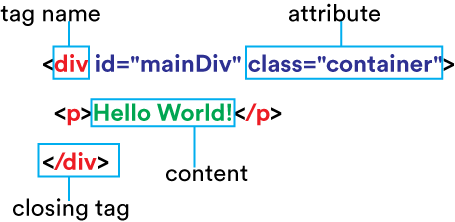

# 

| Title | Type | Duration | Author |
| -- | -- | -- | -- |
| Introduction to HTML5 | Lesson | 1:00 | Sonyl Nagale adapted from DASH, myGA, and FEWD contributor |


# HTML5

### Learning Objectives

*After this lesson, students will be able to:*
- Understand the history of HTML and its purpose.
- Articulate HTML's structure.
- Identify HTML5 semantic tags.

### LESSON GUIDE

| TIMING  | TYPE  | TOPIC  |
|:-:|---|---|
| 10 min  | Intro  | What is HTML? |
| 5 min  | Intro  | Common HTLM Tags |
| 5 min  | Intro  | Creating a Unit Test |
| 5 min | Intro | Anatomy of a Tag | 
| 10 min | Intro | Semantic HTML | 
| 10 min | Intro | Semantic HTML vs. Div |
| 5 min | Intro | Semantic Roles |
| 10 min  | Group Exercise | Semantic HTML5 scaffold |

---

## What Is HTML? (15 min)

### History

The early history of the World Wide Web is a bit cloudy, but it goes something like this:

The year is 1990. The place is a particle physics facility in a suburb of Geneva, Switzerland.

A physicist, Tim Berners-Lee, is feeling disgruntled. He’s tired of logging on to so many different computers to get the information he needs.

There has to be a better way!

“What if I came up with a computer language that would allow people to alter text so that it could be sent over a network? Then any computer connected to that network could interpret the text and make it readable for the user. Now that would be something!”

Berners-Lee came up with a brief set of text tags that computers could interpret, send over a network, and render into readable form... and HTML, or Hypertext Markup Language, was born.

The language is so easy to learn and use that it flourished. More people got involved; more tags were created and added. HTML was here to stay.

But HTML's capabilities were limited, and people wanted this new World Wide Web to be sexy and cool. As a result, other languages were created and paired with HTML; languages that enabled styling and automation, animation, and interactivity.

The web and its primary authoring tool, HTML, will continue to evolve and improve. And despite these ongoing changes, HTML is still a simple, text-based computer language that, with a little practice, anyone can learn.

---

### HTML Structure

Here’s an example of an HTML boilerplate. It should be inserted at the beginning of any HTML document to let browsers know that what follows is, well, HTML:

```html
<!doctype html>
<html>
  <head>
   <title>My Site</title>
  </head>

  <body>
  </body>

</html>
```

Let’s examine each of these lines more closely to find out what they do.

---

### Code-Along: HTML Structure

#### Doctype

We begin our document with the HTML5 `doctype` tag:

`<!doctype html>`

In contrast to other HTML tags, the HTML5 `doctype` tag does not require a closing tag.

This tag gives your web browser the heads up that the following document will be written in HTML.

```html
<!doctype html>
```

---

#### <html>

The `<html>` tag begins your HTML document. It says, "Everything between my _opening_ tag (`<html>`) and my _closing_ tag  (`</html>`) will be part of the following HTML-based instructions."

It's a good practice to close your HTML tags as soon as you open them so that you don't forget later, so let's do that now:

```html
<!doctype html>
<html>
</html>
```

---

#### <head>

The `<head>` tag contains most of the under-the-hood stuff that helps identify your webpage and allows it to show up in search results. This is called **metadata**. Notice that the `<head>` tags are indented inside the `<html>` tag. Adhering to a hierarchy of indentation helps make your HTML more legible (and can assist in tracking down issues).

```html
<!doctype html>
<html>
  <head>
  </head>
</html>
```

---

#### <title>

The `<title>` tag may sound obvious, but in fact, it _doesn’t_ display any kind of title text on your webpage. Instead, the `<title>` tag provides your page with a name that will appear in search engine results. It’s also the text that appears at the top of your browser window or tab. See what displays for Google, Netflix, and Medium in the image below? That's `<title>` tags in action. Let's go ahead and add some content to the tag:

```html
<!doctype html>
<html>
  <head>
    <title>My Site</title>
  </head>
</html>
```


---

#### <body>

You’ll use the `<body>` tag to hold what’s actually displayed on your webpage, including all of your text, links, and images. See the text and images that appear on Medium’s website? All of this is included in the `<body>`.

```html
<!doctype html>
<html>
  <head>
   <title>My Site</title>
  </head>

  <body>
  </body>

</html>
```


And with that, we've completed our HTML5 boilerplate! You won't have to type it out every time, as many templates and code editors provide this scaffold for you, but it's important to know the purpose of each piece.

---

## Common HTML Tags (5 min)

There are dozens of HTML elements, each with their own unique purpose. Here are just a few of the tags we can use to define them:

| Tag | What It Does |
| -------- | -------- |
| `<h1-6>` | Creates heading text, with `<h1>` being the largest and `<h6>` the smallest. |
| `<p>` | Creates a paragraph of text. |
| `<ul>` | Begins an “unordered list”  (e.g., bullets). |
| `<li>` | Indicates the list items inside of a `<ul>`. |
| `<a>` | Opens a hyperlink. |
| `<div>` | Defines a new section on the page. |
| `` | Adds an image. |
| `<br/>` | Creates a line break. |

You might be wondering how you’ll ever remember all of those tags. Not to worry, you don’t have to!

You’ll learn some tags from frequent use, others you’ll never touch, and still others you can simply look up as needed. Tons of websites publish lists of HTML tags for easy reference. One is the World Wide Web Consortium, an international community that develops web standards. We recommend bookmarking its [official list of tags](https://www.w3schools.com/tags/).

And remember, even experienced web designers sometimes have to look up tags while coding!

---

## Hierarchy (5 min)

You may have noticed that some elements fit inside of other elements. Remember our use of indentation? HTML tags follow an established **hierarchy** to help structure information. Elements that sit inside of other elements are called **child elements**, while those that contain other elements are called **parent elements**.

So, `<h1>` is a child element of its parent, the `<body>` tag:

```html
<!doctype html>
<html>
  <head>
    <title>My Site</title>
  </head>

<body>
  <h1>My Site</h1>
</body>

</html>
```

---

## Anatomy of a Tag (5 min)

There are several components that make up an HTML tag. At the very least, it needs a tag name surrounded by opening and closing angle brackets. There are a few other pieces that are useful to know, shown below:



Each tag can have one `id` and one or more `class`es. IDs are unique identifiers; there can only be one tag with a given ID on a page. Classes, however, can be used on multiple tags, and each tag can have more than one class. IDs and classes are part of the structure of HTML, but we'll explore their power when we start using CSS.

---

## Semantic HTML (10 min)

Semantic HTML is the use of specific HTML tags to apply meaning to your HTML, which allows you to quickly understand and make changes to a section of a website.

For example, on an ice cream shop's webpage, you might want users to easily see which flavors are the newest and which flavors are featured:


With semantic HTML, you could structure two **sections** in HTML, one for "Newest Flavors" and one for "Featured Flavors:"

```html
  <section>
    Newest Flavors!
  </section>
  <section>
    Featured Flavors:
  </section>
```

---

### Sections

Let's take a look at some of these elements on the General Assembly website.

- There's the **header**, which groups elements in the opening section of the page. Here, we have the main navigation, the site logo, and a sign-in button.

- There's the **main**, which holds the main content of the page.

- And there's the **footer**, which contains the concluding section of a page. Here, the footer has copyright information. Oftentimes, footers also contain links to social media websites.


The `nav` element is used to create major navigational blocks on a page (i.e., that list of chapter links). These links should be wrapped in a `nav` element, as your users are expected to use them to navigate your website.

Because `nav` is simply semantic HTML, a website's appearance won't change when you add these tags. However, once you have a `nav` element, you can select and style it in the CSS.

---

Be careful not to confuse the `header` element with the `head` of a page.

- As a refresher, the `head` element contains behind-the-scenes info used by the browser and search engines. It goes **above** the opening `body` tag.

- The `header` is part of the page the user sees and simply distinguishes a specific piece. The `header` goes **between** the `body` tags:

```html
<!doctype html>
<html>
  <head>
    <meta charset="utf-8">
    <link type="text/css" rel="stylesheet" href="style.css" />
  </head>
  <body>
    <header>
      <h1>Alice in Wonderland</h1>
    </header>
    <p>Here, I'll read you some chapters!</p>
  </body>
</html>

```

---

The `footer` element is used for the concluding section of a page. For example, the footer might include copyright information and links to social media sites:

```html
<!doctype html>
<html>
  <head>
    <meta charset="utf-8">
    <link type="text/css" rel="stylesheet" href="style.css" />
  </head>
  <body>
    <header>
      <h1>Alice in Wonderland</h1>
    </header>
    <p>Here, I'll read you some chapters!</p>

    <footer>
      <p>Copyright 1865</p>
    </footer>

  </body>
</html>

```

---

## Semantic HTML vs. Div (10 min) 

You can use HTML5 structural elements such as `header`, `main`, `footer`, `nav`, `article`, `section`, and `aside` to manipulate the styles of various elements on the page with CSS.

So, when would you want to use a `div` element, and when would you want to use one of these HTML5 structural elements?

- If you just need a wrapper for styling a portion of the page and no HTML5 elements that provide more meaning are appropriate, then you could use a `div` element to section off that portion and add styles.

- However, if at any point you'll want to apply styles based on type of content (such as all side text (`aside`) or each blog post (`article`)), use the specific HTML5 structural elements.

This will make styling your website much clearer in the future, as well as make your HTML easier for others to scan and understand.

Let's consider our ice cream shop page again:


With semantic HTML, we structured two sections, and now we could add in a few `div` elements to hold the images and captions:

```html
  <section>
    Newest Flavors!
    <div>
      <div>
        
        Chocolate Smoked Sea Salt
      </div>
      <div>
        
        Cinnamon Brittle
      </div>
    </div>

  </section>
  <section>
    Featured Flavors:
    <div>
      <div>
        
        Hibiscus Beet
      </div>
      <div>
        
        Honey Thyme
      </div>
    </div>
  </section>
```


---

## Semantic Roles (5 min) 

It's important to note that any two developers may interpret the role of a page's content differently. You might think something should be an `article`, while a developer you're working with might think it should be a `section`.

The key is thinking about the role of the content in each section of the page and choosing which HTML5 element you'll use to structure it accordingly. As long as you stay consistent within your own site, you'll do just fine.

---

## Group Exercise (10 min)

Work together in pairs to write a semantic HTML5 scaffold for this page:


Consider navigation, headers, and images. And don't forget your boilerplate!
