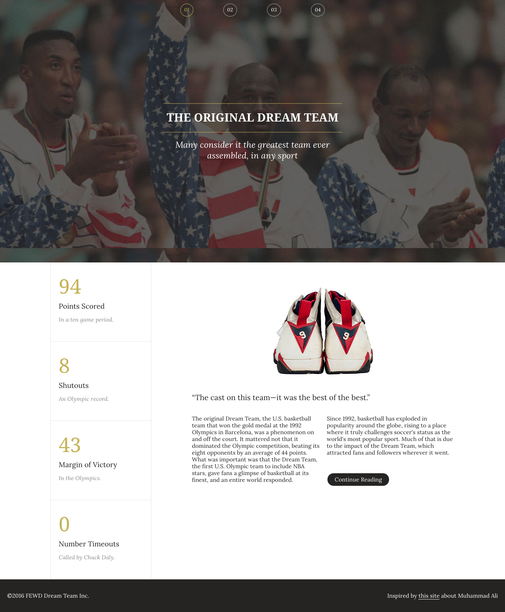

# 

| Title | Type | Duration | Author |
| -- | -- | -- | -- |
| Responsive Design | Lesson | 1:30 | Sonyl Nagale (adapted from SF-SEI) |


## Responsive Design

### Learning Objectives

*After this lesson, students will be able to:*
- Use layout techniques with `width`, `min-width`, `max-width`, `vh`, and `vw`.
- Apply image optimization techniques, such as `min-width`, `max-width`, retina display, etc.
- Identify breakpoints and apply media queries to adjust layout.
- Explore the difference between mobile-up and desktop-down CSS.
- Effectively use media queries to adjust and adapt your page layouts.
- Understand how media queries work in the cascade.
- Describe how responsive design is dictated by visual breakpoints, not device sizes.

### LESSON GUIDE

| TIMING  | TYPE  | TOPIC  |
|:-:|---|---|
| 15 min  | Introduction  | Responsive Design |
| 15 min  | Introduction  | Media Queries |
| 25 min  | Demo | Responsive Design |
| 30 min  | Independent Practice  | Dream Team |
| 5 min  | Conclusion | Review / Recap |
***

## Introduction: Responsive Design (15 min)

Responsive design is the strategy of making a site that "responds" to the browser and device on which it's being displayed. This means a website is usable, readable, and looks great on any and all screen sizes.

According to the Wikipedia definition:

> "Responsive web design (RWD) is a web design approach aimed at crafting sites to provide an optimal viewing experience — easy reading and navigation with a minimum of resizing, panning, and scrolling — across a wide range of devices (from mobile phones to desktop computer monitors)."

### Responsive Design Is _**Not**_ Device-Specific

A responsive site doesn't just look good on the newest phone, watch, tablet, or mega-screen; it looks good on *any* screen. This might seem impossible, but it's relatively straightforward. All that's required is writing a series of rules, known as media queries, that check the size of the browser/device on which the site is being viewed and adjust the CSS as necessary.

### Let's Explore

With a partner, choose one of the following websites to explore (or another of your choosing). Open it in both your laptop browser and your phone browser. (Try resizing your browser window, too!)

- https://medium.com/
- https://www.airbnb.com/
- https://mta.info
- https://craigslist.org

Discuss:

- How does the site's design shift from desktop to mobile?
- What happens when the browser window is resized?

Think about how the layout, styles, and even content change in each experience. 

-----

## Media Queries (15 min)

Media queries are conditional style rules for the size of the browser/device rendering the site. Let's look at an example.

We already know that if we do something like this:

```css
p {
  color: red;
}

p.blue_text {
  color: blue;
}
```

By default, all `p` tags will have red text... unless they have the `blue_text` class, in which case the text will be blue. We can do something similar with media queries:

```css
p {
  color: blue;
}

@media screen and (min-width: 600px) {
  p {
    color: red;
  }
}
```

Now, all `p` tags will be red until the screen size reaches 600px, when they'll turn blue. How do we determine the pixel width to use in the media query?

### Breakpoints

The best approach for identifying the size of a media query is to test your site for breakpoints. A **breakpoint** is simply a specific browser width where the layout either breaks or no longer follows the intended design. Another way to think about it: The design looks "off," or just plain bad!

You can use Chrome Dev Tools to measure the width of a page open in the browser. Adjust the width of the browser and identify breakpoints. If you see an unintended or unacceptable change in design/layout, your media query should be set to the width of the browser when the change occurs. These numbers will not typically be "nice" or even something like `1050px`, they'll more likely seem random (like `527px`).

What else do we need to get started?

### The Viewport Meta Tag!

We've seen some problems that can happen if we don't override some of the initial properties of a website. One of the properties we need to override is the viewport:

```html
<meta name="viewport" content="width=device-width, initial-scale=1">
```

This ensures that the viewport is the same as the screen and displays at a natural zoom of 100%.

If you don't include this tag, the browser gets to choose the default viewport width and will not adhere to the correct media query style rules. In other words, a mobile browser might set its viewport width to `1080px` and display the layout meant for a screen that size.

Here's an example of a site that hasn't overridden the viewport: [http://www.tcgplayer.com](http://www.tcgplayer.com).

***

## Demo/Code-Along: Responsive Design (25 min)

So, how can we make more impactful changes to our site using media queries? The flexbox approach to layout eliminated the need to use media queries to adjust the grid on your page. But what if you're working on a project with existing code using `float`? And what about adjusting other elements on the page using media queries? It's important to understand all methods when approaching responsive design.

Consider this [HTML](codealong/albums/index.html) and [CSS](codealong/albums/css/main-1.css), which renders like this on a large screen:


And like this on a small screen:


<details>

<summary>What are some issues with the layout on the smaller screen?</summary>

- The `nav` takes up too much vertical space.
- The title and description are too large.
- The six-column layout is too narrow for the content.

</details>

It's important that we work "big to small," meaning we address the large layout concerns first, then work through the details of adjusting sizing. We also have to keep in mind that there may be some breakpoints in between a common desktop size and a common mobile size. For now, let's work on adding styles for a small screen size at 400px.

One way to approach media queries is to start by adding in styles you want for the smaller size *at the end of your CSS document*. These styles will overwrite the rules above! Compare this [new CSS](codealong/albums/css/main-2.css) to the [previous CSS](codealong/albums/css/main-1.css) and see how it renders on a large screen:


All content on the page is aligned in a single column, whether viewed on a small or large screen width. Now, we need to specify **at which width** we want these styles to be applied. We can do this by adding in media queries to our [updated CSS](codealong/albums/css/main-3.css).

Here are the four different layouts as we reduce the screen size:

**Initial layout**


**Medium**


**Small**


**Extra Small**


Now our layout looks great on all screen sizes! The final touch is to adjust the copy on the page. Here's the [final CSS](codealong/albums/main-4.css) and how it renders on a small screen:


You can access all of the code [here](codealong/albums).

***

## Independent Practice: Dream Team (30 min)

Take a look at the following mockup.

Choose a dream team of 3–4 fellow students and work together to wireframe out what the site *should* look like when it's responsive.

Start by wireframing a mobile version of the site. If you have time, wireframe a tablet version of the site.

As you wireframe, it may be helpful to consider the following questions:

1. Is there any content that might not be necessary to display on smaller devices?
2. What content needs to be visible?
	- For example, is it necessary to show the entire `nav` if there are other ways of getting to navigation?
3. Identify any extra styling.
	- Can we simplify some of the styles a bit for smaller devices while still maintaining the same look and feel for the site?

Each group will present its wireframes and describe why it made the choices it did.

**Dream Team Basic**



**Dream Team Challenge** (more content)


### Hungry for More?

Finish early? Start [adding media queries to the code](independent-practice/starter-code) to realize your wireframe. You can check your work later with the [solution code](independent-practice/solution-code).

## Conclusion (5 min)

As if CSS wasn't convoluted enough, there are different window sizes, devices, and views to worry about, too.

Let's reflect on what we've learned:
- Why is responsive design important?
- When designing a website's layout, should we design first for large screens or for small screens? Why?
- How are breakpoints used in responsive design?

## Readings

- [Responsive Web Design — An Original Introduction](http://alistapart.com/article/responsive-web-design)
- [Why You Don't Need Device Specific Breakpoints](https://responsivedesign.is/articles/why-you-dont-need-device-specific-breakpoints)
- [Seven Habits of Highly Effective Media Queries](http://bradfrost.com/blog/post/7-habits-of-highly-effective-media-queries/)
- [Media Queries for Standard Devices](https://css-tricks.com/snippets/css/media-queries-for-standard-devices/)
- [Logical Operators in Media Queries](https://developer.mozilla.org/en-US/docs/Web/CSS/Media_Queries/Using_media_queries#Logical_operators)
- [A Tale of Two Viewports](http://www.quirksmode.org/mobile/viewports.html)
- [Responsive Design Pattern Examples](https://bradfrost.github.io/this-is-responsive/patterns.html)
- [Complex Navigation Patterns for Responsive Design](http://bradfrost.com/blog/web/complex-navigation-patterns-for-responsive-design/)
- [mediaqueri.es — A Collection of Responsive Site Examples](http://mediaqueri.es/)
- [CSS Responsive Design](https://www.youtube.com/watch?v=BsuCBmzLf_U&list=PLdnONIhPScST0Vy4LrIZiYKpFNoxgyH7J&index=21)
- [CSS Responsive Design — Media Queries](https://www.youtube.com/watch?v=GYygtVolViM&list=PLdnONIhPScST0Vy4LrIZiYKpFNoxgyH7J&index=23)
- [CSS Mobile First — Min/Max-Width/Height](https://www.youtube.com/watch?v=iQIj7Lu64M4&index=22&list=PLdnONIhPScST0Vy4LrIZiYKpFNoxgyH7J)
