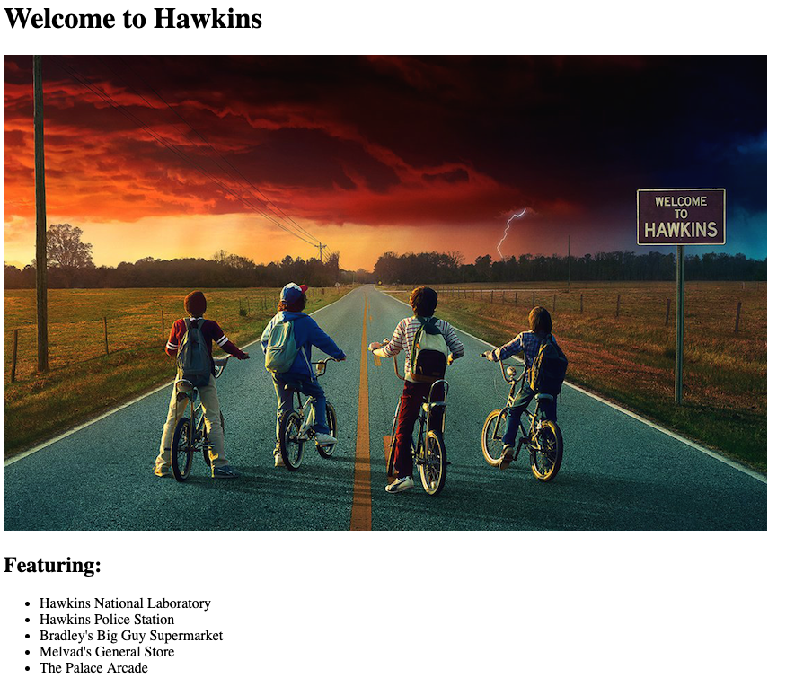

# 

| Title | Type | Duration | Author |
| -- | -- | -- | -- |
| DOM Manipulation | Lesson | 1:45 | Sonyl Nagale (adapted from SEI, Karolin Rafalski) |

# DOM Manipulation

## Lesson Objectives
*After this lesson, students will be able to:*
- Define the Document Object Model (DOM).
- Explain what role the DOM plays in a webpage.
- Relate HTML elements as parents, children, and siblings.
- Identify common DOM manipulation patterns:
 	- Query for an element.
 	- Edit an element.
 	- Add an element.
 	- Remove an element.
- Use DOM commands to interact with a page.

### Instructor Prep
*Before this lesson, instructors will need to:*
- Read through the lesson.
- Add additional instructor notes as needed.
- Edit language or examples to fit your ideas and teaching style.
- Open, read, run, and edit (optional) the starter and solution code to ensure that it's working and you agree with how the code was written.

### Lesson Guide

| TIMING  | TYPE  | TOPIC  |
|:-:|---|---|
| 5 min  | Introduction | DOM Manipulation |
| 20 min  | Demo  | Set Up |
| 20 min | Demo | The DOM |
| 20 min | Demo | DOM Manipulation |
| 30 min  | Group Practice  | DOM Command Vocabulary |
| 5 min  | Conclusion | Summary |

## Intro (5 min)

In this lesson, we'll learn about the mighty **Document Object Model** (DOM), which is used to make websites dynamic and responsive to people's actions.

---

## Set Up (20 min)

### Stranger Code-Alongs

Let's write some code together to create a little website for Hawkins, Indiana. Get started with the following instructions on your terminal:

1. `mkdir dom_intro`
2. `cd dom_intro`
3. `touch app.js`
4. `touch index.html`
5. Open the folder in your text editor.
    * `atom .` (if you're using Atom Text)

**`app.js`**

Open the `app.js` file and enter the following code:

```js
console.log('stranger things are coming!');
```

**`index.html`**

Open `index.html` and insert the HTML5 boilerplate:

> **Pro tip**: A lot of text editors have shortcuts or snippets for this! Be sure to check yours.

```html
<!DOCTYPE html>
<html lang="en" dir="ltr">
  <head>
    <meta charset="utf-8">
    <title></title>
  </head>
  <body>

  </body>
</html>
```

1. Set the title to `Hawkins` inside the `<title>` tag in the `head`.

2. Create an `h1` inside the `<body>` tag that contains the text `Welcome to Hawkins`.

3. Create a `div` below the `h1` with a class of `container`.

**`index.html` => `body` => `div.container`**

4. Create an `img` with an `src` of `https://londontheinside.com/wp-content/uploads/2017/11/StrangerThings2.png` and an `alt` of `Welcome to Hawkins`.

5. Create an `h2` with text `Featuring`.

6. Create an unordered list (`ul`) that looks like this:

  ```html
  <ul>
    <li>Hawkins National Laboratory</li>
    <li>Hawkins Police Station</li>
    <li>Bradley's Big Guy Supermarket</li>
    <li>Melvad's General Store</li>
    <li>The Palace Arcade</li>
  </ul>
  ```

7. In the `<head>` tag, add:

    `<script src="app.js" charset="utf-8"></script>`

8. Check your work.

Our HTML so far should look like this:

  ```html
  <!DOCTYPE html>
  <html lang="en" dir="ltr">

  <head>
    <meta charset="utf-8">
    <title>Hawkins</title>
    <script src="app.js" charset="utf-8"></script>
  </head>

  <body>
    <h1>Welcome to Hawkins</h1>
    <div class="container"></div>

    

    <h2>Featuring:</h2>

    <ul>
      <li>Hawkins National Laboratory</li>
      <li>Hawkins Police Station</li>
      <li>Bradley's Big Guy Supermarket</li>
      <li>Melvad's General Store</li>
      <li>The Palace Arcade</li>
    </ul>

  </body>

  </html>
  ```

9. Load `index.html` in the browser.

- Here's the expected appearance:



### Let's Check It Out

`command option i` to open the Chrome Developer Console.

Here, you can see the HTML you wrote actually being used by the browser! We can also draw our HTML as a tree, with the `document` as the parent and then have parent and child relationships, as well as sibling relationships.


- The `head` and `body` are children of the `document`.
- The `body` is the parent element to `h1` and the `div`, with a class of `container`.
- The `h1` element and the `container` element are siblings.
- Additionally, the `li` elements are each other's siblings.

> **Think**: What relationship does the `img` have with the `h3`? What about the `img` and the `div` with the class of `container`?

Being able to relate the different elements in this way is often referred to as **traversal**, and there are JavaScript methods that will help you access the element you want. Oftentimes, you'll want to target the child elements or the parent element, rather than the element itself. This will become more apparent as you start to build more complex things.

---

## The DOM (20 min)

DOM stands for **Document Object Model**.

When we send HTML to a browser, as we did with our mini Hawkins site, the browser renders the HTML (i.e., displays it in a window) and creates a giant object that represents the webpage. If you are a fan of _Stranger Things_, you could almost think of the DOM as The Upside Down, a parallel world that's only visible to some (but unlike The Upside Down, the DOM isn't evil).

As web developers, we can interact with this object (the DOM) and make changes to it. The browser will then redraw the webpage to reflect the changes we made to the DOM.

Open the console in Chrome Developer Tools:

`Ctrl Command J`


All webpages start with a root of `document`.

As we start to type `document` in the Chrome console, we see that it can be autocompleted, because it exists:


We can go one deeper into the body (don't forget to press the up key to get your previous line):


And deeper...

We can see that the children of the body are an `h1` element; a `div` with a class of `container`:


We can keep going deeper and deeper...


This way of accessing elements in the `document` requires a **lot** of typing and that you always map out your webpage. And, if you change anything around on your page, the route will likely break (this is a great example of fragile code). So, if you moved the `h2` element above the `img`, it would be:

`document.body.children[1].children[0].innerText`

Instead of hard-coding our access to different elements, the browser has some built-in methods to find the element we're looking for. This is called **querying**.

We can query the `document` for the `h1` element and change the text inside (referred to as a key-value property of `innerText`) this element. When we change it in the DOM, it will also update the browser view:

```js
document.querySelector('h1').innerText = 'Welcome to the Upside Down';
```


As we can see as we've updated the DOM in the console, it has also updated our view in the webpage.

> What does that syntax remind you of? It should be reminiscent of how we access and set properties of objects using dot notation. Remember, it's the Document **Object** Model; the DOM is just a giant object and we can access elements (aka, properties of it) just like any other old object.

**Bonus**

We can go to any website, such as CNN, look for a specific header, and change it to say `Everyone agrees, General Assembly is the Best!` However, will our changes be permanent? Will we get in trouble with CNN?

You could also think about how a Chrome extension such as an ad blocker could target (aka, query for) ads and hide them.

Let's refresh our page and see that we've switched back to Hawkins. Whatever changes we make in the Chrome console aren't permanent.

> **Remember**: `Command+r` will do a refresh. Also, sometimes you'll need a `hard` refresh, which you can do with `command_shift+r` (this will also clear your cache).

We can also manipulate the DOM from a `js` file.

Let's grab that code from above and return to The Upside Down:

```js
document.querySelector('h1').innerText = 'Welcome to The Upside Down';
```

Uh oh! It didn't work:


This is because the `document` is being read from top to bottom, and our JavaScript is running before our `h1` has loaded.

There are a couple of ways to solve this. For now, let's move our link to our `app.js` to right before the closing `<body>` tag:

  ```html
  <!DOCTYPE html>
  <html lang="en" dir="ltr">

  <head>
    <meta charset="utf-8">
    <title>Hawkins</title>
    <script src="app.js" charset="utf-8"></script>
  </head>

  <body>
    <h1>Welcome to Hawkins</h1>
    <div class="container"></div>

    

    <h2>Featuring:</h2>

    <ul>
      <li>Hawkins National Laboratory</li>
      <li>Hawkins Police Station</li>
      <li>Bradley's Big Guy Supermarket</li>
      <li>Melvad's General Store</li>
      <li>The Palace Arcade</li>
    </ul>

  </body>

  </html>
  ```

Now, when we refresh our page, we should see our updated `h1`.

---

## DOM Manipulation (20 min)

- JavaScript was built to manipulate the DOM.
- Early JavaScript was challenging to use for complex projects and, although all of the basic functionality was built in, creating solutions could be verbose and clunky.
- JavaScript has been changing, and much better functionality has been built in.

#### Querying and Storing the Queried Element

It's a common pattern to query for an element and then store it in a variable for reuse.

- Let's query for the image:

`const image = document.querySelector('img');`

Instead of querying over and over again, we now have our image stored in a variable. Let's `console.log()` it!

`console.log(image)`


#### Changing CSS With JavaScript

Sometimes, you'll want to add or remove a class to change a page's appearance. Sometimes, you'll want to do it inline with JavaScript. For now, let's do it inline.

We can now manipulate our image:

Let's make it disappear!

`image.style.display = 'none';`

Let's make it reappear!

`image.style.display = 'block';`

Let's make it black and white!

`image.style.filter = 'grayscale(100%)';`

Let's set the width to 95%!

`image.style.width = '95%';`

Finally, let's make it color again!

`image.style.filter = '';`

There are tons of different things you can do. It's important to note how easy it is to reuse a queried element and manipulate it when you store it to a variable.

#### Creating an Element

We can create a new element.

Let's add a new image:

`const eggos = document.createElement('img');`

Where is it?

In the Chrome console:


Although we created the element, we haven't appended it anywhere to the DOM.

Let's add those Eggos to the `div` with a class of `container`.

`document.querySelector('.container').appendChild(eggos);`

Yeah, wait! Where is our image? We can see the tag is appended after the `ul` in the Chrome console:


But it has no attributes. We have to give it an `src` attribute with an image.

#### Set an Attribute

Many elements have attributes; you can add, edit, and remove them using JavaScript.

`eggos.setAttribute('src', 'https://i.ytimg.com/vi/TgSmPqMGk2g/maxresdefault.jpg');`

They are huge! Let's shrink them down a bit.

`eggos.style.width = '100%';` You could also target this element and style it in a CSS file.

#### Remove an Element

Getting rid of an element is easy:

`eggos.remove();`

#### Working With a Collection

What if we have more than one element of the same kind?

We have a few list items; let's grab them!

`document.querySelector('li');`

Oh snap! We only got our first element:


To get all of our elements, we have to use a different method:

`document.querySelectorAll('li');`

Now we get a `NodeList`:


This list is like an array, so we can access the first `li` ("Hawkins Laboratory") and change its text to be `"Demo Dog Hangout"`:

`document.querySelectorAll('li')[0].innerText = 'Demo Dog Hangout'`


Let's try a different one:

`document.querySelectorAll('li')[4].style.color = 'hotpink';`

What did we change there?

Last one: Let's remove Melvad's.

When we remove it, will The Palace Arcade lose its new color?

`document.querySelectorAll('li')[3].remove();`

---

## DOM Command Vocab (30 min)

Hopefully all of that practice accessing objects and the elements within them is also helping us understand how to access the DOM!

#### Common JavaScript DOM Commands

DOM commands fall into a few broad categories based on their use for:

* Searching/retrieving elements on the page.
* Creating new elements.
* Editing the DOM.
* Traversal (related to search) — navigating the DOM.

We will only need a small handful of these commands for now, and most of them we covered in the lesson above!

Let's get into four groups. I'll assign each group one of these categories of DOM commands. Your task is to research the most commonly used terms in that category, what each one does, and when you'd use them. I've already done some of the work for you and suggested some important commands for each category.

Take a few minutes to research, then each group will present to the class.

* **Search**
  * `document.querySelector()`
  * `document.getElementById()`
  * `document.getElementsByClassName()`
  * `document.getElementsByName()`

* **Creation**
  * `document.createElement()`
  * `node.style`

* **DOM Editing**
  * `node.appendChild()`
  * `node.removeChild()`
  * `node.innerText`
  * `node.setAttribute()`
  * `node.innerHTML`
  * `node.id`
  * `node.classList`

* **Traversal**
  * `node.childNodes`
  * `node.children`
  * `node.firstChild`

### Before You Get Started...

You might be asking: what is a **node**?

A node is the generic name for any type of object in the DOM hierarchy. A node could be one of the built-in DOM elements, such as `document` or `document.body`; it could be an HTML tag specified in the HTML, such as `<input>` or `<p>`; or it could be a text node that's created by the system to hold a block of text inside another element. In a nutshell, a node is any DOM object.

> Information about nodes was gathered from [here](https://stackoverflow.com/questions/9979172/difference-between-node-object-and-element-object).

---

## Summary (5 min)

Manipulating the DOM becomes a lot more complicated from here, but these are the basic actions and commands you'll need to get started.
