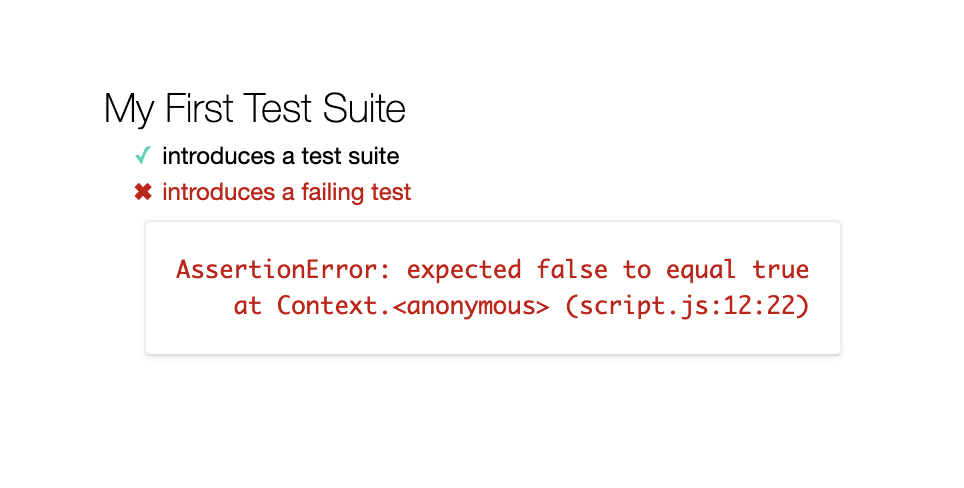

| Title | Type | Duration | Author |
| -- | -- | -- | -- |
| Testing With Mocha and Chai | Lesson | 1:30 | Sonyl Nagale (adapted from SEI) |

#  Testing With Mocha and Chai

### Learning Objectives

*After this lesson, students will be able to:*
- Use Mocha and Chai to write tests for JavaScript code.
- Identify the three things you need to know about any function in order to test it.
- Explain the concept of "black-box testing."

### Lesson Guide

| TIMING  | TYPE  | TOPIC  |
|:-:|---|---|
| 5 min  | Opening  | Mocha and Chai |
| 5 min  | Introduction  | Why Unit Test |
| 10 min | Demo  | An Example |
| 10 min | Demo  | A Better Example |
| 10 min | Introduction | Black-Box Testing |
| 45 min | Independent Practice | Mocha and Chai |
| 5 min  | Conclusion  | Review/Recap |

----

## Overview (5 min)

- [Mocha](https://mochajs.org/) is a feature-rich JavaScript test framework that makes asynchronous testing easy and allows us to choose our own assertion library.

- [Chai](http://www.chaijs.com/) is a Behavior-Driven Development (BDD)/Test-Driven Development (TDD) assertion library for Node.js and the web browser, which can be paired with any JavaScript testing framework (e.g., Mocha).

The two of them work together to make it easy to test your JavaScript code.

---

## Why Unit Test (5 min)

There are many reasons to unit test. Here are a few:

1.  It improves the quality of your code and allows for more agile development so that, when you refactor your code, you can do so more safely, because you have tested components of your code. In this way, you can verify individual units of code when testing the whole application and make it easier to debug.  
2.  It helps you design your code, because you have to think about all of its relative inputs and outputs.
3.  It assists in debugging code: When a test fails, you know that it's because of recent changes to your code.
4.  It reduces the cost of software development: It's much easier to fix bugs early in development versus in late stages, which may cause huge — costly — refactoring.

---

## An Example (10 min)

Take a look at the [`example-code-1`](./example-code/example-1) directory.

Here are the contents of `script.js`:

```js
mocha.setup('bdd');
const assert = chai.assert;
const expect = chai.expect;

//A basic test
describe("My First Test Suite", function() {
  it("introduces a test suite", function() {
    expect(true).to.equal(true);
  });

  it("introduces a failing test", function() {
    expect(false).to.equal(true);
  })
});

mocha.run();
```

If you open `index.html` in the browser, you should see this:



### Dissecting the Example

Our first tests passes with flying colors, as noted by the green check mark. This shouldn't be too surprising, because here's our test:

`expect(true).to.equal(true);`

This is an example of a [**Chai expect**](https://www.chaijs.com/api/bdd/), which, as you can see, is pretty legible. It uses a **language chain** for readability and simply states that the program expects `true` to equal `true` — which it does.

Let's take a look at our second test, which is failing:

`expect(false).to.equal(true);`

Conversely, we would never expect `false` to equal `true`, so our test fails. Welcome to testing!

---

## A Better Example (10 min)

Let's take a look at a slightly more real-world example: [example-2](./example-code/example-2) (well, as "real world" as Pig Latin can be...):

```js
function pigLatin(phrase) {
  const pigLatinWords = [];

  phrase.split(' ').forEach((word) => {
    const firstLetter = word.substring(0, 1);
    word = word.substr(1);
    pigLatinWords.push(`${word}-${firstLetter}ay`);
  });

  return pigLatinWords.join(' ');
}

describe("Testing pigLatin", function() {
  it("Converts 'hello world' into pig latin", function() {
    expect(pigLatin("hello world")).to.equal("ello-hay orld-way");
  })
});

```

If you're not familiar with the word game Pig Latin, the structure is simple: For each word, place its first letter at the _end_ of the word and append an `ay`. So, `"hello world"` becomes `"ello-hay orld-way"`.

To test our `pigLatin()` function, we can see that we're evaluating the return result of the function against a given known value: `"ello-hay orld-way"`.

---

## Black-Box Testing (10 min)

Here's something interesting about testing: _You don't have to understand the function being tested_. So far, we haven't done work with `split()`, `forEach()`, or the two substring functions in the tests above, but that's not important! We just need to know three things:

1. The name of the function to test.
2. The values (`args`) to send to the function.
3. The expected return value.

This may seem odd, but it's actually a common practice when working on a team. One engineer may write the core logic, and perhaps a QA engineer or an SDET (Software Development Engineer in Test) writes the testing logic. For this division of labor, the two parties establish a **development contract** addressing the three points above. In essence, the logic of the function is a _black box_: We don't _need_ to know anything about it!

A development contract can be as simple as comments in the code. Let's look at an example in JSDoc format:

```js
/**
 * pigLatin
 *
 * Takes a string of words separated by spaces and converts the string to Pig Latin.
 * Pig Latin takes the first letter of a word, places it at the end
 * of the word with a dash, and appends the string 'ay' to the word.
 *
 * @param {string} phrase — a string of words separated by spaces.
 * @return {string} — the phrase parameter converted into Pig Latin.
 *
 * @example
 *
 *  const result = pigLatin('I love JavaScript')
 *  // result: "I-ay ove-lay avaScript-Jay"
 */
function pigLatin(phrase) {
  // Contents ...
}
```

When we have a description of _what_ the function does, we don't need to understand its nitty-gritty inner logic. As long as we know a valid input and a valid output, we can write our tests.

---

## Independent Exercise (50 min)

Let's put all of this into practice.

Remember our [Functions lab](https://git.generalassemb.ly/GA-Cognizant/javascript-and-apis/tree/master/javascript-functions-lab)? We're going to create a test suite for the functions you wrote.

As a refresher, here are the requirements for that lab:
1. Define a function, `maxOfTwoNumbers()`, that takes two numbers as arguments and returns the largest of them. Use the `if...else` syntax available in JavaScript. Do some googling to figure this out if you forget how conditionals work.
2. Define a function, `maxOfThree()`, that takes three numbers as arguments and returns the largest of them.
3. Write a function, `isCharacterAVowel()`, that takes a character (i.e., a string of length `1`) and returns `true` if it is a vowel and `false` otherwise.
4. Define a `sumArray()` function and a `multiplyArray()` function that sum and multiply (respectively) all of the numbers in an array of numbers. For example, `sumArray([1,2,3,4])` should return `10`, and `multiplyArray([1,2,3,4])` should return `24`.
5. Write a function that, when called, returns the number of arguments passed to the function.
6. Define a function, `reverseString()`, that reverses a string. For example, `reverseString("jag testar")` should return the string `"ratset gaj"`.
7. Write a function, `findLongestWord()`, that takes an array of words and returns the length of the longest word in the array.
8. Write a function, `filterLongWords()`, that takes an array of words and a number, `i`, and returns a new array of words that are longer than `i` characters.

> **Hint**: Do you know the difference between deep equality and shallow equality? Deep equality is for when we actually want to compare the values of a complex type in JavaScript. You should know that Chai has `equal` for shallow equality (used on primitive types, such as numbers, strings, Booleans, nulls, and undefineds) and `eql` for deep equality (used for anything else). You will need `eql` for No. 8, as arrays refer to *memory addresses*, but we actually want to compare and check the values of the array. You can find more information in [Chai's docs](https://www.chaijs.com/api/bdd/#method_eql)!

### Solution

All done? Check your answer below!

<details>
    <summary>Solution Code</summary>

Does your test suite look similar to this?

```js
describe("Functions Lab Test Suite", function() {
  it("Max of 123 and 79 is 123", () => {
    expect(maxOfTwoNumbers(123, 79)).to.equal(123);
  });

  it("Max of 23, 135, and 13 is 135", () => {
    expect(maxOfThree(23, 135, 13)).to.equal(135);
  });

  it("a is a vowel", () => {
    expect(isCharacterAVowel('a')).to.be.true;
  });

  it("b is not a vowel", () => {
    expect(isCharacterAVowel('b')).to.be.false;
  });

  it("sumArray([1,2,3,4]) == 10", () => {
    expect(sumArray([1, 2, 3, 4])).to.equal(10);
  });

  it("multiplyArray([1,2,3,4]) == 24", () => {
    expect(multiplyArray([1, 2, 3, 4])).to.equal(24);
  });

  it("numberOfArguments(a,b,c,d) == 4", () => {
    expect(numberOfArguments("a", "b", "c", "d")).to.equal(4);
  });

  it("numberOfArguments(a,b,c,d) != 5", () => {
    expect(numberOfArguments("a", "b", "c", "d")).to.not.equal(5);
  });

  it("reverseString('jag testar') === 'ratset gaj'", () => {
    expect(reverseString('jag testar')).to.equal('ratset gaj');
  });

  it("altReverseString('jag testar') === 'ratset gaj'", () => {
    expect(altReverseString('jag testar')).to.equal('ratset gaj');
  });


  it("findLongestWord(['hello', 'world!']) === 6", () => {
    expect(findLongestWord(['hello', 'world!'])).to.equal(6);
  });

  it("filterLongWords(['hello', 'world!', 'supercalafragalisticexpealidocious'], 5) === ['world!', 'supercalafragalisticexpealidocious']", () => {
    expect(filterLongWords(['hello', 'world!', 'supercalafragalisticexpealidocious'], 5)).to.eql(['world!', 'supercalafragalisticexpealidocious']);
  });
});
```

</details>

----

## Conclusion (5 min)

Testing may sound intimidating and difficult, but hopefully, by playing around with it a little bit and knowing a few simple rules, you'll see that it can be fun (or grunt work), depending on the camp in which you fall!

Remember, all you need to know to write a test is:
1. The name of the function you're testing.
2. The inputs for the function (the `args` it expects).
3. The output for the function (what it returns back to you).

## Resources

*  [Eight Benefits of Unit Testing](https://dzone.com/articles/top-8-benefits-of-unit-testing)
*  [Is Unit Testing Worth It?](https://stackoverflow.com/questions/67299/is-unit-testing-worth-the-effort)
*  [Top Benefits of Unit Testing](https://apiumhub.com/tech-blog-barcelona/top-benefits-of-unit-testing/)
