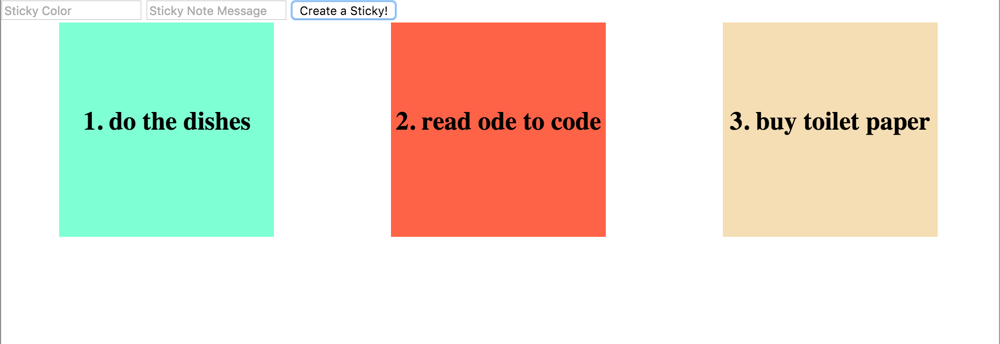

#  Closures

| Title | Type | Duration | Author |
| -- | -- | -- | -- |
| Closures | Lesson | 1:00 | Sonyl Nagale (adapted from SEI) |

## Objectives

_After this lesson, students will be able to:_

- Understand and explain JavaScript context.
- Understand and explain closures.

## Student Preparation

_Before this lesson, students should already be able to:_

- Create a function.
- Explain scope.
- Manipulate the DOM.

### INSTRUCTOR PREP
*Before this lesson, instructors will need to:*
- Read through the lesson.
- Add additional instructor notes as needed.
- Edit language or examples to fit your ideas and teaching style.
- Open, read, run, and edit (optional) the starter and solution code to ensure that it's working and you agree with how the code was written.

### Lesson Guide

| TIMING  | TYPE  | TOPIC  |
|:-:|---|---|
| 5 min  | Introduction | Closures and Context|
| 5 min  | Review  | Scope |
| 15 min  | Demo  | Scope Chains |
| 15 min  | Demo  | Closures |
| 15 min | Independent Practice | Create a Closure |
| 15 min  | Bonus: Guided Practice  | Closure Brain Teaser |
| 5 min | Conclusion | Summary |

---

## Introduction to Closures and Context (5 min)

Today, we're going to talk about a couple features of JavaScript that make it unique from other languages: _closures_ and _context_. Closures and context are definitely used in many languages other than JavaScript, but it's the way JavaScript handles them that makes it unique. Context and closures are often thought of as the most hard-to-grasp JavaScript concepts, but we'll break down this lesson to cover them one topic at a time, followed by plenty of independent practice and brain teasers. Let's get cracking!

---

## A Review of Scope (5 min)

As we have learned previously, JavaScript implements a concept of **scope**. If you don't fully remember, scope is synonymous with variable access; in other words, the scope of our executed code will dictate which variables we have access to and can ultimately use at the time of execution. The two types of scope we touched on were global and local.

**Global scope**:

```js
const a = 1

function foo() {
  console.log(a)
}

foo() // 1
```

If you declare a variable _outside_ of all functions, it becomes globally scoped, meaning it can be accessed from anywhere within the execution environment. In the example above, `foo()` logs the value for the global variable `a`.

**Local scope**:

```js
function bar() {
  const b = 'local value'
  console.log(b)
}

bar() // 'local value'

console.log(b) // b is not defined
```

Variables declared _inside_ of a function exist in local scope and can only be accessed from within the function in which they were declared. This is why, when we run `bar()`, our log of `b` gives us `'local value'`, but when we try to access `b` outside of that scope, we get `b is not defined`.

---

## Scope Chains (15 min)

The scoping rules work the same when there are functions nested inside of other functions: Each function gets its own local scope, and variables in that scope can only be accessed from the _lines of code_ within the function in which they were declared. This is called **lexical scope**.

To phrase it differently, inner functions can access variables in the scope of their outer function, but the reverse isn't true: Outer functions _cannot_ access the scope of an inner function.

For example:

```javascript
function someFunc() {
  const outerVar = 1;
  function zip() {
    const innerVar = 2;
  }
}
```

`zip()` has access to both `innerVar` and `outerVar`, but `someFunc()` only has access to `outerVar`.

### Multiple Nested Scopes

Nesting isn't limited to a single inner scope. There can be multiple nested scopes, each of which adhere to the rules above. There is one addition: Sibling scopes are _also_ restricted from accessing each other's variables.

For example:

```javascript
function someFunc() {
  function zip() {
  }
  function quux() {
  }
}
```

`zip()` & `quux()` are both inner scopes of `someFunc()`. Just as `someFunc()` cannot access `zip()`'s variables, `zip()` cannot access `quux()`'s variables (and vice versa).

### Scope Tree

Looking at the nesting top-down, we can diagram a **scope tree**.

This code:

```javascript
function someFunc() {
  function zip() {
    function foo() {
    }
  }
  function quux() {
  }
}
```

Produces this tree:

```
    global
       │
       ↓
   someFunc()
       │
      ╱ ╲
     ╱   ╲
    ↓     ↓
  zip() quux()
    │
    ↓
  foo()
```

If we remember that inner scopes can access the outer scope's variables, but *not* vice versa (`foo()` can access `zip()`'s variables, and `zip()` can access `someFunc()`'s variables), then it makes more sense to look at the tree from the bottom up, which forms...

### Scope Chains

Looking from the innermost to the outermost scope forms a **scope chain**:

```
    global
       ↑
       │
   someFunc()
       ↑
      ╱
     ╱
  zip()
    ↑
    │
  foo()
```

---

## Closures (15 min)

Let's say `someFunc()` declares a variable, `bar`:

```
    global
       ↑
       │
   someFunc()
    var bar
       ↑
       ⋮
```

Given how nesting scope works, it's possible for an inner scope within `someFunc()` to access `bar`. In this example, let's say `zip()` accesses `bar`:

```
    global
       ↑
       │
   someFunc()
    var bar
       ↑
      ╱
     ╱
   zip()
alert(bar)
    ↑
    ⋮
```

Then, `zip()` is said to _close over_ `bar`. Therefore `zip()` is a **closure**. The term "closure" may sound scary, but the idea is straightforward: A **closure** is a function that has access to its parent's scope. In this example, `zip()` has access to `bar`. It's as simple as that!

The closure will be maintained even if `zip()` isn't executed immediately. It's perfectly legal in JavaScript to pass `zip` around or return it from `someFunc()` for later execution. All the while, `bar` will continue to be available.

This continues down the scope chain. Say `zip()` declares a variable, `beep`, and `foo()` alerts it out:

```
    global
       ↑
       │
   someFunc()
    var bar
       ↑
      ╱
     ╱
   zip()
alert(bar)
 var beep
    ↑
    │
   foo()
alert(beep)
```

Now we have two closures: One for `zip()`, which closes over the `bar` variable, and one for `foo()`, which closes over both variables, `bar` and `beep`.

To put it another way: Both `bar` and `beep` are _in scope_ of `zip()` and `foo()`.

Only `bar` is in scope of `someFunc()`, and neither `bar` nor `beep` are in the `global` scope.

**Here's a more practical example:**

```html
<button>Click Me!</button>
```

```js
document.addEventListener('DOMContentLoaded', function() {
  let count = 0;

  document.querySelector('button').addEventListener('click', function() {
    alert(count);
  });
});
```

The `click` handler closes over the `count` variable and continues to have access to that variable no matter how many times the user clicks on the `<button>`.

Note that, because `count` is declared inside the outer function, it is _not_ available in the `global` scope.

We can then extend the code to increase the count each time the button is clicked:

```html
<button>Click Me!</button>
```

```js
document.addEventListener('DOMContentLoaded', function() {
  let count = 0;

  document.querySelector('button').addEventListener('click', function() {
    count++;
    alert(count);
  })
})
```

Because the `count` variable is in an outer function and is closed over by the inner function, any modifications made to it anywhere along any of the scope chains leading to it are reflected in every closure:

```html
<button id="increase">Increase Number +</button>
<button id="show">Show Me!</button>
```

```js
document.addEventListener('DOMContentLoaded', function() {
  let count = 0;

  document.querySelector('#increase').addEventListener('click', function() {
    count++;
  });

  document.querySelector('#show').addEventListener('click', function() {
    alert(count);
  });
})
```

Here we have two scope chains:

1. `#increase`'s `click` function -> `DOMContentLoaded` function
2. `#show`'s `click` function -> `DOMContentLoaded` function

<!-- NOTE TO INSTRUCTOR: The scope chains also extend up to the `global` scope but hasn't been depicted here for ease of explanation. -->

Both close over `count` so, whenever it changes, both scope chains have access to the new value.

> **Note**: This sharing of a variable across closures can sometimes be the cause of unexpected bugs, due to the variable being unexpectedly modified by another scope chain.

### But Why?

Now that we know *what* closures do, let's take a moment to think about *why* we'd want to use them. Consider our example above, but with one small change. This time we'll put `count` in the global scope:

```js
let count = 0; // Global now!

document.addEventListener('DOMContentLoaded', function() {
  document.querySelector('#increase').addEventListener('click', function() {
    count++;
  });

  document.querySelector('#show').addEventListener('click', function() {
    alert(count);
  });
})
```

**Will we have any trouble accessing the value of `count` within our event handlers?**

Nope! The global scope is accessible by everyone. No problems for our event handlers! However... could this open us up to access we _don't_ want? Try the following:

1. Open your Chrome DevTools console.
2. Type `count = 4000000`.
3. Click the "Show" button.

What happened? We were able to just change that value without going through the proper channels (the buttons). Closures can be very useful when you have data and you want users to go through a certain set of steps in order to access or change it!

---

## Independent Practice: Create a Closure (15 min)

What better way to learn something than by doing it? For the next 15 minutes, make a closure that will help you create colored sticky notes dynamically in your DOM with the click of a button. The results should look something like:



The CSS is all set up for you in the [starter code](./starter-code/index.html).

Your tasks are to:

- Create input and button elements.
- Run JavaScript code only after the document is "ready" (`DOMContentLoaded`).
- Ensure that sticky note color and message are both dictated by user input.
- Make sure that each sticky note message starts with a number representing the order of its creation.

---

## (Bonus) Guided Practice: Closure Brain Teaser (15 min)

<!-- NOTE TO INSTRUCTOR: You might luck out with a couple of people, but most students don't know about IIFEs quite yet! Walk the class through the code below and try to get students talking about why this code is problematic, as well as potential solutions. -->

As we mentioned earlier, the ability for an inner function to reference an outer function variable can be dubious if that variable updates. Take a look at the following code:

```js
function queueCreator(waitList){
  let positionInQueue = 1

  for (let i = 0; i < waitList.length; i++) {
    waitList[i].id = function() {
      return positionInQueue;
    }
    positionInQueue++;
  }

  return waitList;
}

const people = [{name: 'George'}, {name: 'Chris'}];

const queueList = queueCreator(people);

queueList[0].id(); // 3?!
```

Here we have a `queueCreator()` function that helps us order all of our guests upon arrival. But, as we can see, the first person in our `queueList` is showing an incorrect `id`! The same goes for the second person. Your job for the next 15 minutes is to help fix this `queueCreator()` so that each guest is given their correct position in the list.

> **Hint**: You will need to create a closure that references a new position value each time the `for` loop is executed.

### Closure Brain Teaser Solution

Before we can cover the solution, we must first be able to explain the problem. Because the inner function accesses the outer function's variable _by reference_ (memory address) and not _by value_ (actual value), it grabs the latest updated value of `positionInQueue`. And, because the value of `positionInQueue` was incremented in a `for` loop that ran twice, its referenced value ended up being `3` (initial value of `1`, `+ 1 + 1`). How can we fix the code so that our closure uses the correct reference?

Here is a potential solution using _immediately invoked function expressions_ (IIFE). By immediately using the function, we can get the value _in the moment_ we expect when we are creating the queue, instead of calling the function later and using the later value:

```js
function queueCreator(waitList){
  let positionInQueue = 1;

  for (let i = 0; i < waitList.length; i++) {
    (function(position) {
      waitList[i].id = function() {
        return position;
      }
    })(positionInQueue) // IIFE
    positionInQueue++;
  }

  return waitList;
}

const people = [{name:'George'}, {name:'Chris'}];

const queueList = queueCreator(people);

queueList[0].id(); // 1
```

An IIFE (immediately invoked function expression) is a fancy way of saying that we are immediately _calling_ the function as soon as we're done defining it.

By immediately invoking the function commented with `IIFE`, we're instantly creating a new scope. The function takes a single parameter, `position`, which is a copy of the current value of `positionInQueue`. This takes advantage of the way JavaScript passes arguments by value, allowing the closure created by the `.id()` function to reference a unique, unchanging value for `position`.

An alternative solution, which also helps to explain how the above IIFE works, is to use any one of the built-in array iteration methods, such as `.forEach()`:

```js
function queueCreator(waitList){
  const positionInQueue = 1;

  waitList.forEach(function(item, index) {
    item.id = function() {
      return positionInQueue + index;
    }
  })

  return waitList;
}

const people = [{name:'George'},{name:'Chris'}];

const queueList = queueCreator(people);

queueList[0].id(); // 1
```

Here, the scope created by the function passed to `.forEach()` also contains a unique value for `index` every time it is executed, allowing the closure created by `.id` to close over the single unchanging value.

## Summary (5 min)

IIFEs and closures may sound a bit intimidating, but they are simpler to use than the fancy-sounding language would suggest, and they can be especially helpful when we're trying to maintain data integrity in cases of unexpected user access or unexpected behavior by JavaScript itself.
