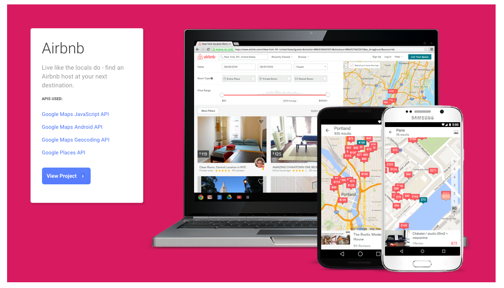
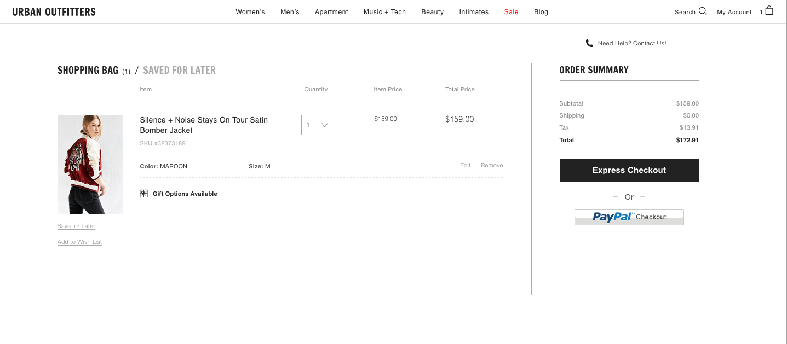
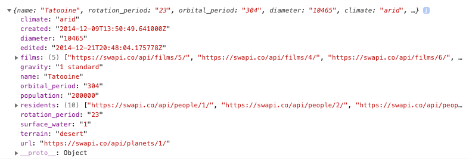
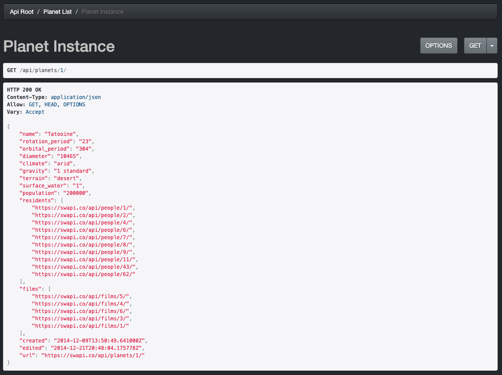
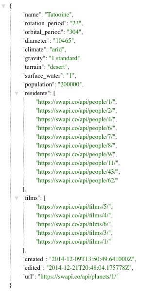
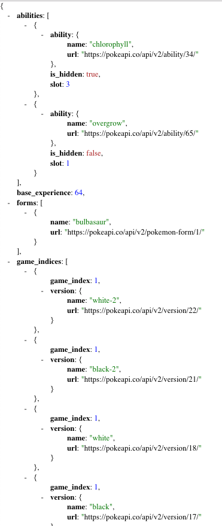

#  Introduction to APIs

| Title | Type | Duration | Author |
| -- | -- | -- | -- |
| APIs and AJAX | Lesson | 2:00 | Sonyl Nagale (adapted from SEI) |

## Learning Objectives

*After this lesson, students will be able to:*

- Describe application programming interfaces (APIs) and identify common use cases.
- Demonstrate the ability to read API documentation.
- Describe what AJAX is and why we might use it.
- Understand the format of AJAX data.
- Explain why APIs are useful.
- Use AJAX to call APIs.
- Interact with data returned from an API.

### Student Pre-Work

*Before this lesson, students should already be able to:*

- Use CSS selectors in JavaScript to select elements in the DOM.
- Use JavaScript and CSS selectors to:
	- Add and remove classes on DOM elements.
	- Get and set information inside DOM elements.
	- Change the value of attributes on DOM elements.
	- Write code to detect and react to a submit event.

---
<a name="opening"></a>
## Opening (5 min)

<!-- NOTE TO INSTRUCTOR: Use this time to review learning objectives and preview the lab that the students will work on later in this class. -->

In this lesson, we'll dig into how we can request data from an external application programming interface (API) using AJAX.

What is an API and why are they useful? Watch this short [video](https://generalassembly.wistia.com/medias/ntnzqxrij7) to find out.

---

<a name="intro-to-apis"></a>
## Intro to APIs (40 min)

Taken from HowStuffWorks.com:

"An application-programming interface (API) is a set of programming instructions and standards for accessing a web-based software application or web tool. A software company releases its API to the public so that other software developers can design products that are powered by its service... [it] is a software-to-software interface, not a user interface. With APIs, applications talk to each other without any user knowledge or intervention."

As you saw in the video, application programming interfaces (APIs) can be used to communicate between programs. While this is a very general definition that applies to many things, typically, when someone refers to "an API," what they really mean is a third-party web API that contains some data or functionality they want to access. Perhaps you have an API that fetches the current weather conditions or grabs a random inspirational quote and you want to use that data in your own application.

> Note: You may hear an API referred to as an "application program interface." This means the same thing!

### When Do We Want to Use APIs?

When do we want to use APIs?

Let's explore a few examples of when it would be useful to pull data from an external API.

#### Maps

We may want to incorporate an interactive map into our website, but it would take a lot of time and effort to do it ourselves.

Instead, we can use the Google Maps API to integrate the functionality of Google Maps into our site.

Even large companies such as WhatsApp and Airbnb use the Google Maps API.



Why bother recreating a map from scratch when we can use a platform that contains a variety of features and is maintained by a team of expert developers?

#### Social Media Integration

If we want to integrate social media sharing into our site, we can use the Twitter or Facebook APIs. This allows our users to log in with their existing social media accounts and saves us from having to create our own social media platform.

#### Payment System

If we want to integrate a secure payment system into our site, we can make use of a payment API such as PayPal or Stripe.



This allows our customers to make payments using the trusted accounts they've already set up.

#### Turn and Talk

Now that you know what APIs do, partner with a classmate and visit a few of your favorite websites. Which ones might use APIs and for what purposes? Think about payment, maps, social, weather, and location (just to name a few). For example, maybe your favorite clothing store has a social and/or payment API, so you can buy that next great piece of couture _and_ let your friends know about it!

### What Can APIs Do?

The first thing we need to find out when looking at an API is _what_ it can do.

Every API can be used to complete different tasks. When we want to solve a particular problem, we need to research what different APIs can do so that we pick the right tool for the job.

- The Facebook and Twitter APIs allow us to access and update profiles, as well as create status updates.
- The Spotify API allows us to find another user's playlists or add and remove tracks from a playlist we create on our own.

**How Do We Find Out What an API Can Do?**

Easy! We check out its documentation. You will always need to check the documentation for how to get started using an API. There may be some setup required, such as getting an API key (for authentication — more on that later!) and discovering what methods are available for use.

### Instructor-Led Documentation Deep Dive

Let's take a look at the [Pokemon API](https://pokeapi.co/docs/v2.html) together.

* How do I get started? <!-- No set up for this one! -->
* Do I need a key? <!-- Nope, no key needed! -->
* Can I access the data in the browser? <!-- Yeah. PokeAPI has an in-page tool, or you can show in the browser. Try putting this link into the browser for the demo: https://pokeapi.co/api/v2/pokemon/1. -->
* Um... isn't this supposed to be [Bulbasaur](https://pokeapi.co/api/v2/pokemon/1)? What is all this mess in my browser?

APIs typically return data in the JSON format. JSON stands for **JavaScript Object Notation**. JSON is great for our programs but can look like a bit of a mess to humans. To make this a little easier to read, we recommend using a Chrome plug-in such as [JSONView](https://chrome.google.com/webstore/detail/jsonview/chklaanhfefbnpoihckbnefhakgolnmc?hl=en) so you can see the JSON object color-coded and with whitespace!

> **Tip**: Once you install JSONView, check your extensions and make sure it is *enabled*!

Try refreshing your Bulbasaur page now. There's still a lot of information, but it's in a more digestible format. You can minimize nested objects (such as the abilities) so that you can see other properties more clearly.

### Turn and Talk

Spend two minutes discussing the following with a partner:

Describe APIs. How would you help a non-technical person understand what an API is? List a few examples of when it would be helpful to use an external API.

---
## AJAX (5 min)

## AJAX

**So, We've Defined an API. Now What?**

How can we use an API to dynamically manipulate the DOM with the given data? There are a few different methods we can use, from third-party libraries to methods built into ES6.

**AJAX**, which stands for "Asynchronous Javascript and XML," is the method through which we are able to make HTTP requests. This is what we'll be using! The standard requests we'll be investigating are `GET`, `POST`, `PUT`, and `DELETE`, although we'll be working with `GET` for ease of use, as it doesn't require signing up for an account or any other authentication.

The method of generating an AJAX call we'll focus on is **`fetch`**. As you'll come to learn, this allows us to build single-page applications that do not require refreshes.

<details>
    <summary>Aside: What is XML?</summary>

XML stands for "Extensible Markup Language" and, if you've ever seen it, you might think it looks a lot like HTML (Hypertext Markup Language) but with more generic-sounding tag names. This is because HTML is a subset of XML!

It used to be quite common for APIs to return data in this format. However, it was a bit of a pain to deal with information that was so difficult to parse, so it's become a lot more common to just use the JSON format instead.

Look at that, you just got a mini-history lesson!

</details>

---
## Retrieving Data From an API Using AJAX (50 min)

There are four main HTTP verbs that are commonly used when dealing with APIs:

| Type of Request | What Does It Do? |
| --------------- | ------------- |
| `GET`           | Read          |
| `POST`          | Create        |
| `PUT`           | Update        |
| `DELETE`        | Delete        |

We'll focus on `GET`, as most public APIs require authentication for the other verbs.

### Asynchronous vs. Synchronous

What is a synchronous operation?

* **Sync**: A synchronous operation runs immediately after the previous operation, and the subsequent operation is not run until after the synchronous operation is complete. This is no problem if the operation is immediate (i.e., dependent only on values already present in the environment). However, any operations that take significant time to complete (i.e., require interaction with some outside resource) will block subsequent operations. Because JavaScript is single-threaded (can only do one thing at a time), blocking operations jam up the entire application, making for an intolerable user experience.

What is an asynchronous operation?

* **Async**: JavaScript environments (e.g., Node.js and browsers) provide built-in utilities for doing work that takes time without blocking subsequent calls. The fundamental concept that permits this is the **callback**: A function provided to the built-in utility that the utility knows to execute when the long-running operation is complete. The environment then takes care of executing the callback when the operation completes and the environment is not occupied with other work. To understand "not occupied with other work," consider a coffee shop (for example): The cashier has two jobs, taking orders (sending them to the kitchen) and serving the drinks as they come out. "Not occupied with other work" just means that, if the cashier is taking a new order, the kitchen will wait until the cashier is free to ask them to serve the drink.

As part of the main power of AJAX is its ability to deal with asynchronicity, we'll focus on asynchronous examples.

### An Asynchronous Example

Let's take a look at an example call using `fetch`, which was standardized in ES6. It's a standard asynchronous call that retrieves data from the Star Wars API (SWAPI) to retrieve information on (in this case) the first planet we see in the Star Wars canon: Tatooine.

```js
fetch('https://swapi.co/api/planets/1/')
  .then((response) => {
    return response.json();
  })
  .then((response) => {
  	console.log(response);
  })

```
When using `fetch`, we can omit the HTTP verb `GET` if we're making a simple request like this. However, `fetch` can also take an object of options to configure the request.

If we execute our `fetch`, we'll see this in our console:



Even though AJAX has "XML" as part of its acronym, JSON is more commonly used these days as a data transfer vehicle. Remember that JSON is simply a native JavaScript object; there's no inherent technology there. It's simply key-value pairs in a structured fashion that organizes data.

If you open the Star Wars API URL from the `fetch` call directly in the browser, you'll see a little more than raw JSON:



That's because, for this particular API, the designers are detecting where our request is coming from and returning HTML. To see only the JSON as our `fetch` call sees it, we can toggle the `GET` menu to `json`:



However, just to make life interesting, not all API authors make an HTML human-readable page. Remember our Pokémon API?

`https://pokeapi.co/api/v2/pokemon/1`



Here, we see the JSON view directly. As you explore APIs and AJAX calls, it's important to note that `fetch` does a little magic behind the scenes, as mentioned previously with the omission of `GET`.

### `fetch` Options

Here's the list of options available to you via [MDN](https://developer.mozilla.org/en-US/docs/Web/API/Fetch_API/Using_Fetch). The **defaults** are denoted with __*__.

```js
fetch(url, {
  method: 'POST', // *GET, POST, PUT, DELETE, etc.
  mode: 'cors', // no-cors, cors, *same-origin
  cache: 'no-cache', // *default, no-cache, reload, force-cache, only-if-cached
  credentials: 'same-origin', // include, *same-origin, omit
  headers: {
      'Content-Type': 'application/json',
      // 'Content-Type': 'application/x-www-form-urlencoded',
  },
  redirect: 'follow', // manual, *follow, error
  referrer: 'no-referrer', // no-referrer, *client
  body: JSON.stringify(data), // body data type must match "Content-Type" header
})

```

## What Is a Promise?

Think about a request we could make to an API.

What are the possible outcomes of this request?

1. **It works**: We get the data we requested.
1. **It doesn't**: Thanks to web standards, we at least get some information about why it didn't work.

And, before one of these two things happens, it hasn't happened, so we don't know which it's going to be.

All asynchronous operations can be described similarly. Either something is:

1. **Pending** and we are anticipating the completion of the asynchronous operation (still waiting for it to work).
1. **Fulfilled** and the asynchronous operation successfully did what we asked of it (**it works!**).
1. **Rejected** and the asynchronous operation ran into a problem and wasn't able to complete its task (**it doesn't**).

A **promise** is an object that represents the **state** of an asynchronous operation.

Promises, which started off as libraries, have become a built-in part of JavaScript. Almost all new libraries dealing with asynchronicity abstract it with promises.

---

## Responding to Async Operations (10 min)

The most important thing we want to do with an async operation is attach behavior to it by providing a callback. Promises have a method, `then`, that takes a callback, which the `Promise` calls when it is fulfilled. The interesting thing with promises is that the `then` method returns a new promise, which will **resolve** based on the value returned by callback it was passed.

### `fetch`

```js
fetch('https://swapi.co/api/planets/1/')
  .then((response) => {
    return response.json();
  })
  .then((response) => {
  	console.log(response);
  })

  ```


#### When Things Go Wrong (Or Don't)

Promises also give us the `.catch` method for when an error occurs. Additionally, the  `.finally` method _always_ executes:

```js
fetch('https://swapi.co/api/planets/1/')
  .then((response) => {
    return response.json();
  })
  .then((response) => {
  	console.log(response);
  })
  .catch((err) => {
  	console.log(err);
  })
  .finally(() => {
  	console.log('done');
  })
```

## Conclusion (5 min)

* Why are APIs useful/important?
* What is AJAX?
* What information might we need to pass to an AJAX call?
* How do we go about interacting with the response of an AJAX call?

## Resources

* [Postman](https://www.getpostman.com/)
* [Beautify Your JSON in Chrome](https://chrome.google.com/webstore/detail/jsonview/chklaanhfefbnpoihckbnefhakgolnmc?hl=en)
