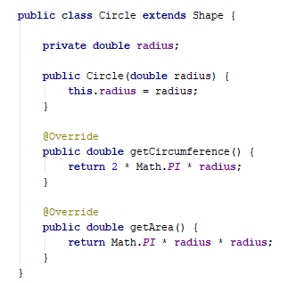
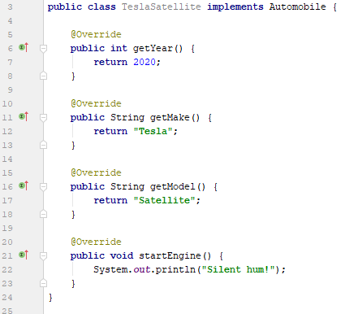

| Title | Type | Duration | Creator |
| --- | -- | -- | --- |
| Abstract Classes and Interfaces | Lesson | 1:35 | Victor Grazi, NYC |

#  Abstract Classes and Interfaces

### Learning Objectives
- Write an abstract class.
- Define an interface in Java.
- Understand when to use an abstract class versus an interface.

### Lesson Guide

| Timing  | Type  | Topic  |
|:-:|---|---|
| 5 min  | [Opening](#opening-5-min)  | Learning Objectives | 
| 10 min | [Demo](#demo-abstract-classes-10-min) | Abstract Classes |
| 10 min | [Guided Practice](#guided-practice-abstract-classes-in-action-10-min) | Abstract Classes in Action |
| 10 min | [Demo](#demo-interfaces-10-min) | Interfaces |
| 15 min | [Guided Practice](#guided-practice-implementing-interfaces-15-min) | Implementing Interfaces |
| 20 min | [Independent Practice](#independent-practice-creating-and-implementing-interfaces-20-min) | Creating and Implementing Interfaces |
| 10 min | [Demo](#demo-breaking-it-down-10-min) | Breaking It Down |
| 10 min | [Demo](#demo-interfaces-vs-abstract-classes-10-min) | Interfaces vs. Abstract Classes |
| 5 min  | [Conclusion](#conclusion-5-min)  | Review/Recap |

## Opening (5 min)

There are times when you want to implement some behavior in a class but want another developer to implement some other behavior.

For instance, in our earlier example of the `Shape` class, we provided a default implementation for the `getCircumference()` and `getArea()` methods:

```java
public class Shape {
    public double getCircumference() {
        return 0;
    }

    public double getArea() {
        return 0;
    }
}

```

In that example, both returned `0`.

Now suppose a different developer implemented a subclass, such as `Circle`, and they weren't clear that the initial developer of the `Shape` class intended those two methods to be overridden to provide an implementation. Then, they would leave those unimplemented and we would suddenly find circles with circumferences and areas equal to zero.

----

## Demo: Abstract Classes (10 min)

To prevent this sort of communication breakdown, the developer of the `Shape` class can mark it as an **abstract class**. Abstract classes allow us to define abstract methods that **force** the developer to define an implementation. If they don't, the Java compiler will throw an error.

An abstract method can **only** be defined in an abstract class. To define an abstract class, put `abstract` before the `class` keyword:

```java
public abstract class Shape {
    // Contents
}
``` 

With that done, we can now define some abstract methods. These get a method signature and return type but don't get an implementation. The return type must be preceded by the `abstract` keyword, as in the following example:

```java

public abstract class Shape {
        public abstract double getCircumference();

        public abstract double getArea();
}

```

By seeing this, the developer and Java compiler both understand that there must be an implementation of a method called `getCircumference()` in a subclass of `Shape` and that it must return a `double` result. 

**What if we forget to implement a method marked as `abstract`?**

Let's say we wanted to create a `Circle` subclass, but we forgot to implement the `getArea()` method.


You can see that IntelliJ warns us — with a big red underline and a fat dialog box — that our class is doomed to fail when compiling.

Once we implement the missing method, everything will go back to normal:



----

## Guided Practice: Abstract Classes in Action (10 min) 

A common use of abstract classes is to implement a **framework** or **template method** design pattern. This pattern allows the framework to define the larger behavior, leaving the particulars to the framework developer.

Suppose we want to create a framework that does some (undefined) processing and writes the results to a file. This is a common operation in monitoring applications, where input could come from a database, files, event logs, devices, and more. It's a perfect use case for abstract classes.

> **Note**: We purposely design the abstract class as generic so subclasses can handle potentially any of these cases.

We want to process that information by writing individual `Monitor` subclasses that call the `process()` method and write the result to the file system.

Let's write a base abstract class called `AbstractMonitor`, with an abstract method called `process()` that returns a `String`, and a non-abstract method called `startMonitoring(String fileName)`:

```java
public abstract class AbstractMonitor {
    public abstract String process();
    
    public void startMonitoring(String fileName) throws IOException, InterruptedException {
        while(true) {
            String value = process();

            RandomAccessFile file = new RandomAccessFile(fileName, "rw");
            file.seek(file.length());
            file.write(value.getBytes());
            file.writeChar('\n');
            Thread.sleep(1000);
        }
    }
}
```

Subclasses benefit from the `AbstractMonitor` class in that they don't have to rewrite the `startMonitoring(String filename)` method; they just have to worry about their own particular functionality for the `process()` method.

For example, let's write a subclass called `MemoryMonitor` that outputs the current time and CPU utilization:

```java
public class MemoryMonitor extends AbstractMonitor {

    @Override
    public String process() {
        return new Date() + ":" + Runtime.getRuntime().freeMemory();
    }

    public static void main(String[] args) throws IOException, InterruptedException {
        new MemoryMonitor().startMonitoring("test.txt");
    }
}
```

----

## Demo: Interfaces (10 min)

Let's switch gears to interfaces. As we're walking through what an interface is and what it does, think about how it compares and contrasts to an abstract class.

In Java, an interface defines an API, which is essentially a contract that a class will contain the methods defined in the interface.

> **Note**: We're using API to mean "application programming interface," in that we know certain methods we can use to access something — in this case, a Java class. You may have heard the term "API" used to mean a web API, which is usually leveraged to access some sort of data. In the generic sense, an application programming interface describes that process as well.

An interface is not a class; it **cannot be instantiated**. It's just a contract declaring to the compiler that whatever instance is assigned to it will contain the methods in the interface. An interface is similar to an abstract class in that its methods are declared but not defined.

All this will become clearer when we get to the sample code. But first, let's see how to define an interface:

```java
public interface Automobile {
    // Contents
}
```

That defines the shell of an interface. The declaration of an interface is similar to a class, except it uses the `interface` keyword in place of `class`. And, like a class, an interface can have public or default (package-private) visibility.

Let's add some functionality to our `Automobile` interface:

```java
public interface Automobile {
    int getYear();
    String getMake();
    String getModel();
    void startEngine();
}
```
 
Our `Automobile` is now contracted to provide a year, make, and model, and some functionality to start the engine. Notice how these methods are defined exactly like abstract methods in abstract classes?

Now we can have some code that says something like:

```java
Automobile auto = getAutomobileById("12357"); // Get an Automobile from our database.
String make = auto.getMake();
String model = auto.getModel();
int year = auto.getYear();
auto.startEngine();
```

Note that we didn't specify any visibility for the interface methods. That's because all interface methods are always public and non-static.

-----

## Guided Practice: Implementing Interfaces (15 min)

To implement an interface means you're committing to fulfilling the interface contract for the class that implements it. 

The syntax is as follows:

```java
class MyClass implements MyInterface {
    
}
```

- `MyClass` is the class you're defining.
- `MyInterface` is the interface you're promising to enforce.

In a more concrete example, we might take our `Automobile` interface and create a `HondaAccord` class that looks like this:

```java
class HondaAccord implements Automobile {
    // Instance variable:
    private int year; 

    // Constructor:
    public HondaAccord(int year) {
        this.year = year;
    }

    // Methods that the interface needs:
    @Override
    public int getYear() {
        return this.year;
    }

    @Override
    public String getMake() {
        return "Honda";
    }

    @Override
    public String getModel() {
        return "Accord";
    }

    @Override
    public void startEngine() {
        System.out.println("Vroom vroom!");
    }
}
```

### Why Is This Important?

Let's say we're an auto manufacturing company, and last year we bought a large library of Java code from you for managing cars. We're coming out with a new kind of car, a model called Tesla Satellite, and we want to use the functionality in your `Automobile` library.

All we have to do is implement your `Automobile` interface, and we can use your existing library to manage our new car that didn't even exist when your library was written. It's one thing to write a `HondaAccord` class because we already know everything about it, but now we're able to realize the usefulness of an interface.

By **implementing** your interface, the Java compiler will ensure our new `TeslaSatellite` class has implemented all of the methods in your `Automobile` interface, thus ensuring it's usable by our libraries:


So, let's implement those methods and try again:


 
> **Tip**: As we saw before, the `@Override` annotation is optional but desirable. 

### Fields in Interfaces

Surprisingly, interfaces may contain variables, but these variables are static and **must** be assigned values in the interface. Remember that static means the field can be accessed from the interface name — as in the example below — or from any class that implements that interface. And these variables are **final**: They may not be changed, as indicated by the red underline in IntelliJ.


### Extending, Extending, Extending

Just like classes can extend classes, interfaces can extend other interfaces, and they inherit all the methods of the base interface. This is useful for complex systems we might encounter in real life.

Classes can also implement multiple interfaces. Let's take a look.

Think back to our `Automobile` interface. Imagine we also have a `TowVehicle` interface that deals with towing capacity, carrying capacity, and fuel type:

```java
public interface TowVehicle {
    int getCarryingCapacity();
    int getTowingCapacity();
    String getFuelType();
}
```

We might want to create a `DodgeRam` class that implements **both** interfaces. To do so, include a comma-separated list of interfaces to implement after the `implements` keyword, like this:

```java
class DodgeRam implements Automobile, TowVehicle {
    // Methods that the Automobile interface needs:
    @Override
    public int getYear() {
        return 2019;
    }

    @Override
    public String getMake() {
        return "Dodge";
    }

    @Override
    public String getModel() {
        return "Ram";
    }

    @Override
    public void startEngine() {
        System.out.println("VROOM!");
    }

    // Methods that the TowVehicle class needs:
    @Override
    int getCarryingCapacity() {
        return 2000;
    }

    @Override
    int getTowingCapacity() {
        return 13000;
    }

    @Override
    String getFuelType() {
        return "Diesel";
    }
}
```

> **Knowledge Check**: Take a second to consider the `DodgeRam` class. What methods are legal to run on it compared to the `HondaAccord` and the `TeslaSatellite` classes?

---

## Independent Practice: Creating and Implementing Interfaces (20 min)

Let's work through another example.

### Step 1

Create three interfaces:

|Interface|Methods| 
|---|---|
|`Sapient`| `void think();` |
|`Sentient`| `void feel();` |
|`Biped`| `void walk();` |

Add a default method to the `Sapient` interface called `void speak()`.

### Step 2

Create a `Person` class that implements all of these interfaces. For the implementation, use `System.out.println("some appropriate message")`.

Then, assign it to variables of each of the types (`Sapient`, `Sentient`, `Biped`, and `Person`), and see what methods you can call on each.

> **Tip**: Want to use IntelliJ like a pro? Place the variable name on a new line, followed by a dot. Then hit `ctrl+space` and IntelliJ will show you the methods you can call.

The solution is in the `src` directory.

-----

## Demo: Breaking It Down (10 min)
 
Our `Person` class implements three interfaces: `Sapient`, `Sentient`, and `Biped`.

It would be perfectly legal to say:

```java
Person person = new Person();
Sentient sentient = person;
Sapient sapient = person;
Biped biped = person;
```

Each of the variables would contain the same instance. However, you would only be allowed to call the methods exposed by the interface, depending on the variable.

So the following are all legal (assuming the interfaces define those methods):

```java
sentient.feel();
sapient.think();
biped.walk();
```

However, the following is illegal:

``` java
sentient.walk();
```

This is because, even though the instance is a `Person`, the interface is a `Sentient`, so you can only call methods from the `Sentient` interface.

This feature provides a way of having multiple inheritance in Java that's otherwise not supported.

----

## Demo: Interfaces vs. Abstract Classes (10 min)

> Take a moment to think: What's the difference between an interface and an abstract class? 

The main difference is that a class can only extend one class (abstract or not), but it can implement many interfaces. This can be helpful in the use cases above, where we need to refer to a single instance under different APIs.

So, why use an abstract class? An abstract class allows you to provide some implementation, which is useful when you want to define some methods but not others, as we saw in our earlier example with `Monitor`.

### Default Methods in Interfaces

In fact, the difference between abstract classes and interfaces has started to blur since Java 8, when the ability to define **default methods** was added to interfaces.

A default method essentially provides some functionality we want to add to all classes that implement an interface. Such methods become public, non-static members of all implementing classes. And, like any public method, they may be overridden by an implementing class.

For example:

```java
public interface Sapient {
    void think();
    
    default void speak() {
        System.out.println("I think therefore I am.");
    }
}
```

Now our `Person` class (that implements `Sapient`) gets the `speak()` method:

```java
new Person().speak(); // displays I think therefore I am.
```

----

## Conclusion (5 min)

Both interfaces and abstract classes are used for abstraction. They're implemented in similar ways, but interfaces are most useful when you don't have any shared code between the subclasses, unlike our `Monitor` example, wherein all `Monitor` instances were able to share the `startMonitoring(String filename)` method.

Remember that interfaces:
* Cannot be instantiated.
* Cannot be static.
* Cannot implement methods.

You should use **abstract classes** when:
* You need both static and non-static methods.
* You need both abstract and non-abstract methods.
* You don't want all your fields to be `final`.

You should use **interfaces rather than abstract classes** when:
* All the methods you're defining are abstract.
* You need future developers to follow a certain pattern (this is our contract).
* You need to use more than one interface. (Remember: A class can only extend one class.)

The difference is somewhat subtle. Both interfaces and abstract classes are used for abstraction, but the key takeaway for knowing which one to use is whether or not the classes that would implement or extend the interface or abstract class will **share lines of code**.

This may require some thinking about your particular task or situation. There's no one right answer for each and every situation. It's OK, though; we trust you!


## Additional Resources

Need more examples of abstract classes and interfaces? Check out this [GeeksforGeeks article](https://www.geeksforgeeks.org/difference-between-abstract-class-and-interface-in-java/).
