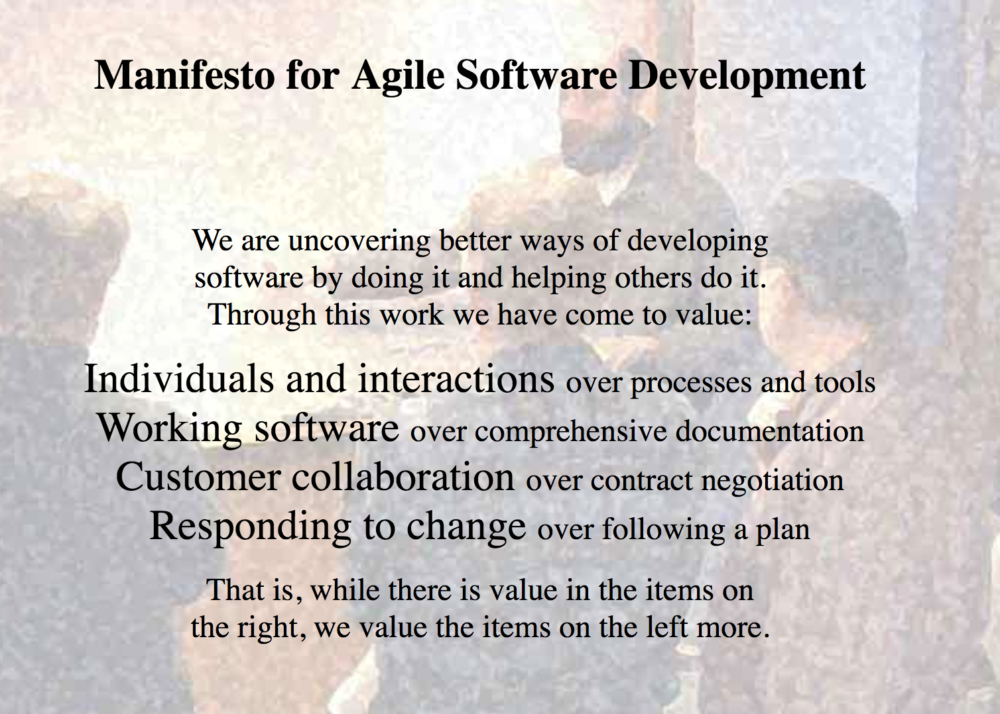
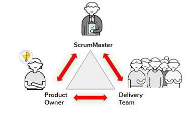
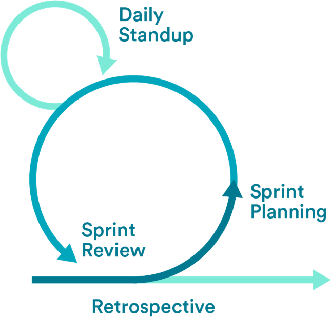
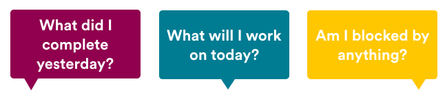

#  Agile Introduction

### Learning Objectives
*After this lesson, students will be able to:*
 - Define the core principles of Agile.
 - Differentiate between the various versions of Agile.
 - Explain the different Scrum roles.
 - Identify the different stages and rituals of a sprint cycle.

### Lesson Guide

| TIMING  | TYPE  | TOPIC  |
|:-:|---|---|
| 5 min  | [Opening](#introduction-5-min)  | Welcome/Lesson Objectives/Introduction to Agile |
| 10 min | [Instruction](#the-agile-manifesto-10-min)  | The Agile Manifesto |
| 10 min | [Instruction](#overview-of-scrum-lean-and-kanban-10-min)  | Overview of Scrum, Lean, and Kanban |
| 10 min | [Instruction](#overview-of-scrum-roles-and-the-sprint-cycle-10-min)  | Overview of Scrum Roles and the Sprint Cycle |
| 10 min | [Instruction](#the-four-ceremonies-10-min)  | Overview of Scrum Ceremonies |
| 10 min | [Discussion](#discussion-10-min)   | Strategies for Running a Successful Scrum |
| 5 min  | [Conclusion](#conclusion-5-min)   | Review/Recap |

## Introduction (5 min)

Agile software development is a set of frameworks and practices based on the values and principles expressed in the Manifesto for Agile Software Development and the 12 principles behind it. 

The Agile methodology follows the same basic steps as any other product development framework: a combination of planning, building, testing, and deploying. Its steps are broken up into small batches, completed in a full cycle, and repeated frequently. Each full cycle is known as a **sprint**. The length of a team’s sprint varies depending on product complexity, team size, location, and test capacity.

-----

## The Agile Manifesto (10 min)

"On February 11-13, 2001, at The Lodge at Snowbird ski resort in the Wasatch mountains of Utah, 17 people met to talk, ski, relax, and try to find common ground — and of course, to eat. What emerged was the Agile ‘Software Development’ Manifesto. Representatives from Extreme Programming, Scrum, DSDM, Adaptive Software Development, Crystal, Feature-Driven Development, Pragmatic Programming, and others sympathetic to the need for an alternative to documentation-driven, heavyweight software development processes convened.

"Now, a bigger gathering of organizational anarchists would be hard to find, so what emerged from this meeting was symbolic — a Manifesto for Agile Software Development — signed by all participants. The only concern with the term 'agile' came from Martin Fowler (a Brit) who allowed that most Americans didn’t know how to pronounce the word ‘agile.'"

That is how Jim Highsmith, one of the authors of the manifesto, described this important gathering.

### So, What Did They Come Up With?

> **Knowledge Check**: As we go through each part of the manifesto, call out a few ways in which you think this plays out in the workplace. 

*	**Individuals and interactions over processes and tools.**
     *	Agile prioritizes customer feedback and collaboration and working with customers and clients.
     * You can solve problems faster and more effectively with communication instead of checklists.
     
 *	**Working software over comprehensive documentation.**
     * In Waterfall, your project isn’t done until you complete all of the requirements as listed in the project's documentation. With Agile, “done” increases every step along the way. It doesn’t leap from 0% to 100%, and no one will miss the documentation.
     
* **Customer collaboration over contract negotiation.**
     * When you throw requirements over the wall (that is, when you tell your team what to do and how to do it), you create an adversarial relationship with your customers. Instead, partner with your customers throughout the project. Embrace learning and responding to their changing needs. We need to be open to incorporating change from customers to learn and grow with them.
     
* **Responding to change over following a plan.**
     * Embrace change. The Agile method is organized to allow teams to respond rapidly when changes occur. In Waterfall, you can’t adapt if there are better opportunities that arise during the project.
     * Example: You’re developing a mobile phone and a new, better CPU launches, but you can’t adjust your plans to accommodate. Not changing can also increase costs, because you put so much effort into building the wrong thing, and you then have to rebuild it after the wrong thing has already been shipped.

---

## Overview of Scrum, Lean, and Kanban (10 min)

Agile is a concept: A collection of principles and ideas that describes how teams can build products quickly and remain focused on the customer. But Agile itself is not a way of working with defined roles, processes, and tools.

To “be” Agile, you have to choose a development methodology to help implement its principles and ideas. The three most common methodologies are:

*	**Scrum**
     * One of the most prevalent and widely adopted Agile methodologies in the field of software development.
     * Notable for its incorporation of a position known as **Scrum master**.
     * Highly structured, with timetables of daily meetings and a commitment to delivering working code to the customer every two weeks.
     
*	**Lean**
     * Designed for teams to get quick customer feedback.
     * Focused on building a minimum viable product (MVP), testing it, and iterating on it. An MVP is a version of a product that has the core features necessary to deploy and satisfy customers and nothing else. 
     * By releasing a product in an MVP form, teams are able to move more quickly and receive customer feedback more regularly.
     
*	**Kanban**
     * Known for being less structured than Scrum.
     * Based on a prominently displayed Kanban board that provides workflow visualization, organization, and tracking for each element of a project.
     * Reliant on a very disciplined team.
    
### Which Method Is Best? 

It depends.

There are lots of factors to take into account when choosing a development methodology, even if you’re just testing it out for a short period of time.

Here’s a comparison of the three Agile methods, as well as the more traditional Waterfall method:

| Methodology | Pros | Cons  |
| ------------- |:-------------|:-----|
| **Scrum** | Large projects are divided into easily manageable chunks and can be adapted over time. | The process is hard to adopt for large teams, and it can take a long time for newer team members to adapt to it.| 
| **Lean** | An intense focus on user needs means that everything that’s built is valuable to customers. | Can become too focused on customer requests and not on strategic positioning or market growth. | 
| **Kanban** | A more fluid process, focusing on what needs to get done next instead of timelines and milestones. | Very tactical and doesn’t focus on long-term, strategic vision. | 
| **Waterfall** | Makes it easier to predict what will actually be delivered at the end of the development cycle.| Many assumptions are made and committed to early in the process that can later prove invalid.|

> **Knowledge Check**: Why can Agile be a scary or difficult thing for companies to implement?

---

## Overview of Scrum Roles and the Sprint Cycle (10 min)

There are three common roles on an Agile Scrum team:

*	Product owner.
*	Scrum master.
*	Delivery team.

The **product owner** owns “what” is desired and “why” it’s desired. They are responsible for prioritizing work. They are the voice of the customer and understand the big picture, business, competition, customers, trends, etc.

The **Scrum master** is the keeper of the Scrum process. They are facilitators whose goal is to always work to make the team its most efficient self. They used to be considered project managers, but this role focuses more on facilitating and creating team efficiency. They may work with other teams to get resources, training, or other support.

**The Scrum delivery team** owns “how” and “how quickly” work is delivered. This team includes everyone responsible for delivering work. It is usually made up of engineering and design people, but may include marketing, support, and operations.

### Scrum and the Sprint Cycle

**Step 1: Plan**

Ask yourself, “What feature is most valuable to the customer?” and build that first. Collaborate with the business, if possible, to help pin down customer preferences.

**Step 2: Design**

Mock up a complete solution that includes front-end, back-end, and middleware. At this point, the team collaborates to create a full list of technical tasks.

**Step 3: Build**

Write the code. The groundwork you laid in the previous two steps really pays off here, keeping everyone organized and focused on a task. Frequent check-ins are strongly advised to ensure compatibility and minimize unexpected roadblocks.

**Step 4: Test**

Put the software through its paces. Make sure everything works as expected and integrates properly with existing software.

**Step 5: Deploy**

Get the software into customers’ hands. The speed of this process can be astonishing, especially if you’re used to the traditional way of doing things. The trade-off for all this speed is that unit testing becomes an essential part of the process for every piece of functionality in the software. This sounds challenging at first, but the continuous deployment environment makes it less daunting.

A mature Agile system is able to complete all five of these steps in a single sprint. This means the software is able to be used from the very first sprint onward. Every sprint after that has the application growing in functionality and value through slow iteration.

---

## The Four Ceremonies (10 min)

A sprint is a short, timeboxed period (often two weeks) in which a team completes a set amount of work. A lot happens in that period (work gets done, products get launched) and then the whole thing starts again.

To help teams stay on track, four ceremonies occur at different points in the sprint to make sure work is completed as efficiently as possible. These include:

*	Sprint planning
*	Daily standups
*	Sprint reviews
*	Retrospectives

### Before You Get Started

Before you get started, the backlog must be complete and in order. The backlog is a list of user stories, bugs, and other work in priority order. The backlog is owned by the product owner, and the order is determined by the product management team. During the course of the project, the backlog will be constantly “groomed,” with the highest-priority tickets appearing at the top.

### Sprint Planning: First Things First

Once the backlog is in order, you’re ready to turn your ideas into something usable. That’s what you’ll do in **sprint planning**: Review what needs to get done and clarify the tasks so that the development team is ready to start building.

Sprint planning is one of the Scrum rituals that needs to be followed. Sprint planning happens right before a sprint starts. The goal of sprint planning is to make sure that the tickets in your backlog are ready to be moved into that sprint planning backlog as well. Your sprint planning backlog is a subset of the product backlog; it’s whatever is highest priority and needs to get done in the upcoming sprint. 

In the sprint planning meeting, you need to be able to present the user story, along with acceptance criteria, to your development team. As a product manager, your job is to make sure that you’ve really identified the “what” they need to build and the “why” they need to build it; let your development team figure out the “how.”

### Time to Stand Up

| Attendees | When | Duration  | Inputs | Purpose | 
| :-----: |:-------:|:-----:|:-----:|:-----:|
|Product owner, development team, and Scrum master| Once a day, often in the morning. | No more than 15 minutes. | None — just attendance from all team members. | Quickly inform everyone of what’s going on across the team and identify anything that’s blocking progress. |

No one likes standing for too long, right? That’s why **standups** have a time limit of 15 minutes (ideally less). If you’re having a daily meeting, it’s best not to overwhelm everyone and instead keep it short and concise.

To honor that time limit, team members should come prepared to answer these three questions:

These prompts keep everyone focused on progress and forward movement. Any blockers or issues that arise during the standup can be discussed after the fact, rather than during the meeting with the entire team involved.

### Sprint Review: It’s Demo Day!

The last day of the sprint means it’s time for the sprint review, also known as **demo day**. It’s critical to showcase your work to your team and stakeholders, get feedback, and celebrate accomplishments. The most important part of a sprint review? Making sure that you have an actual, working product to show (or at least a feature of it).

| Attendees | When | Duration  | Inputs | Purpose | 
| :-----: |:-------:|:-----:|:-----:|:-----:|
|Product owner, development team, Scrum master, and stakeholders| At the end of a sprint or milestone. | 30–45 minutes | Work that has been completed in the sprint. | Share what’s been built, answer questions, get feedback, and, most importantly, celebrate the team’s hard work! |

### Retros: Wrapping Up

Once the sprint is wrapped up and the product is reviewed, take the time to conduct a **retrospective** (“retro” for short) with your team. If a sprint review looks at what was created, the retro looks at how it got done — what works, what doesn’t, and how to keep getting better.

| Attendees | When | Duration  | Inputs | Purpose | 
| :-----: |:-------:|:-----:|:-----:|:-----:|
|Product owner, development team, and Scrum master| At the end of a sprint, after the sprint review. | 30–45 minutes. | Nothing specific. | Uncover what’s working well, discuss what’s not working, and create a plan to improve how the team operates together. |

#### Start Stop Continue

A simple exercise called **start stop continue** can help your retros be more productive and forward-thinking. As a group, brainstorm and discuss:

*	What should we **start** doing or do more of?
*	What should we **stop** doing?
*	What should we **continue** doing?

---

## Discussion (10 min)

As a group, discuss the following questions:

*	It is recommended to start a sprint on Tuesday, Wednesday, or Thursday. Why do you think that is?
*	What time(s) do you think would be best for a daily standup? Why? What times should be avoided? Why?

As a group, can you identify strategies for running a successful Scrum standup? Answers might include:

*	Come prepared. Update your issues on the Jira board or other tracking tool before the standup.
*	Arrive promptly.
*	Stick to the schedule.
*	Practice presenting your activities in a brief, clear manner.
*	Listen to each other.
*	Don’t get sidetracked. Make a practice of taking discussions offline.
*	Share laughter, bagels, donuts, and muffins!

As a group, can you identify strategies for using Agile Scrum if you’re part of a virtual team? Answers might include:

*	Daily standups can be done via Slack (with a Slackbot or reminder).
*	Daily standups can happen on a virtual call, such as on Zoom or Webex. Just make sure you can share the Jira board or other tracking tool you are using.
*	Demo day can happen on a virtual call, such as on Zoom or Webex. Just make sure that you can share screens to demo the product.

---

## Conclusion (5 min)

If that seemed like a ton of Agile talk, never fear. We'll be practicing standups and retros during our project weeks so that we can stay accountable and keep moving forward.

### Resources

*	[Manifesto for Agile Software Development](https://agilemanifesto.org/)
*	[Agile Alliance](https://www.agilealliance.org/)
*	[Scrum Reference Card](http://scrumreferencecard.com/scrum-reference-card/)

---

