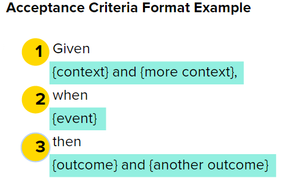
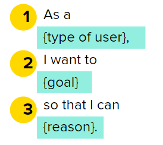

#  User Stories and Acceptance Criteria

### Learning Objectives

*After this lesson, students will be able to:*

- Explain the value of user stories and acceptance criteria.
- Write an effective user story and accompanying acceptance criteria.

### Lesson Guide

| TIMING  | TYPE  | TOPIC  |
|:-:|---|---|
| 5 min  | [Opening](#introduction-5-min) | Lesson Objectives |
| 10 min | [Discussion](#discuss-writing-user-stories-10-min)  | Writing User Stories |
| 10 min | [Exercise](#judging-user-stories-10-min) | Judging User Stories | 
| 10 min | [Exercise](#writing-user-stories-10-min)  | Writing User Stories |
| 10 min | [Discussion](#acceptance-criteria-10-min) | Acceptance Criteria |
| 10 min | [Exercise](#writing-acceptance-criteria-10-min) | Writing Acceptance Criteria | 
| 5 min  | [Conclusion](#conclusion-5-min)   | Review/Recap |

## Introduction (5 min)

User needs are represented in the form of **user stories**.

A user story is a single unit of work that a team can commit to completing during a sprint.

User stories provide two major benefits to teams working in Agile:

- They break a large problem (e.g., updating a website’s checkout flow) into small chunks (e.g., updating the shopping cart feature) to help a team make incremental progress toward a larger goal.
- They represent the voice of the customer and explain the problems a user is experiencing, rather than focusing on internal objectives or technology.

User stories are different than "requirements" for a project.

User stories explain what problem the user is having and why it is important to solve it. Requirements answer how the team will reach the goal. This is the solution and is not included in the user story.

Teams create user stories in a variety of places: Jira, Trello, and even basic index cards or Post-it notes. Index cards and Post-it notes are valuable tools, as they limit the amount of detail you can include in the story. 

----

## Discuss: Writing User Stories (10 min)

### The Structure of User Stories

User stories are always structured in the same way:

"As a (blank), I want (blank) so that (blank)."

Let’s explore each part of a user story.

**As a [type of user]**: Get specific who your user is. Instead of saying "as a user," use something like "As Claudia," or "As a developer," or "As a member of the marketing team." 

**I want to [goal]**: Describe what the user wants to do, not what feature should be built.

**So that [reason]**: Describe the user’s motivation and ensure that you’re solving that need. This is a very important piece, as it helps others understand the motivation behind the story and allows the team to suggest better ways to solve the need rather than building exactly what the customer is asking for.

Good user stories follow the **INVEST principle**:

- **Independent**: Dependencies lead to problems in estimation and prioritization.
- **Negotiable**: Stories are not contracts; they allow for flexibility.
- **Valuable**: Reflect value to users or customers, not developers.
- **Estimable**: We need to be able to estimate so we can use a story to create a plan.
- **Sized Appropriately**: A story is sized appropriately when it can be completed in one iteration.
- **Testable**: Define an easy or binary way of knowing when the story is finished.

> **Knowledge Check**: Why is it important that user stories exist independently?

### When You're Writing User Stories...

Be sure to:

- Define the _what_, not the _how_.
- Use understandable language.
- Group stories by themes.
- Have a healthy backlog of user stories — don't be the bottleneck for your team. 

Watch out for:

- Ambiguous language (e.g., "easy," "simple," "seamless," "intuitive").
- Subjective or judgmental language (e.g., "better," "good," "allowable").
- Generalizations (e.g., "always," "never," "everyone").
- Observed behavior that isn't directly related to the story under consideration.
- Tautological stories that are self-defining.

--- 

## Judging User Stories (10 min)

With a partner, review the user stories below. Discuss the following questions:

- Do they use the proper formatting?
- Do they employ INVEST principles?
- Do they follow best practices?
- How could they be improved?

“As a student, I want to purchase a parking pass so that I can park at school.”

“The user can run the system on Windows and Linux.”

“As a commercial advertiser, I want to have a filtering option on the ad management system.”

“As a user, I want to indicate folders to exclude from backup so I don’t fill my backup drive with things I don't need.”

---

## Writing User Stories (10 min)

### Directions

Divide into groups of 3–5 people. With your group, rewrite the following user stories:

- “A user can quickly master the system.”
- “A user can edit the address on a resume.”
- “A user can add, edit, and delete multiple resumes.”
- “A job seeker can solicit a recommendation from a peer to improve their profile.”
- “A customer can leave feedback or a recommendation about their purchase experience.” 

---

## Acceptance Criteria (10 min)

How do you know when a story is done?

**Acceptance criteria** confirm when a user story is accepted, or done. They set boundaries to help a team understand what’s included in the scope of a user story.

Acceptance criteria focus on the "what" (the end result), not the "how" (the solution approach). In other words, they should reflect the functionality that a user will see, rather than the back-end technology that makes it possible.

Each user story should have at least one acceptance criteria but, depending on the complexity of the story, there is a one-to-many relationship when it comes to user stories and acceptance criteria.

### How to Create Acceptance Criteria

There are two ways to write acceptance criteria:

**Option 1**

"Given that [context on the user], when [event happens or action is taken], then [outcome]."

Here's what that looks like in action:

* "As a bank customer, I want to transfer funds between my linked accounts so that I can pay my credit card bill."

    GIVEN that my account has sufficient funds, WHEN I request an inter-account transfer, THEN my source account is debited and my credit card receives the funds.

**Option 2**

Acceptance criteria can also be written as bullets to describe the actual behaviors and functions a user would see to get to the desired outcome. While slightly more technical, the functions they describe are the mechanics a user should see and experience, not what a development team should build.

For the bank account user story, we could then write:

-	Source account balance is verified.
-	Error message returned if account has insufficient funds.
-	Funds removed from source account.
-	Credit card receives funds.

### Best Practices

Good acceptance criteria...

- Are written at the same time as the user story.
- Vary in number, depending on the story. Sometimes there are many detailed acceptance criteria; other times, there are only one or two. 
- Test if the functionality meets expectations before release.
- Include both what the feature should do and the error states.
- Include design.

---

## Writing Acceptance Criteria (10 min)

As a group, add at least three acceptance criteria to this user story.

“As a superuser, I want to input as little as possible so that I can complete my task as quickly as possible and with minimal effort.”

    
Possible solution

    
- GIVEN the user has already provided their personal info, WHEN the user approaches the "Name" screen, THEN they can bypass it to the next screen without inputting any characters.
- GIVEN the user is logged in WHEN the user does not input characters on the "Name" screen, THEN the greeting on the preceding page will persist without direct address. 
- GIVEN the user is logged in WHEN the user reaches the intake form, THEN they can forgo selections and filling boxes.

---

## Conclusion (5 min)

- Why are user stories important?
- What’s the recommended structure for writing user stories?
- Why are acceptance criteria important?
- What’s the recommended structure for defining acceptance criteria?
- What does INVEST mean?

#### Resources 

- [Ten Tips For Writing Good User Stories](https://www.romanpichler.com/blog/10-tips-writing-good-user-stories/) by Roman Pichler.
- [What Characteristics Make Good Agile Acceptance Criteria?](https://www.seguetech.com/what-characteristics-make-good-agile-acceptance-criteria/) by Segue Technologies.
