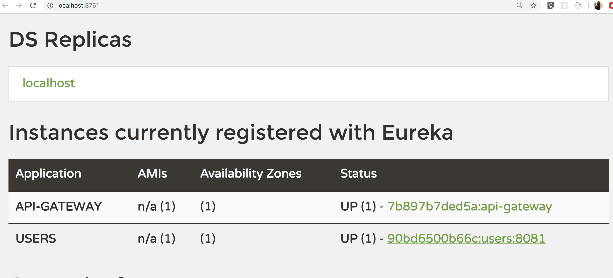

| Title | Type | Duration | Author |
| -- | -- | -- | -- |
| Microservices Environment Overview | Lesson | 2:50 | Prateek Parekh |  

#  Microservice Environment Overview

### Learning Objectives

*After this lesson, students will:*
- Implement a API gateway and service registry using Eureka and Zuul.
- Explain how the API gateway, service registry, and services operate together in a microservice application.
- Use Docker to start up our services.

### Lesson Guide

| TIMING  | TYPE  | TOPIC  |
|:-:|---|---|
| 10 min  | Opening | Introduction  |
| 15 min | Guided Practice | Getting Started |
| 30 min | Guided Practice | Creating the Service Registry |
| 30 min | Guided Practice | Creating the API Gateway |
| 30 min | Guided Practice | Setting up `docker-compose` | 
| 15 min | Lecture | Naming Services with the API Gateway |
| 30 min | Guided Practice | Creating the Users Service |
| 10 min | Closing | Summary |

## Opening (10 min)

When we first learned about Spring Boot, you worked through a lab to create a Spotify clone. That application was a monolith, which is a better approach when you're first learning about the Spring framework, among many other reasons.

But now you're an expert, so you're going to build a Spotify app again — this time using microservices. It's more difficult to split a monolith into microservices; there are steps you need to follow over a period of time to make it happen. For now, we're going to build our microservices from scratch, similar to what we've done in previous lessons.

`User` and `Song` metadata won't often be accessed at the same time, so let's create functionality for two separate `User` and `Song` microservices. We will create `User` microservice in class together and you will work on `Song` later. 

**Quick refresher:** With a partner, discuss the following related to what we've learned about micrservices already:

- What are some of the benefits of building microservices?
- What challenges do they bring?
- How do bounded contexts and domains help us build microservices?

-----

## Getting Started (15 min)

There are three basic components we will need for our microservice environment:


> *Diagram borrowed from this [excellent Auth0 blog series on Microservices](https://auth0.com/blog/an-introduction-to-microservices-part-1/).*

- **The API Gateway** - Each of our services will have its own URL. A client may require data from each of those, and managing several URLs can be extremely cumbersome. An API gateway will allow us to create a single entry-point for any client to consume.
- **The Service Registry** - Our API gateway needs to know where our services live so that it can shuttle data back and forth. The Service Registry will keep a live "database" of each of our services, along with its address. As new services spin up, they will automatically register themselves in this database, and therefore automatically expose themselves through our central API Gateway URL.
- **Services** - Each of our services will be its own, fully-functioning application. They will look like mini versions of a monolithic app. The only thing we will need to add to our little MVC services is the ability to register with the Service Registry on startup.

Let's start by creating a new wrapper directory for all of our microservices:

```bash
$ mkdir spring-boot-microservices
```

```bash
$ cd spring-boot-microservices
```

----

## Creating the Service Registry (30 min)

We'll create our Service Registry first. The API gateway will need this to tell us where our services live, and our services will need it running so that they can register. 

To keep things simple, we're going to use a pre-packaged Service Registry implementation built by Netflix. [Netflix Eureka](https://github.com/Netflix/eureka) is a fully-featured service registry library that the company uses in production with fantastic results. Fortunately for us, they have open-sourced it. Let's see what it looks like.

First, we'll create a fresh Spring Boot application in a new `eureka-server` folder:

```bash
$ spring init eureka-server
```

Now let's move into our new server directory and open the project in IntelliJ IDEA:

```bash
$ cd eureka-server
```

```bash
$ idea pom.xml
```

> Be sure that `auto-import` is checked when IDEA opens the project.

### Setting up Dependencies

The Spring ecosystem includes several Spring Cloud dependencies that are very easy to set up. One of these is a simple wrapper that turns any Spring Boot app into a Eureka server. Let's include this dependency in our `pom.xml`:

```
<dependency>
	<groupId>org.springframework.cloud</groupId>
	<artifactId>spring-cloud-starter-netflix-eureka-server</artifactId>
	<version>2.1.2.RELEASE</version>
</dependency>
```

You can get the latest version from [here](https://mvnrepository.com/artifact/org.springframework.cloud/spring-cloud-starter-netflix-eureka-server). Your complete `pom.xml` will look like this:

```
<?xml version="1.0" encoding="UTF-8"?>
<project xmlns="http://maven.apache.org/POM/4.0.0" xmlns:xsi="http://www.w3.org/2001/XMLSchema-instance"
	xsi:schemaLocation="http://maven.apache.org/POM/4.0.0 http://maven.apache.org/xsd/maven-4.0.0.xsd">
	<modelVersion>4.0.0</modelVersion>
	<parent>
		<groupId>org.springframework.boot</groupId>
		<artifactId>spring-boot-starter-parent</artifactId>
		<version>2.1.6.RELEASE</version>
		<relativePath/> <!-- lookup parent from repository -->
	</parent>
	<groupId>com.example</groupId>
	<artifactId>eureka-server</artifactId>
	<version>0.0.1-SNAPSHOT</version>
	<name>demo</name>
	<description>Demo project for Spring Boot</description>

	<properties>
		<java.version>1.8</java.version>
	</properties>

	<dependencies>
		<dependency>
			<groupId>org.springframework.boot</groupId>
			<artifactId>spring-boot-starter</artifactId>
		</dependency>

		<dependency>
			<groupId>org.springframework.boot</groupId>
			<artifactId>spring-boot-starter-test</artifactId>
			<scope>test</scope>
		</dependency>

		<dependency>
			<groupId>org.springframework.cloud</groupId>
			<artifactId>spring-cloud-starter-netflix-eureka-server</artifactId>
			<version>2.1.2.RELEASE</version>
		</dependency>
	</dependencies>

	<build>
		<plugins>
			<plugin>
				<groupId>org.springframework.boot</groupId>
				<artifactId>spring-boot-maven-plugin</artifactId>
			</plugin>
		</plugins>
	</build>

</project>
```

### Setting up Eureka

Now that we've added our Spring Cloud Eureka JAR, we'll need to add an annotation to our `DemoApplication` main class which is under `src/main/java/com/example/eurekaserver` folder. 

Let's rename the main class to `EurekaServerApplication` by right-clicking on the class. Replace its contents with this:

```java
package com.example.eurekaserver;

import org.springframework.boot.SpringApplication;
import org.springframework.boot.autoconfigure.SpringBootApplication;
import org.springframework.cloud.netflix.eureka.server.EnableEurekaServer;

@SpringBootApplication
@EnableEurekaServer
public class EurekaServerApplication {

	public static void main(String[] args) {
		SpringApplication.run(EurekaServerApplication.class, args);
	}
}
```

There is nothing special going on in this code. As a matter of fact, the contents of our class are just the default Spring-generated code. All we've added to the standard Spring boilerplate is a small annotation at the top of the class: `@EnableEurekaServer`.

This is all we need to do! The Spring Cloud Eureka JAR that we've included will take care of the rest. All we had to do was drop it in and add a single annotation.

### Configuration

We'll need to set up a few bits of configuration in our `application-dev.properties` before we get started. Let's create the file in our `resources` package and add a few lines:

```ruby
server.port=8761

eureka.client.registerWithEureka=false
eureka.client.fetchRegistry=false
eureka.server.waitTimeInMsWhenSyncEmpty=0
```

This configuration tells our Eureka server to run on the standard Eureka port, `8761`. It also tells Eureka not to try to register with any other service registries when it starts up.

Now you can create an executable JAR file and run the Spring Boot application by running the below command from the same directory as our project pom.xml file:

`mvn clean install`

### Start it up!

Let's start the app in the `dev` profile. 

Use the name of the jar file created in the previous step. You can find the name either under `/target` folder or towards the end in the logs. If you have followed the steps to the T so far the name of your jar file should be `eureka-server-0.0.1-SNAPSHOT.jar`.

```bash
$ java -jar -Dspring.profiles.active=dev target/eureka-server-0.0.1-SNAPSHOT.jar
```

We can visit [localhost:8761](http://localhost:8761) in the browser to see our Eureka dashboard!

-----

## Creating the API Gateway (30 min)

Now that we have a service registry running, we can create our API Gateway. Netflix has another handy pre-packaged tool that was open-sourced that we'll use for our app!

Let's set up a second Spring Boot app inside of our wrapper directory that will function as an API gateway using [Netflix Zuul](https://github.com/Netflix/zuul). Zuul can be used as the "front door" for all requests to an application's back-end.

From our top-level directory `spring-boot-microservices`, let's generate another fresh Spring Boot app and open it in IDEA:

```bash
$ spring init api-gateway
```

```bash
$ cd api-gateway
```

```bash
$ idea pom.xml
```

### Adding Dependencies

Spring Boot has a wrapper for Zuul as well! Let's drop it in in `pom.xml`.

```
<dependency>
    <groupId>org.springframework.cloud</groupId>
    <artifactId>spring-cloud-starter-netflix-zuul</artifactId>
    <version>2.1.2.RELEASE</version>
</dependency>

<dependency>
	<groupId>org.springframework.cloud</groupId>
	<artifactId>spring-cloud-starter-netflix-eureka-client</artifactId>
	<version>2.1.2.RELEASE</version>
</dependency>
```

You can check the latest version from [here](https://mvnrepository.com/artifact/org.springframework.cloud/spring-cloud-starter-netflix-zuul).

### Setting up the Server

Just like our Eureka server, the Zuul gateway will be a standard Spring Boot app with a single annotation on the `DemoApplication` main class. 

Let's rename our main class to `ZuulGatewayApplication` and fill it in:

```java
package com.example.apigateway;

import org.springframework.boot.SpringApplication;
import org.springframework.boot.autoconfigure.SpringBootApplication;
import org.springframework.cloud.netflix.eureka.EnableEurekaClient;
import org.springframework.cloud.netflix.zuul.EnableZuulProxy;

@SpringBootApplication
@EnableZuulProxy
@EnableEurekaClient
public class ZuulGatewayApplication {

	public static void main(String[] args) {
		SpringApplication.run(ZuulGatewayApplication.class, args);
	}
}
```

### Configuration

Just like earlier, let's set up our dev server configuration in `application-dev.properties` before we start it up:

```
spring.application.name=api-gateway

management.security.enabled=false

eureka.client.serviceUrl.defaultZone=http://eureka:8761/eureka/

# Add color to log output
spring.output.ansi.enabled=ALWAYS
```

This config gives the application a name, which will be passed to Eureka. It also tells Spring to turn off security in our `dev` profile. We'll need this when we check our routes later on.

Finally, it tells our app where the Eureka server lives. The Eureka URL here assumes the Eureka server lives on a host named `eureka` instead of `localhost`, because we are now going to use `docker-compose` to start everything up. Before that, let's quickly build our app by running `mvn clean install` to make sure everything is working smoothly.

-----

## Setting Up `docker-compose` (30 min)

We can continue starting each of these services individually, but as we continue to add services we'll have to manage more and more start-up commands as well. We'll need to pull in `docker-compose` to solve this problem for us.

> Check: Can someone explain what `docker-compose` is and how it plays into the Docker ecosystem?

`docker-compose` is a perfect tool for a microservice development environment. It will allow us to run start and stop commands for all of our services with a single `docker-compose up` or `down` command. 

Let's drop a new `docker-compose.yml` file into our wrapper directory `spring-boot-microservices` and configure it to start our Eureka (Service Registry) and Zuul (Api-Gateway) servers:

```yaml
version: '3'

services:
  eureka:
    image: maven:3.6.1-jdk-8
    ports:
      - '8761:8761'
    working_dir: /app
    volumes:
      - ./eureka-server:/app
    command: 'mvn spring-boot:run'
    environment:
      - SPRING_PROFILES_ACTIVE=dev
  api-gateway:
    image: maven:3.6.1-jdk-8
    ports:
      - '8080:8080'
    working_dir: /app
    volumes:
      - ./api-gateway:/app
    depends_on:
      - eureka
    command: 'mvn spring-boot:run'
    environment:
      - SPRING_PROFILES_ACTIVE=dev
```

Now, when we run `docker-compose up` from our top-level directory, each service will start up in the `dev` profile on their assigned ports. Make sure you already have Docker installed and running before running this command.

Remember that Maven will download and cache its dependencies the first time this happens so it will take a little while.

> Note: If you want to start just one service, you can run `docker-compose up <app-name>` (e.g. `docker-compose up api-gateway`.)

Let's move into our top-level directory and try it out!

```bash
docker-compose up
```

Everything starts up! It takes a little longer because we are running inside of the Docker environment, but remember that `docker-compose` lets us hot-reload our code. Once everything is started up, we won't have to restart too often.

-----

## Naming Services with the API Gateway (15 min)

By default, the application name that we set in our `application.properties` will become the route that Zuul uses. In a moment, we'll add a `Users` API that will automatically register itself with Zuul as `/users`.

This is a very convenient feature, but we may not always want to expose every server route through our gateway. Anything that we expose to the gateway is exposed to our end-users. Therefore, we will leave this feature on for today, but in the future you may want to configure exactly which routes are available using Spring's [Zuul Configuration](https://cloud.spring.io/spring-cloud-netflix/multi/multi__router_and_filter_zuul.html) properties.

These properties also provide nice features such as:
- Renaming routes
- Prefixing routes, e.g. `/api/users` instead of `/users`
- Controlling which headers users are allowed to send in their request

This tool provides a lot of fantastic security and routing options. Be sure to keep the documentation handy!

------

## Creating the Users Service (30 min)

Now it's time to create our `Users` API. This API will be a standard Spring Boot MVC app connected to a Postgres database. The only thing we'll need to add to set this apart from a vanilla Spring Boot service is the ability to register with our service registry on start-up.

Let's start by creating the basic Spring Boot skeleton:

```bash
$ spring init users-api
```

```bash
$ cd users-api
```

```bash
$ idea pom.xml
```

### Add Dependencies

We will need to mark our service as a Eureka client, so we'll pull in the Spring Cloud Eureka dependencies in our `pom.xml`. 

```
<dependency>
    <groupId>org.springframework.boot</groupId>
    <artifactId>spring-boot-starter-web</artifactId>
</dependency>

<dependency>
	<groupId>org.springframework.cloud</groupId>
	<artifactId>spring-cloud-starter-netflix-eureka-client</artifactId>
	<version>2.1.2.RELEASE</version>
</dependency>
```

Notice that we will still need the standard Spring Boot Web starter for this service to create REST APIs.

### Set up Server

Let's rename our main class to `UsersApiApplication` and drop in some starter code:

```java
package com.example.usersapi;

import org.springframework.boot.SpringApplication;
import org.springframework.boot.autoconfigure.SpringBootApplication;
import org.springframework.cloud.netflix.eureka.EnableEurekaClient;
import org.springframework.web.bind.annotation.RequestMapping;
import org.springframework.web.bind.annotation.RestController;

@SpringBootApplication
@EnableEurekaClient
@RestController
public class UsersApiApplication {

	@RequestMapping("/")
	public String home() {
		return "some users";
	}

	public static void main(String[] args) {
		SpringApplication.run(UsersApiApplication.class, args);
	}
}
```

This is a basic Spring Boot main class with a single `/` route that returns some generic data.

The `@SpringBootApplication` and `@RestController` annotations are standard Spring Boot annotations that enable the Spring app context and allow us to register the `/` route within this file.

The only thing that sets this file apart from a generic Spring app is the one new annotation: `@EnableEurekaClient`. This annotation tells our app to look for a Eureka server on startup and register itself. Once the application has started and registered, Zuul will pick it up from the service registry and expose all of its URLs automatically!

### Configuration

We'll need to add some configuration to make this happen. Let's drop this into a new `application-dev.properties` file:

```
server.port=8081

spring.application.name=users

eureka.client.serviceUrl.defaultZone=http://eureka:8761/eureka/

# Add color to log output
spring.output.ansi.enabled=ALWAYS
```

This app will need to run on port `8081`, because our API gateway has taken over port `8080`.

This configuration will give our app a name, which will translate to its base URL in Zuul. We'll call our app `users` so that any requests to `/users` will end up here.

We also need to tell our app where Eureka lives so it can register on start-up.

### Dockerize It

Let's tell our `docker-compose.yml` file where this app lives and how to start it up:

```yaml
version: '3'

services:
  eureka:
    image: maven:3.6.1-jdk-8
    ports:
      - '8761:8761'
    working_dir: /app
    volumes:
      - ./eureka-server:/app
    command: 'mvn spring-boot:run'
    environment:
      - SPRING_PROFILES_ACTIVE=dev
  api-gateway:
    image: maven:3.6.1-jdk-8
    ports:
      - '8080:8080'
    working_dir: /app
    volumes:
      - ./api-gateway:/app
    depends_on:
      - eureka
    command: 'mvn spring-boot:run'
    environment:
      - SPRING_PROFILES_ACTIVE=dev
  users-api:
    image: maven:3.6.1-jdk-8
    ports:
      - '8081:8081'
    working_dir: /app
    volumes:
      - ./users-api:/app
    depends_on:
      - eureka
    command: 'mvn spring-boot:run'
    environment:
      - SPRING_PROFILES_ACTIVE=dev
```

### Start it up!

Let's run `docker-compose up` and see our whole environment come to life!

Once everything has started, you should be able to see both api-gateway and user service registered on Eureka:



We should check on a few URLs,

- [localhost:8761](http://localhost:8761) should have our `API-GATEWAY` and `USERS` apps registered
- [localhost:8080/routes](http://localhost:8080/routes) should show our `/users` route
- [localhost:8080/users/](http://localhost:8080/users/) should return "some users"
- [localhost:8081](http://localhost:8081) should also return "some users"


## Setting up a Database with `docker-compose`

As we've seen in our previous set-up, Docker provides pre-made operating system images that we can simply download and run. These images often include certain tools, such as our Java JDK that are already set up and ready to go. These pre-configured images and tools don't extend only to application environments, but can provide ready-made database environments as well. Let's use `docker-compose` to set up a new PostgreSQL database with just a few lines of code!

In our `docker-compose.yml` file, we currently have 3 services. This defines our Spring Boot application, and if we'd like to set up a PostgreSQL image to run alongside it, it's as simple as tacking on one more `service` to our `docker-compose.yml` file. Let's try it out:

```
postgresdev:
 image: postgres
 ports:
  - "5432:5432"
 environment:
  - POSTGRES_PASSWORD=password
  - POSTGRES_USER=postgres
  - POSTGRES_DB=pgdev
```

The complete `docker-compose.yml` file will look like,

```
version: '3'

services:
  eureka:
    image: maven:3.6.1-jdk-8
    ports:
      - '8761:8761'
    working_dir: /app
    volumes:
      - ./eureka-server:/app
    command: 'mvn spring-boot:run'
    environment:
      - SPRING_PROFILES_ACTIVE=dev
  api-gateway:
    image: maven:3.6.1-jdk-8
    ports:
      - '8080:8080'
    working_dir: /app
    volumes:
      - ./api-gateway:/app
    depends_on:
      - eureka
    command: 'mvn spring-boot:run'
    environment:
      - SPRING_PROFILES_ACTIVE=dev
  postgresdev:
    image: postgres
    ports:
     - "5432:5432"
    environment:
     - POSTGRES_PASSWORD=password
     - POSTGRES_USER=postgres
     - POSTGRES_DB=pgdev
  users-api:
    image: maven:3.6.1-jdk-8
    ports:
      - '8081:8081'
    working_dir: /app
    volumes:
      - ./users-api:/app
    depends_on:
      - eureka
    command: 'mvn spring-boot:run'
    environment:
      - SPRING_PROFILES_ACTIVE=dev
```

This new `postgresdev` service will set up a few things for us:

1. The official `postgres` Docker container will be downloaded and started up.

2. The PostgreSQL database will be set up on port `5432` and exposed on the same port to our other services. 

3. The database will be started up with our defined password, username, and database name so we can easily connect to it later on.

If we stop and start our application using `docker-compose down` and `docker-compose up`, we'll see that a PostgreSQL database downloads and spins up. It's that simple!

### Connecting a Spring Boot Application to Postgres

Now that our database is running, let's connect our application to the database.

We'll need to leverage [Spring Boot Profiles](https://docs.spring.io/spring-boot/docs/current/reference/html/boot-features-profiles.html) to make sure this set-up only runs in our development environment. 

Update `application-dev.properties` in our `/resources` folder and fill it in with our database credentials. Notice that the host name for our `docker-compose` services is the same as the service name itself. We'll need to use a [JDBC](https://docs.oracle.com/javase/8/docs/technotes/guides/jdbc/) URL to connect to our database from a Java application:

```
spring.datasource.url=jdbc:postgresql://postgresdev:5432/pgdev
spring.datasource.username=postgres
spring.datasource.password=password

spring.jpa.properties.hibernate.temp.use_jdbc_metadata_defaults=false
```
> jpa property is added to avoid `Disabling contextual LOB creation as createClob() method threw error : java.lang.reflect.InvocationTargetException` exception.

It's now time to add Postgres Maven dependency in users-api `pom.xml`,

```
<dependency>
	<groupId>org.postgresql</groupId>
	<artifactId>postgresql</artifactId>
	<scope>runtime</scope>
</dependency>
```
> The `runtime` designation simply states that this dependency is needed to run the app only. In other words, we do not need this code to `compile` our application.

Now when we start everything up, our app will run in the `dev` profile and will be ready to connect to our Postgres database!

### Managing Database Migrations with Flyway

A database isn't very useful without some data! Let's add a `USERS` table to our new database. While we could do this manually, we'll opt to use database "migrations" instead. Migrations are a safe, modern way of controlling the tables and columns in our database. We can think of our migrations as a way of "version controlling" our database. Our migration files will allow us to view a timeline of how our database structure reached its current state, and we can roll it back to a previous point in time if anything goes wrong.

We'll use a tool called Flyway to set up migrations for our Spring Boot app. The first thing we'll need to do is require the `flyway` JAR as a `compile`-time dependency in our `pom.xml`. Let's go ahead and add it now:

```
<dependency>
	<groupId>org.flywaydb</groupId>
	<artifactId>flyway-core</artifactId>
	<scope>compile</scope>
</dependency>
```

This dependency will automatically leverage the Spring Boot database set-up that we already have! Now all we have to do is provide a directory for the Flyway migration files, and we'll be good to go. By default, all of our migration files should live in `/resources/db/migration`. Let's create that directory now:

```bash
mkdir -p src/main/resources/db/migration
```

Our Flyway migrations are simply a set of SQL statements that will run, one after the other, to construct our database. Since `docker-compose` will build a fresh database from scratch every time we start up, these migrations will all run each time we start until our database ends up in its proper state. Let's create our first migration in our `/db/migration` folder, using the default Flyway naming convention (`{DBVersion}__{migration_name}`):

```bash
touch src/main/resources/db/migration/V1__create_users.sql
```

> Notice the use of two underscores after the version number!

Now we'll drop a standard SQL `create table` statement into this file:

```sql
CREATE TABLE users (
    id SERIAL,
    user_name VARCHAR(100) NOT NULL,
    first_name VARCHAR(50),
    last_name VARCHAR(50)
);
```
> The `serial` data type tells PostgreSQL to manage our IDs for us and auto-increment them when we create new `Users`.

And that's it! When we start our application, Flyway should automatically connect to our Postgres database and run each migration in our `/db/migration` folder. 

There is just one last thing left, Flyway tries to leverage as much of our generic Spring Boot set-up as possible. Spring Boot apps generally use the Java Persistence API (JPA) to manage database interaction. Flyway wants to piggy-back on our JPA set-up, but we haven't included any of the set-up in our application. Fortunately, Spring Boot provides a "starter" JAR that will handle all of the hard stuff for us. All we have to do is include this dependency in our `pom.xml`,

```
<dependency>
	<groupId>org.springframework.boot</groupId>
	<artifactId>spring-boot-starter-data-jpa</artifactId>
	<scope>compile</scope>
</dependency>
```

Let's start everything up:

```bash
docker-compose up
```

Now when we start up our application, we should see something some Flyway messages that look like this:

```
Flyway 3.2.1 by Boxfuse
Database: jdbc:postgresql://postgresdev:5432/pgdev (PostgreSQL 10.1)
Validated 1 migration (execution time 00:00.038s)
Creating Metadata table: "public"."schema_version"
Current version of schema "public": << Empty Schema >>
Migrating schema "public" to version 1 - Create users table
Successfully applied 1 migration to schema "public" (execution time 00:00.091s).
```

If we look towards the bottom of this log snippet, we'll see something pretty cool:

```
Migrating schema "public" to version 1 - Create users table
```

Flyway is confirming for us (in plain English) that our database is indeed at Version 1 and that our `USERS` table was created!

### Seeding the Database

Any good development environment has a seeded sandbox database that we can dive right into. Let's leverage Flyway's [callback](https://flywaydb.org/documentation/callbacks.html) feature to create some default data in our development database. Flyway callbacks provide several pre-configured options for running additional SQL statements before, during, and after our migration process. Because our seed data will have to conform to our updated database schema, we'll leverage the `afterMigrate` callback to allow all of our migrations to run before our seed data is inserted.

This is as simple as creating a file inside of our `/db/migration` folder named `afterMigrate.sql`. Let's create this file now:

```bash
touch src/main/resources/db/migration/afterMigrate.sql
```

...and all we have to do is create some `Users` inside this file:

```sql
INSERT INTO users(user_name, first_name, last_name)
VALUES ('quinto', 'timothy', 'quinto'),
('darkness', 'charlie', 'murphy'),
('hilldawg', 'hillary', 'clinton'),
('onionfan', 'ser', 'davos'),
('1337codr', 'mad', 'hax'),
('badstash', 'charlie', 'chaplin');
```

Now the next time we start up, our `migrations` will create the `USERS` table, and then the `afterMigrate` callback will fill it in with some test data!

Let's start it up and validate. First we'll re-start our application:

```bash
docker-compose down
docker-compose up
```

The logs should now contain this line, along with our other Flyway info:

```
Executing SQL callback: afterMigrate
```

After all services are up, check one last time to see if [Eureka dashboard](http://localhost:8761/) is working and is both api-gateway and users are registered to it. You can also check if the [API](http://localhost:8080/users) you created in users service is working.

This is all for now, later while doing the lab you will add repository to access the database and controller to create APIs to get the data. You already know how to do that from previous lessons.

----

## Independent Practice
You by now have a database `pgdev` and a `users` service. But this service is not really returning any data you have in the database or has any APIs to do CRUD on that data.

You will now add repository to access the database and controller to expose the APIs to do CRUD on the data. User service should be able to perform CRUD (create, read, update, and delete data).

You already know how to do all of that from previous lessons. You are being given a [solution-code](./solution-code/) for reference.

## Conclusion (5 min)

And that's how we create a (very simple) microservices application that brings together the API gateway, service registry, and services! With a partner, take a minute to discuss and wrap up:

- What is Eureka and why did we use it?
- What is Zuul and why did we use it?
