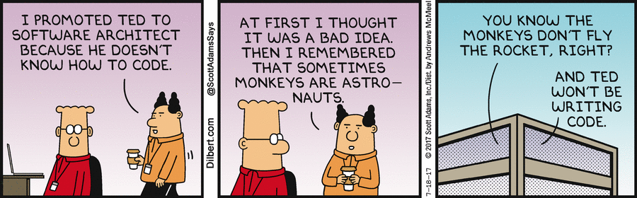

#  What Is Systems Architecture?

## Introduction 

To an outsider, all software developers do the same thing (develop software, right?!). But within the industry, there are many nuanced roles, teams, and disciplines in which developers specialize.

We're going to spend some time looking at some of those specific disciplines, starting with a biggie: **systems architecture** (also called software architecture, or software design, or systems design...).

---

## What Is Systems Architecture?

Let's think about actual buildings for a moment. What is a building's architecture (or the architect) concerned about?

	
Think of things like...

- How big is the building?
- What type of building is it?
- How long will it take to build?
- What resources will we need to build it?
- Is it resistant to floods, storms, earthquakes, etc.?
- Is it energy efficient? Modular? Avant garde?

An architect isn't doing the actual construction, but they are creating the blueprint for how the building should work. 

In a similar way, a software architect isn't writing the code for applications (although they probably *should* understand that stuff pretty well). They're more concerned with how to make the overall software and systems reliable, scalable, flexible, and secure.

Here's another nice definition:

> "Software architecture is the process of converting software characteristics such as flexibility, scalability, feasibility, reusability, and security into a structured solution that meets the technical and the business expectations."
*(Source: https://codeburst.io/software-architecture-the-difference-between-architecture-and-design-7936abdd5830)*

So, let's think about it. 

What types of businesses might want **scalability** as a top priority for their technology? What about **security**? Why might **feasibility** be most important? What about **flexibility**?

	
Some possible answers:

- **Scalability**: A business that gets high spikes in traffic, such as HBO (when a Game of Thrones episode was released) or Ticketmaster (when tickets for a concert go on sale).
- **Security**: Financial institutions, insurance/healthcare products, eCommerce websites... anything that deals with lots of consumers' personal information.
- **Feasibility**: Businesses that are cash-strapped: startups, government institutions, etc.
- **Flexibility**: Companies that are rapidly growing, launching new products, and adding new users.

A systems architect would work with product managers and other business stakeholders to determine these priorities. These priorities dictate the design choices they make on the technology side.

----

## A Day in the Life

So, what does this look like in practice? Let's find out!

With a partner, visit your favorite job search website (maybe Indeed, LinkedIn, or Glassdoor) and search for systems architect positions. (You might also try "software architect" or "solutions architect.")

Review the responsibilities and requirements in the job listings. 
- What appears consistently? 
- What jumps out at you?
- What questions do you have?

---

## Software Architectural Patterns

In the same way that design patterns provide a standard solution to common problems we see in our code, architectural patterns provide a standard framework and solution to common problems we see in our software and systems.

There are many types of architectural patterns that each serve different purposes. Let's cover a few popular ones:

#### Serverless Architecture

In this pattern, third-party technologies and providers are relied upon to manage the complexity of the servers and back-end systems. A business rents server space or VMs, which will run its back-end code.

> **Think**: What benefits does this provide? What types of businesses or applications might use this architecture?

#### Event-Driven Architecture

This pattern depends on **event producers** and **event consumers**. A system’s components are decoupled and a component will be triggered when a relevant event from another component is also triggered. (Think about event handling in JavaScript: Certain things happen in the DOM when users take certain actions.)

> **Think**: What benefits does this provide? What types of businesses or applications might use this architecture?

#### Microservices Architecture

This pattern depends on small, independent services that each solve a specific problem or perform a unique task. The services communicate with each other through APIs. We'll talk a LOT more about microservices later on. You'll even get to build them yourself!

> **Think**: What benefits does this provide? What types of businesses or applications might use this architecture?

