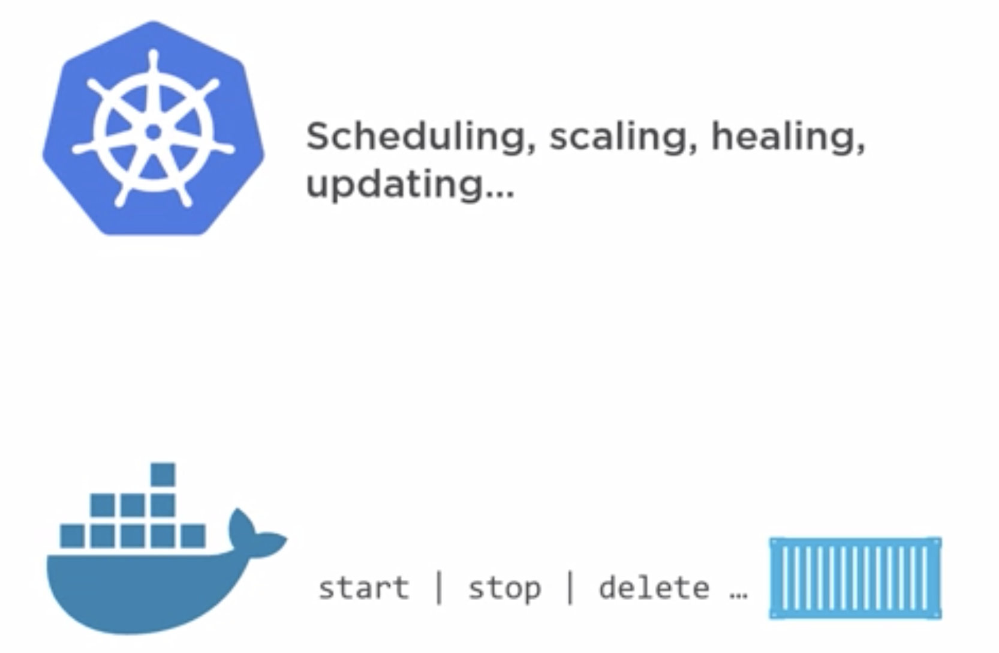
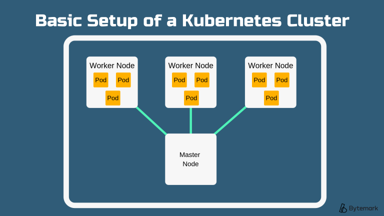
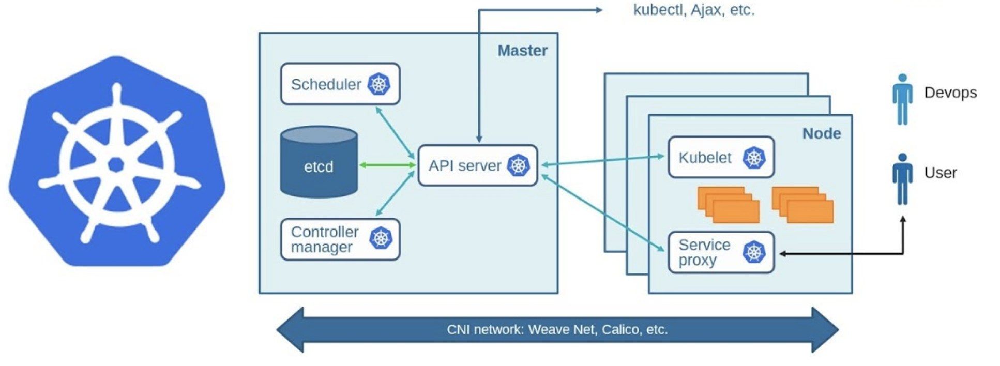

| Title | Type | Duration | Author |
| -- | -- | -- | -- |
| Intro to Kubernetes | Lesson | 2:00 | Prateek Parekh |      
    
#  Intro to Kubernetes

### Learning Objectives

*After this lesson, students will be able to:*

* Explain what Kubernetes is and define key terms.
* Run Kubernetes locally with Minikube.

### Lesson Guide

| TIMING  | TYPE  | TOPIC  |
|:-:|---|---|
| 5 min   | Introduction  | What Is Kubernetes? |
| 30 min  | Introduction | Why We Need Kubernetes
| 20 min  | Introduction  | Kubernetes Architecture |
| 50 min  | Independent Practice  | Running Kubernetes With Minikube |
| 5 min   | Conclusion  | Review/Recap |

----

## Introduction: What is Kubernetes? (5 min)

What is Kubernetes? As its creators put it:

*Kubernetes is a portable, extensible open-source platform for managing containerized workloads and services that facilitates both declarative configuration and automation. It has a large, rapidly growing ecosystem. Kubernetes services, support, and tools are widely available.*

> **Fun fact**: Kubernetes comes from a Greek word that means "helmsman" or "pilot." A fitting name! #themoreyouknow

Google built the Kubernetes project and open-sourced it in 2014. Kubernetes builds upon Google's decade and a half of experience with running production workloads at scale, combined with best-of-breed ideas and practices from the community.

---

## Why We Need Kubernetes (30 min)

Let's go back to the definition of Kubernetes. Does anything sound familiar?!

"Containerized workloads"... sounds a lot like a Docker thing, right? And it is! Kind of. Kubernetes is used to **manage and orchestrate containers**, and Docker is one of the most popular container technologies.

> **Refresher**: What are the main problems that Docker solves? Think about old-school deployment methods, VMs, and containers.

Containers are a good way to bundle and run your applications. In a production environment, you need to manage the containers that run the applications and ensure that there is no downtime. If a container goes down, another container needs to start. Wouldn’t it be easier if this behavior was handled by a system?

That’s how Kubernetes comes to the rescue! It provides you with a framework to run distributed systems resiliently, taking care of your scaling requirements, failover, deployment patterns, and more. 

Modern containerized apps can have thousands of containers. Containers allow you to decouple your applications but also bring new challenges around deployment, maintenance, security, and availability. Orchestrators such as Kubernetes help manage these containers. 

A good analogy is sending packages via courier services. We package our item in standard packaging, label it, include a manifest, and hand it over to the courier company; it takes care of all the complex logistics, such as which plane it goes on, which driver to use, etc. The same applies to an app in Kubernetes. It's packaged in a container, given a declarative manifest, and Kubernetes will take care of the rest of the complexities of running it (and making sure it stays running).  

> **Knowledge Check**: Can you think of another analogy or technology that serves a similar purpose?

### What's So Great About Kubernetes?

Some of the ways Kubernetes can change your life include:

- **Service discovery and load balancing**: If traffic to a container is high, Kubernetes is able to load balance and distribute the network traffic so that the deployment is stable.
- **Storage orchestration**: Kubernetes allows you to automatically mount a storage system of your choice.
- **Automated rollouts and rollbacks**: You can describe the desired state of your deployed containers using Kubernetes, and it can change the actual state to the desired state at a controlled rate.
- **Automatic bin packing**: Kubernetes allows you to specify how much CPU and memory (RAM) each container needs. When containers have resource requests specified, Kubernetes can make better decisions to manage the resources for containers.
- **Self-healing**:  Kubernetes restarts containers that fail, replaces containers, kills containers that don’t respond to your health check, and doesn’t advertise them to clients until they are ready to serve.
- **Secret and configuration management**: Kubernetes lets you store and manage sensitive information. You can deploy and update secrets and application configuration without rebuilding your container images and without exposing secrets in your stack configuration.

### How Kubernetes Differs From Docker

Docker and Kubernetes are often mentioned in the same breath, but it's not because they're competitors or replacements for each other. They're different technologies that serve different purposes.

While Docker provides the mechanics for starting and stopping individual containers, Kubernetes is more concerned with higher-level activities, such as how many containers to run an application on, which nodes to run it on, scaling up or down, and updating containers without any downtime. 

> **Knowledge Check**: How do Docker and Kubernetes work together?

### Kubernetes Key Terms

Before we get into the hows of Kubernetes, let's review some of the whats. 

Here's some key vocabulary that you'll be hearing in the rest of this lesson. We'll build on these concepts as we explore more about the architecture of Kubernetes.

#### Pod

The simplest unit of Kubernetes. Consists of one container or several containers that are tightly coupled and share resources.

#### Node

The CPU/RAM resources (usually a VM or physical machine) to be used by your application. Pods aren’t constrained to any given node at any given time but will move across all available resources to achieve the desired state of the application.

#### Cluster

A series of connected nodes connected that run the containerized applications being managed by Kubernetes. Together, nodes pool their resources and make the cluster much more powerful than the individual machines of which it's made up. 

#### Master Components

Control a cluster and tell it what to do: start/stop new containers, scheduling, etc.

#### Node Components

Run on every node, maintaining running pods and providing the Kubernetes runtime environment.

### Turn and Talk

That was a lot! Let's take a few minutes to digest what we talked about. 

Turn to a partner and come up with an "Explain it like I'm 5" explanation for:

- What Kubernetes is.
- How it works.
- Why it's helpful.

---

## Kubernetes Architecture (20 min)

Kubernetes is platform-agnostic. It runs on Linux but doesn't care if the underlying platform is bare metal, VM, a cloud instance, or OpenStack. 

First, we have the master (usually running on a single server), also known as the **control plane**. Its front end is called the **API server** (kube-apiserver) and exposes a restful API and consumes the manifest file in JSON format. The manifest file declares the state of our application. The master validates it and attempts to deploy it on a cluster. 

Next, we have a **cluster store**. It stores the configuration and state of the cluster in persistent storage known as [**etcd**](https://coreos.com/etcd/). 

Etcd is an open-source key-value store that is distributed, consistent, and gives the ability to watch for events and take action accordingly. It's based on the [Raft distributed consensus protocol](https://speakerdeck.com/benbjohnson/raft-the-understandable-distributed-consensus-protocol). Etcd plays an extremely important role in Kubernetes, as it's also the source of truth for the cluster and therefore warrants frequent backup. 

The **controller manager** (kube-controller-manager) can be considered a controller of controllers. It manages the node controller, namespace controller, endpoints controller, and many more. These controllers constantly wait for changes in the cluster and ensure that the current state of the cluster matches the desired state. 

Finally, we have the **scheduler** (kube-scheduler). It watches for new pods and assigns them to worker nodes. It's responsible for constraints, resource management, and various other tasks. 

The API server is the only component that exposes an endpoint for the cluster. It can be thought of as the brains of Kubernetes. Commands are sent to it via the `kubectl` command line utility in the form of JSON and eventually routed to the individual nodes. 

> **Knowledge Check**: What role does etcd play in Kubernetes?

---

## Running Kubernetes Locally With Minikube (50 min)

In [Docker](https://www.docker.com/) world, you can quickly spin up a local Docker environment with [Docker for Mac](https://docs.docker.com/v17.12/docker-for-mac/install/). Similarly, **Minikube** allows you to run a local Kubernetes environment. 

When you spin up Minikube, it creates a local VM in the background. Inside this VM, it spins up a single-node Kubernetes cluster. It also set things up such that the Kubernetes API server and other services inside of the VM are also available outside in your local environment. 

You can then use the `kubectl` binary on your local machine to manage the cluster inside the Minikube VM.

### Let's Do It

The first step is to install Minikube. [Click this link](https://kubernetes.io/docs/tasks/tools/install-minikube/), select your operating system, and follow the installation instructions.

> **Note**: Minikube is NOT meant for production environments. It's ideal for local development environments on your desktop/laptop and lets you get familiar with Kubernetes in a short period of time. 

Once you've completed the Minikube installation, follow this [demo guide](https://kubernetes.io/docs/setup/learning-environment/minikube/#quickstart) to learn how to:

1. Start Minikube.
2. Use `kubectl` to interact with the cluster.
3. Create a Kubernetes deployment.
4. Launch and access a pod.
5. Delete the service and deployment.
6. Stop and delete the cluster.
7. Manage a cluster.
8. Explore various configuration options.

See how far you can get in the next 45 minutes or so. Happy Kubernet-ing!

----

## Conclusion (5 min)

And with that, you've covered the basics of Kubernetes! With Minikube all set up and running, you can now work with some basic clusters to get a feel for Kubernetes.

