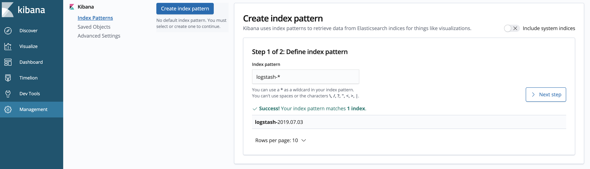

| Title | Type | Duration | Author |
| -- | -- | -- | -- |
| Logging and Monitoring | Lesson | 2:50 | Prateek Parekh |  

#  Logging and Monitoring

### Learning Objectives

- Explain the importance of logging and monitoring.
- Identify the best metrics against which to monitor your apps.
- Choose the best logging tools for a given situation.
- Implement logging and monitoring systems for your applications.

### Lesson Overview

| TIMING  | TYPE  | TOPIC  |
|:-:|---|---|
| 5 min  | Opening  | Discuss lesson objectives |
| 10 min | Introduction | Overview of logging and monitoring |
| 20 min | Introduction | Key Monitoring Metrics |
| 30 min | Introduction | Key Tools |
| 50 min | Guided Practice | Getting Started with ELK |
| 50 min | Guided Practice | Instrumenting Hosts |
| 5 min  | Conclusion  | Review / Recap |

## Opening (5 min)

You're dropping a hot new line of clothing on your site at 12pm. At 12:02, a bunch of customers report that they're seeing error statuses as the page loads, but you're still seeing some customers access the site with no problem. What's gives?! 

If you have a microservices application that runs hundreds of instances and containers, it can be nearly impossible to track down the instance that's having the problem and what caused it.

Breaking up a monolithic system into smaller fine-grained services brings a number of benefits, but it also adds complexity to our system. The single point of failure nature of Monolith systems can make monitoring and investigating issues a lot simpler compared to the distributed nature of a microservices application, where there are multiple servers to monitor, multiple logs to sift through, and many sources of network latency. 

----

## Introducing Logging and Monitoring (10 min)

Before we go much further, let's define the key terms of this lesson.

- **Logging** generates a detailed set of events about what's going on in your application. When an event happens, a set of data is automatically generated about what happened.
- **Monitoring** tells you if your application is working or not. It's less about specific events and more about what's happening over time.

On their own, they're both great. But they go together like chips and guac. Pairing logging with monitoring can help you sift through log data much more efficiently in order to get to the root of the problem.

Think about it: You go to the doctor and tell her that your throat hurts. That's a log - a thing that's going on. But a sore throat could be any number of things - strep, the common cold, yelling too much at a concert, etc. That's monitoring - an ongoing record of what has been happening in your life. 

Let's break it back to technology. Imagine that you're seeing errors on your server. 

You can look back at your logs to see when it happened and with what frequency. In your monitoring history, you see that memory usage is fairly stable and consistent. But then, you see a spike in the memory utilization. That's not right!

Without the logs, this spike doesn’t mean much (other than it shouldn't be there). Bringing together your logs and monitoring can provide much more clarity. During the spike in memory utilization, you find some unusual log entries indicating a specific event that caused the spike.

----
   
## Key Monitoring Metrics (20 min)

But how do you know what datapoints to monitor? How can you decide when something is good or bad? Where in your application should you be looking? It all comes down to picking the right metrics.

In a complex environment, we might need to monitor a range of metrics at many different levels: application, host, and service. 

### Host Monitoring
  
Host/Infrastructure metrics include the metrics on the platform that our microservices resides on. 
 - CPU 
 - Memory
 - Disk space
 - Network bandwidth

### Services Monitoring

Services are the microservices components that make up our microservices architecture.

 - Availability
 - Response times
 - Status codes (Errors, Exceptions, timeouts)
 - Cache hit rates
 - Error rates

Additionally, we need metrics on our own services. These are also known as business metrics that can expose issues that are subtle and hidden, as they are not directly correlated with any technical metrics and statistics. 

For example, we have rolled out a new version of our E-commerce website and there's a bug where our new checkout button is not rendering correctly on one of the browsers. It's preventing customers from proceeding with the purchase of their order. This will result in a sudden drop in sales, but since there are no obvious technical metrics around this use case that can be collected in our system, we might miss an important detail like this. 

### Monitoring Strategy 

Our monitoring strategy would differ based on whether it's a service that's part of our microservices application or it's a third party library. We also might want to collect different statistics and metrics at different stages. 

For example, if we have just released a new version of a microservice, we would want to collect more statistics around exceptions being thrown or compatibility issues introduced by a new bug in our application. 

----
 
## Tools (30 min)

Not only do we want to look at a metric (like average CPU load) aggregated for the whole system, but we also need to aggregate that metric for all instances of a service or even for a single instance of that service. This would need associating some kind of metadata with the metric that will allow us to differentiate between these contexts.  
   
### Enter: the ELK Stack  

Elastic - the developer of ELK - describes it as:

_"ELK" is the acronym for three open source projects: Elasticsearch, Logstash, and Kibana. Elasticsearch is a search and analytics engine. Logstash is a server‑side data processing pipeline that ingests data from multiple sources simultaneously, transforms it, and then sends it to a "stash" like Elasticsearch. Kibana lets users visualize data with charts and graphs in Elasticsearch._    
[Source](https://www.elastic.co/elk-stack)

It allows you to create a fully capable monitoring and dashboard system for your infrastructure.  
   
The Elastic company offers 2 primary ways to use the ELK stack: a cloud hosted option or a self hosted on-premise option.  

Following is a brief overview of each of these projects.

[Elasticsearch](https://www.elastic.co/products/elasticsearch):
 - Highly scalable document database
 - Built-in search, aggregation and sharding capabilities 
 - Backs up popular services like Microsoft Azure Search, Wordpress and Stack Exchange
 - Backend repository for logging and monitoring infrastructure

[Kibana](https://www.elastic.co/products/kibana):
 - Web-based front-end for viewing logs 
 - Allows searching through logs using regular expression and time ranges with a query syntax
 - Can generate graphs showing trends of the various metrics
 - Works seamlessly with Elasticsearch
 
[Logstash](https://www.elastic.co/products/logstash):
 - Aggregates incoming logs and messages
 - Processes them by modifying or supplementing the log data
 - Forwards the altered logs to Elasticsearch

[Beats](https://www.elastic.co/products/beats):
 - Collection of small, lightweight programs
  - Filebeat: analyzes text log files
  - Metricbeat: collects metrics from the OS and applications
  - Packetbeat: collects network data
  - Winlogbeat: listens on windows event log
  - Libbeat: Write your own custom utility in Golang
 - Allows the collection of data from a variety of sources
 - Can forward data to another external application like Logstash or Elasticsearch
 
So, how do all of these work together? 

First, the respective Beats applications read the logs and telemetry data, forward the information to a Logstash server where it will be changed and augmented and then sent to an Elasticsearch server. Finally, Kibana can help graph and make sense out of this information.  
  
An example of one such workflow is shown below:
  
  
*[Source](https://howtodoinjava.com/microservices/elk-stack-tutorial-example/)*
  
### Graphite

[Graphite](https://graphiteapp.org/) is a system that exposes an API allowing our application to send metrics in real time and query them to produce displays like charts. 

  
*[Graphite High Level Architecture](https://graphiteapp.org/)*

It can aggregate across samples or drill down to a single series. An alternative to this tool is [Prometheus](https://prometheus.io/). If you have access to the raw data, you can even provide your own custom reporting and dashboards. You can store information about your system over a long period of time to generate trend reports which can be immensely helpful for capacity planning.   

### Zipkin  

*"Zipkin is a distributed tracing system. It helps gather timing data needed to troubleshoot latency problems in microservice architectures. It manages both the collection and lookup of this data. Zipkin’s design is based on the Google Dapper paper."*
[Source](https://zipkin.io/)

It can trace calls across multiple system boundaries and provide very detailed tracing of interservice calls alongwith a UI to represent the data. 
  
### Pingdom

[Pingdom](https://www.pingdom.com/) is a global performance and availability monitoring solution for your websites, applications, and servers. So, it not only allows you to track if your website is down but also ensure that the users of your application are able to access it in a timely manner.  
  
It also provides [webhooks](https://www.pingdom.com/resources/webhooks/) that let you programmatically act on state changes that occur on any uptime or transaction checks.

------

## Getting Started with ELK (50 min)

We'll be going through our installations using Homebrew, which you should already have installed on your Mac.

### Installing Elastic Search 

Typically, Elasticsearch installations comprise of multiple nodes that form a cluster which balances out the work and storage of the indices. However, we will only be going through a one node cluster installation which will handle all the duties of storing and indexing log data.  

Verify the current Java installation (you need JDK 1.8 or higher):

```sh   
   # Homebrew 
   brew update
   brew cask install java
   
   # Verify version of java installed
   brew cask info java
   
   # Verify version of java from the Terminal
   java --version
   
   # Install elastic search
   brew install elasticsearch
```

The primary Elasticsearch configuration file is in `/usr/local/etc/elasticsearch/elasticsearch.yml` It contains all of the configuration we'll need to manage for this Elasticsearch node. 

We'll make the following changes:

```
cluster.name: ga-monitoring
node.name ga-node1
```

Now, Open Terminal and run the following commands:

```
   # Start the elastic search server
   brew services start elasticsearch
   
   # Verify server is running
   curl http://localhost:9200

   # The output should appear as below
   {
     "name" : "LrDGF7Q",
     "cluster_name" : "ga-monitoring",
     "cluster_uuid" : "TzGWB0aOT6e1scWc2zZYfA",
     "version" : {
       "number" : "6.8.0",
       "build_flavor" : "oss",
       "build_type" : "tar",
       "build_hash" : "65b6179",
       "build_date" : "2019-05-15T20:06:13.172855Z",
       "build_snapshot" : false,
       "lucene_version" : "7.7.0",
       "minimum_wire_compatibility_version" : "5.6.0",
       "minimum_index_compatibility_version" : "5.0.0"
     },
     "tagline" : "You Know, for Search"
   }
   
   # List the elastic search server process
   ps ax | grep elasticsearch
```

### Installing Logstash   

Logstash is an open source data collection engine. It's designed to ingest data (e.g., logs) and filter them before forwarding it to a permanent backend storage. In other words, it serves as a clearinghouse for our data. 

Note that if Logstash is being installed on a different host (as is the case in most production systems), it will require JDK to be already installed. 
   
```
   # Install Logstash
   brew install logstash
```

We can test the Logstash installation by passing it a full Logstash configuration as follows:  

```
logstash -e 'input { stdin { } } output { elasticsearch { hosts => ["localhost:9200"] } }'
```

The command tells logstash to accept input from standard input (command-line) and set the output directory to our elastic search server. This doesn't include the optional filter option. 

Now, let's verify if the Logstash server is correctly forwarding the message to Elasticsearch. When the above command is run, we see some startup messages followed by a prompt. We can write the test message below:

`This is a logstash test! Hello from GA!`

To ensure that our message reached Elasticsearch, we'll use [Postman](https://www.getpostman.com/downloads/). 

In Postman, create the following GET request:

`http://localhost:9200/logstash-*/_search`   

 - HTTP verb is GET since we are requesting information from Elastcsearch
 - the hostname and port number our Elasticsearch is running on
 - the index name we are expecting along with the wilcard
 - an empty search clause which will return all documents 

When we submit, we get the results of our search:

```
{
    "took": 44,
    "timed_out": false,
    "_shards": {
        "total": 5,
        "successful": 5,
        "skipped": 0,
        "failed": 0
    },
    "hits": {
        "total": 1,
        "max_score": 1,
        "hits": [
            {
                "_index": "logstash-2019.07.03",
                "_type": "doc",
                "_id": "JxgxuGsBAdywd6FbqC8_",
                "_score": 1,
                "_source": {
                    "@version": "1",
                    "@timestamp": "2019-07-03T14:16:30.277Z",
                    "message": "This is a logstash test! Hello from GA!",
                    "host": "LM-ABC-00010051"
                }
            }
        ]
    }
}
```

The index was automatically created with the logstash-date syntax (default for logstash) with all the default fields added to the entry. Note that our message is also present in this document. We have confirmed that our logstash installation is working as expected. 

We can terminate logstash by going back to our terminal and entering CTRL + C.

To start logstash as a service, use the following:

```   
   # Run logstash
   brew services start logstash
```

### Installing Kibana   

Kibana is a general purpose graphing and visualization tool from the Elastic team. It was originally written in Node.js so it's quite easy to install and distribute it as a package without the need of any runtime installations.  

If Kibana is being installed on a different host, it does not require JDK (unlike Elasticsearch and Logstash). 
   
```
   # Install Kibana
   brew install kibana   
```

The Kibana configuration file, `kibana.yml`, is located at `/usr/local/etc/kibana` and allows you to update values like...

- server.host: "localhost" 
   - specifies the IP address or hostname to which the Kibana server will bind
- server.name: "ga-kibana01" 
   - sets the name of your Kibana server
- elasticsearch.url: "localhost:9200" 
   - is the IP address of the Elasticsearch server installed previously 

```
   # Run Kibana
   brew services start kibana
```   

Once the server is started, it is available at `http://localhost:5601`.

 

Click on "Explore on my own".

Next, go to "Management" --> "Index Patterns".

Make sure the Index Pattern in "Step 1 of 2: Define index pattern" is `logstash-*`. It tells Kibana what our Elasticsearch index names look like. 



In "Step 2 of 2: Configure settings", the time filter field name should be set to `@timestamp`. This is the field Logstash and Elasticsearch use as the default time field name format. 

When we click "Create Index Pattern", a default set of fields are displayed that Kibana is expecting to see. This may depend on whether or not you already have some data in your elasticsearch cluster. 

Next, click on Discover and change the time range (top right corner) to "this week".


Kibana should show a single event. It's the logstash event we sent when installing Logstash. Kibana is listing it in the default Discover tab since the search parameters are not explicitly set. We can view all the default data Logstash added. 

Expand the document by clicking on the array on the left of the date. You should now see two tabs (Table and JSON). To view how the data appears in Elasticsearch, click the JSON tab of the document result. 

-----

## Instrumenting Hosts (50 min)

In a production environment, your Elasticsearch cluster would consist of multiple hosts (Linux or Windows). To get a complete picture of our network health, we will need to instrument these hosts. For our activity, we will use our Mac as the host to instrument. 

### Metricbeat

The first step is to install [Metricbeat](https://www.elastic.co/products/beats/metricbeat). It will give us a realtime view of our CPU, RAM, and disk consumption. Additionally, we will use [Filebeat](https://www.elastic.co/products/beats/filebeat) for monitoring text-based file log data. It works in two phases:

1. Reads the log files one line at a time.
2. Ships that data to either Elasticsearch or Logstash for further processing. 

Let's begin!

Install filebeat with homebrew: 

```
brew install metricbeat
```

The metricbeat configuration file is located at `/usr/local/etc/metricbeat/metricbeat.yml`.

Here, we choose the metrics to include. The important ones are already enabled by default. 

Scroll down to the `tags` and `fields` section. 

Tags let us add arbitrary data in each log entry that we might be interested in querying on later in our Elasticsearch repository. They become their own array of data inside Elasticsearch. Fields data get appended directly at the root of the JSON document inside Elasticsearch. 

```
# The tags of the shipper are included in their own field with each
# transaction published.
tags: ["fileserver"]

# Optional fields that you can specify to add additional information to the
# output.
fields:
  env: staging
```

Scroll down to enable Kibana by uncommenting host.

```
#============================== Kibana =====================================

# Starting with Beats version 6.0.0, the dashboards are loaded via the Kibana API.
# This requires a Kibana endpoint configuration.
setup.kibana:

  # Kibana Host
  # Scheme and port can be left out and will be set to the default (http and 5601)
  # In case you specify and additional path, the scheme is required: http://localhost:5601/path
  # IPv6 addresses should always be defined as: https://[2001:db8::1]:5601
  host: "localhost:5601"
```
  
Next, ensure the output is set to Elasticsearch.

```
#-------------------------- Elasticsearch output ------------------------------
output.elasticsearch:
  # Array of hosts to connect to.
  hosts: ["localhost:9200"]

  # Enabled ilm (beta) to use index lifecycle management instead daily indices.
  #ilm.enabled: false

  # Optional protocol and basic auth credentials.
  #protocol: "https"
  #username: "elastic"
  #password: "changeme"

#----------------------------- Logstash output --------------------------------
#output.logstash:
  # The Logstash hosts
  #hosts: ["localhost:5044"]
```

### Filebeat

Now, we will install filebeat with homebrew: 

```
brew install filebeat
```

The configuration file is located at `/usr/local/etc/filebeat/filebeat.yml`.

At the very top is the Filebeat prospectors section. The prospector configuration is disabled by default. Enable it by uncommenting the following line:

```
#=========================== Filebeat prospectors =============================

filebeat.prospectors:

# Each - is a prospector. Most options can be set at the prospector level, so
# you can use different prospectors for various configurations.
# Below are the prospector specific configurations.

- type: log

  # Change to true to enable this prospector configuration.
  enabled: true
```

These entries tell Filebeat which directories to monitor and process. For example, the `paths:` entry with `/var/log/*.log` causes all the files with log extension under this directory to be watched by Filebeat. There can be a lot of files in this directory and we could limit this to just the syslog data by changing the value to `/var/log/system.log`. 

We could also supply the document type so that Logstash knows the type of data it is reading. So, we add the following below the path entry.

```
paths:
   - /var/log/system.log
document_type:
   - syslog
```

You can also have Filebeat specifically ignore or include lines in a log file using the `exclude_lines` and `include_lines` directives and regular expressions. We will leave them unchanged for our activity.  

Filebeats also has a tag and field section that we can change as shown below: 

```
# The tags of the shipper are included in their own field with each
# transaction published.
tags: ["fileserver"]

# Optional fields that you can specify to add additional information to the
# output.
fields:
  env: staging
```

Scroll down to enable Kibana by uncommenting host:

```
#============================== Kibana =====================================

# Starting with Beats version 6.0.0, the dashboards are loaded via the Kibana API.
# This requires a Kibana endpoint configuration.
setup.kibana:

  # Kibana Host
  # Scheme and port can be left out and will be set to the default (http and 5601)
  # In case you specify and additional path, the scheme is required: http://localhost:5601/path
  # IPv6 addresses should always be defined as: https://[2001:db8::1]:5601
  host: "localhost:5601"

```

Finally, ensure that the output is sent to Elasticsearch. 

```
#-------------------------- Elasticsearch output ------------------------------
output.elasticsearch:
  # Array of hosts to connect to.
  hosts: ["localhost:9200"]

  # Optional protocol and basic auth credentials.
  #protocol: "https"
  #username: "elastic"
  #password: "changeme"

#----------------------------- Logstash output --------------------------------
#output.logstash:
  # The Logstash hosts
  # hosts: ["localhost:5044"]
```

Before starting Filebeat or Metricbeat, we need to load the index template, which lets Elasticsearch know which fields should be analyzed in which way.

```
cd /usr/local/etc/metricbeat

metricbeat setup --template -E output.logstash.enabled=false -E 'output.elasticsearch.hosts=["localhost:9200"]'

cd /usr/local/etc/filebeat

filebeat setup --template -E output.logstash.enabled=false -E 'output.elasticsearch.hosts=["localhost:9200"]'
```

Start the beat utilities with hombrew.

```
# List all brew services
brew services list

# Start the service
brew services start filebeat
brew services start metricbeat

# If any service is already running
brew services restart filebeat
brew services restart metricbeat
```

The final step is to create index pattern in Kibana based on the indices that have been created.

```
# If Kibana is not already running, start it using homebrew
brew services start kibana 
```

Go to [http://localhost:5601/app/kibana](http://localhost:5601/app/kibana).

Click on Management -> Index Patterns -> "Create index pattern".

Enter the pattern `filebeat-*` under "Index Pattern". If the index template has been loaded correctly as per the previous step, the following message should be displayed "Success! Your index pattern matches 1 index."

Click "Next step" to configure settings. 


Under "Time Filter field name", enter "@timestamp" as it will allow us to filter date by time. 

Click "Create index pattern".


Repeat the above steps to create index pattern for metricbeat.

Let's make these index patterns useful. Click on Discover on the left navigation. Under "Add a filter", you should now be able to select either `metricbeat-*` or `filebeat-*` pattern and view all the events over a period of time that have been received by Elasticsearch. If you expand any of these document results and click the JSON tab, you can view the tag (i.e. fileserver) and env (i.e. staging) information that we had earlier added. It is just as easy to search and filter these results by tag or hostname or environment or all of these especially in a cluster with multiple hosts. 

Moreover, you can save your search and then create Graphs out of these searches by clicking on the Visualize tab on the left. Finally, this graph can then be combined with other graphs to form a Dashboard.

-----

## Summary (5 min)

This was a long lesson. Let's summarize everything we did.   
 
1. We introduced the concept of logging and monitoring and why it's especially important in a microservices architecture. 
1. We identified the different key monitoring metrics and the extent of their impact on our application and business. 
1. We explored some tools like the ELK stack, Graphite, Zipkin, and Pingdom that greatly simplify various monitoring tasks around search, analytics, data processing, tracing and visualization. 
1. We went through several hands-on activities, including installing and configuring the various monitoring tools to work together and summarizing the findings in an intuitive graphical format. 

It's important to understand that the tools we learned about are only useful once we have explored and identified the key metrics in our application. For example, if we have an application consisting of several microservices interacting with each other over the network, we would certainly want to instrument the network traffic. 

#### Resources

- [Zipkin](https://zipkin.io/pages/quickstart.html)
- [Pingdom Reports](https://www.pingdom.com/tutorial/understanding-reports/)

