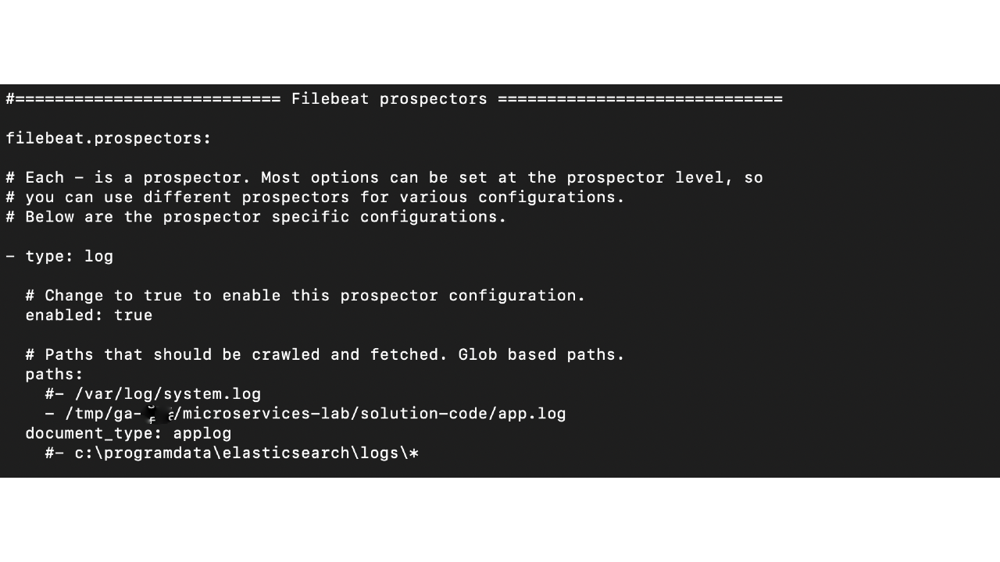
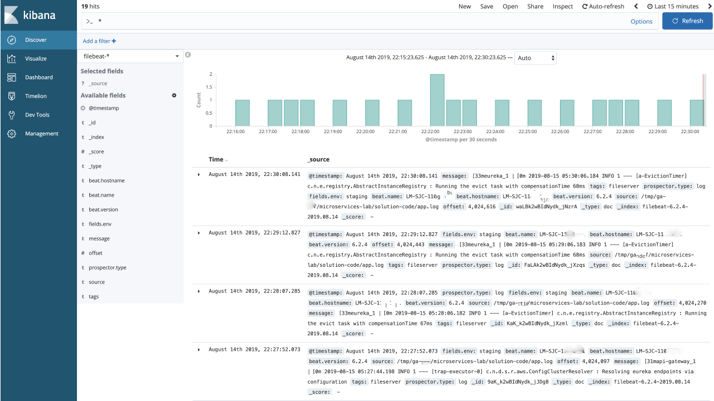
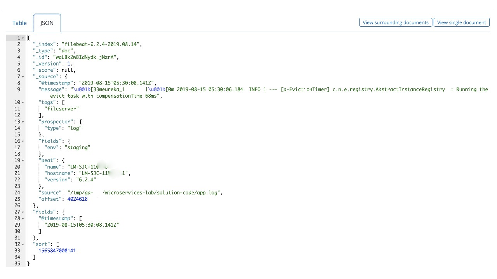
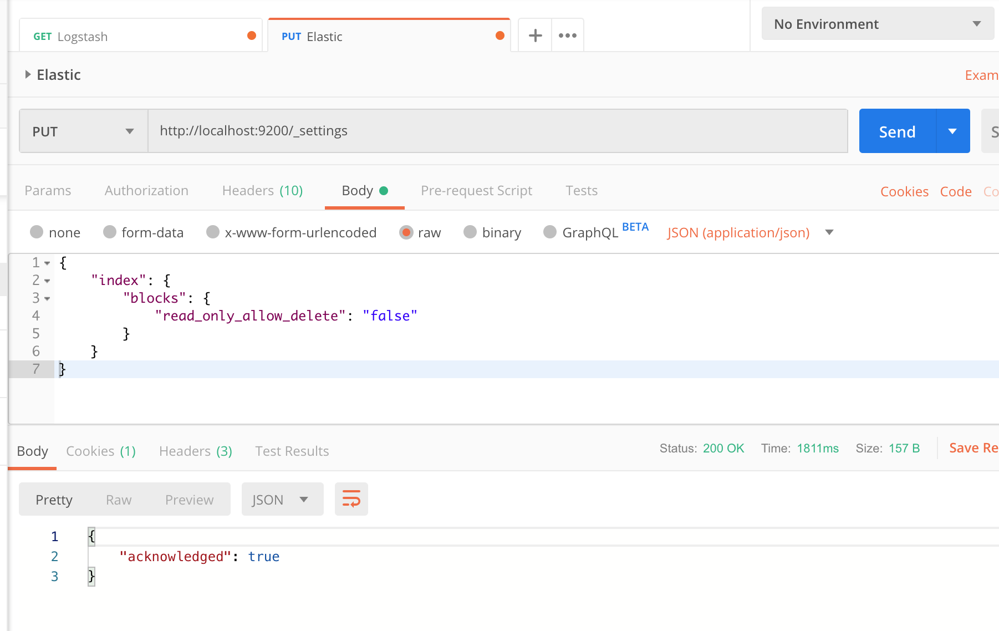

#  Monitoring Application Logs Lab

## Overview

As we've already learned in the ["Logging and Monitoring"](/logging-monitoring-lesson) lesson, there are several tools that can help us understand the overall state of our system and track down issues when things go wrong.

Let's see this in action with another application we developed in the ["Microservices"](https://git.generalassemb.ly/GA-Cognizant/building-for-cloud/tree/master/microservices-lab) lab.

In this lab, we'll get hands-on experience with how logging and monitoring can improve troubleshooting. We'll:

- Launch our previously developed microservices application.
- Set up logging and monitoring using the tools we've already installed.
- Gain familiarity with how to query for errors and messages using Kibana.

----

## Setting Up Application Logging 

We'll set up a log file containing all information related to application startup, server, errors, warnings, and so on. 

#### Step 1

Create an empty `app.log` file. We can run the `docker-compose` command to initialize all services and launch our application from the ["Microservices"](https://git.generalassemb.ly/GA-Cognizant/building-for-cloud/tree/master/microservices-lab) lab, then redirect all output to this file:

```sh
   cd /path/to/microservices/lab/with/docker-compose.yml
   touch app.log
``` 

This file can quickly grow in size, and it would be extremely challenging to understand and search for specific errors or keywords in our application. One possible approach would be to use UNIX utilities like `grep`, `awk`, and `sed`, but as the size of the file increases, this can become tedious. 

#### Step 2
 
Next, we'll make use of our [previously installed ELK Stack and Filebeat utility](https://git.generalassemb.ly/GA-Cognizant/dev-ops/tree/master/logging-monitoring-lesson) to get details on key metrics in our microservices application log, such as errors, exceptions, and configuration details.   

Open the Filebeat configuration file at `/usr/local/etc/filebeat/filebeat.yml`. Under the `Filebeat prospectors` section, scroll to the `paths` entry and change it to `/path/to/microservices/lab/app.log`. Also, scroll down to the `General` section and change the `tags` field to `console`. Leave the other settings unchanged.



#### Step 3

Restart or start the Filebeat and Kibana services.

```sh
   brew services restart filebeat
   brew services restart kibana
```

#### Step 4

Launch the microservices application using `docker-compose` and redirect the output to the `app.log` file.

```sh
   docker-compose up >> app.log
```

#### Step 5
   
Open Kibana on your browser (`http://localhost:5601/app/kibana`) and go to the `Discover` tab on the left-hand side. Under `Filter`, select `filebeat-*`. You should now see the details of the messages that were being logged in the `app.log` file. You can filter messages by error, time stamp, tag, host, and so on:
    


You can even drill down to each document result and view the data in JSON format:



### `Error: FORBIDDEN/12/index read-only / allow delete (api)`

If you don't see anything in Kibana, it may be because of a problem when Filebeat sends data to Elasticsearch. Have a look at your Filebeat log file to see what's going on:

```bash
cat  /usr/local/var/log/filebeat/filebeat  | grep WARN
```

If you see a message like the one below (specifically, `"reason":"blocked by: [FORBIDDEN/12/index read-only / allow delete (api)];"`), you'll need to change the settings for an existing index in Elasticsearch as described [here](https://discuss.elastic.co/t/forbidden-12-index-read-only-allow-delete-api/110282). You can use Postman to make the configuration change in Elastic.



```bash
2019-08-25T11:35:24.200-0400	WARN	elasticsearch/client.go:502	Cannot index event publisher.Event{Content:beat.Event{Timestamp:time.Time{wall:0xbf50c88ec5cb2f50, ext:1280682148210, loc:(*time.Location)(0x555ba00)}, Meta:common.MapStr(nil), Fields:common.MapStr{"message":"\x1b[33meureka_1       |\x1b[0m 2019-08-25 15:35:21.329  INFO 1 --- [a-EvictionTimer] c.n.e.registry.AbstractInstanceRegistry  : Running the evict task with compensationTime 49ms", "tags":[]string{"console"}, "prospector":common.MapStr{"type":"log"}, "fields":common.MapStr{"env":"staging"}, "beat":common.MapStr{"name":"iceman", "hostname":"iceman", "version":"6.2.4"}, "source":"/Users/alex/workspaces/GA-Cognizant/building-for-cloud/microservices-lab/solution-code/app.log", "offset":93042}, Private:file.State{Id:"", Finished:false, Fileinfo:(*os.fileStat)(0xc000492ea0), Source:"/Users/alex/workspaces/GA-Cognizant/building-for-cloud/microservices-lab/solution-code/app.log", Offset:93042, Timestamp:time.Time{wall:0xbf50c753a7895e50, ext:20197583234, loc:(*time.Location)(0x555ba00)}, TTL:-1, Type:"log", FileStateOS:file.StateOS{Inode:0x202aec24a, Device:0x1000004}}}, Flags:0x1} (status=403): {"type":"cluster_block_exception","reason":"blocked by: [FORBIDDEN/12/index read-only / allow delete (api)];"}
```

