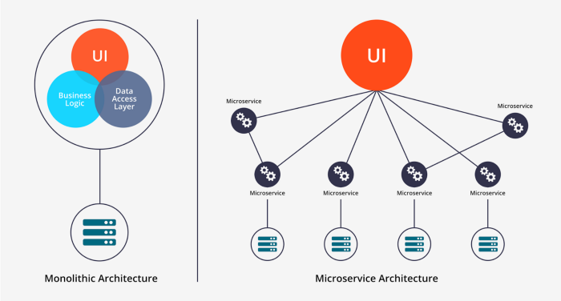

#  Intro to Microservices

## Learning Objectives

*After this lesson, students will be able to:*

- Discuss the pros and cons of microservices and monoliths.
- Reference real case studies of companies that have moved from monoliths to microservices.

## Lesson Guide

| TIMING  | TYPE  | TOPIC  |
|:-:|---|---|
| 15 min | Introduction  | The Origin of Microservices |
| 10 min  | Introduction  | Thinking Through Microservices |
| 30 min  | Independent Practice  | Microservices Case Studies |
| 5 min  | Conclusion  | Review/Recap |

## The Origin of Microservices (15 min)

The deployment and monitoring of applications has been an epic chore for as long as code has existed. 

Let's take a trip back in time to the beginning of the internet era. In the 1990s and 2000s, enterprise applications were the bread and butter of many engineers. Software teams built and maintained these enterprise apps in one single, large, complex codebase. We call these **monoliths**. 

> **Check**: What was "different" about engineering back in this time period? 

For a long time, "deploying" code meant moving the data around on some physical medium. (Anyone remember AOL CDs?) The code had to be put on disks (or even tape) and inserted into a server.

If that server was miles away, someone had to drive it there. The server often had to be shut down entirely and turned back on to start the new service. Anything else running on that server also had to be shut down. Once you had everything running, you still needed some kind of secure access to that machine to view the logs. And should you find a bug? You had to start the process all over.

But it wasn't all bad. One benefit of monoliths is that a single application is much easier to turn on and off than multiple applications. It's also much easier to monitor. 

With the advent of fast internet connections and cloud-hosted virtual machines (and now containers), the work required to deploy and monitor an application has significantly decreased. It has decreased so much, in fact, that multiple applications can be managed with less overall complexity than was once required for a single app. This opens up some interesting possibilities.

**Microservice architecture** takes advantage of modern tools by breaking up large applications into small, individual apps. Each of these apps can be deployed, monitored, and maintained independently, but they all work together to solve large problems. 

A common microservices term is **coupling**. Microservices are loosely coupled, while monoliths are tightly coupled.

> **Knowledge Check**: Can someone explain what the difference is?

---

## Thinking Through Microservices (10 min)

Microservices sound like a pretty great improvement over monoliths, huh? Let's think through the pros and cons a bit more.

### Benefits of Microservices

- **Scaling**: Microservices can be "scaled" independently of each other. If we have far more requests to a shopping cart API than we do to a user profile API, we can turn on more instances of the shopping cart API independently. With a monolithic application, we'd have to scale the whole thing.
- **Separation of concerns**: Unrelated code no longer needs to live together.
- **Development speed**: We no longer need to navigate the maze of a large application.
- **Testability**: Smaller apps are easier to test end to end.
- **Learnability**: It's much easier to get up to speed on a new project or task when the application is simpler.

### Challenges of Microservices

- **Design and runtime complexity**: While microservices can help reduce complexity within a large application, they have to interact with each other. This introduces a new kind of complexity that can be prohibitive. It also introduces the need for new tools. Modern tools make it simpler to manage an application's life cycle, but it will always be simpler to manage one than many. Guaranteeing reliability is always a challenge.
- **Network overhead**: Networks are slow compared to other alternatives. All the different calls over the network can cause issues around latency. Your applications need to be designed with these issues in mind.

All that brings us to the ultimate question...

### Should I Always Build Microservices?

Any pattern that can be used can also be abused.

It's always a good idea to choose the simplest solution at first and then refactor later. A microservice environment will necessarily have more moving pieces than a monolith, so starting with a monolith may be the right decision. 

It's not at all uncommon to see a monolithic application with a few "satellite" microservices that have been refactored out of the main codebase. Many, many startups build their applications in this way.

----

## Microservices Case Studies (30 min)

Whether or not to move to a microservices architecture is a question that many companies face as they scale.

Break into small groups and choose one of the case studies below. 

Take five minutes to read the article on your own. After that, come back together with your group.

As a group, take 10 minutes to discuss:

* Why did the company decide to migrate to a microservices architecture?
* What did its architecture look like before?
* How have microservices helped the company?
* What drawbacks and challenges has it experienced?
* What would you ask the authors of these cases if you had the chance?

Be ready to share a recap of the case and your reflections with the class!

### Case Studies

- [Box Co-Founder on Moving From Monolith to Microservices](https://architecht.io/box-co-founder-on-moving-to-microservices-and-the-promise-of-kubernetes-a49f01b1c0c0)
- [Adopting Microservices at Netflix](https://www.nginx.com/blog/adopting-microservices-at-netflix-lessons-for-team-and-process-design/)
- [Breaking Up a Monolith at Kong](https://buttercms.com/books/microservices-for-startups/breaking-up-a-monolith)

----

## Conclusion (5 min)

We'll get our hands dirty setting up a microservices environment soon. For now, let's review:

- What is the difference between a monolith and microservice?
- What do we mean when we talk about coupling parts of an app?
