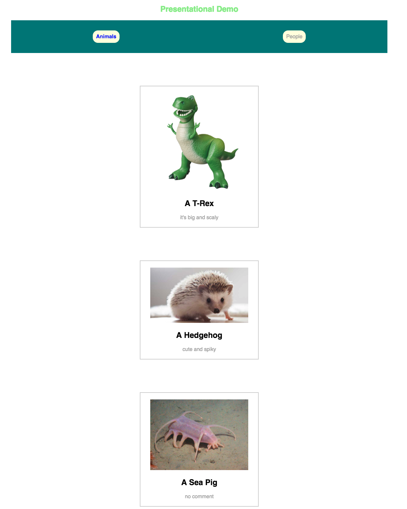

#  React Component Lab

## Introduction

For this exercise, you'll build out a few simple components in React based on the provided screenshot. The aim is to practice making small, reusable components that simply take data as props and then display it. The quicker you become comfortable with factoring out components, the sooner you can build more complex and interesting apps.

Throughout this exercise, save and check your code in the browser frequently; helpfully, `create-react-app` allows us to quickly iterate and experiment with writing small bits of code. Leverage this resource!



### Step 1: Up and Running

First, let's make a new React app:

- Run `create-react-app <your-app-name-here>`.
- `cd` into the app and `npm start`.
- Remove the boilerplate code from the `render()` method in `App.js`.

### Step 2: A Greet Component

Time for our first component!

- Make a `Greet.js` file.
- Import React.
- Make a `Greet` component.
- The `Greet` component should simply render a greeting message in large, colored text (you can add styles directly to `App.css`).
- Export the `Greet` component from the file.
- Import the `Greet` component inside `App.jsx` and render it from the `App` component.
- WIN!

### Step 2: A Header Component

- Make a `Header.js` file.
- Import React and make a `Header` component (don't forget to export it!).
- The `Header` component should receive a `tabs` prop, which will be a list of headings to render (in the mockup, these are `People` and `Animals`).
- Import the `Header` from `App.js` and render it; don't forget to pass an array of `tabs` to render in the header.
- Render the tabs inside the `Header` component.
- Style `Header` so that it has a background and some spacing between the two tabs (if you're feeling ambitious, try to highlight one of the tabs).

### Step 3: A Button

Now, let's factor out some of the code for the tabs into a separate `Button` component. Later, we can add click event handling to our `Button`, but for now it'll just be for styling:

- Make a `Button.js` file.
- Write and export a `Button` component from `Button.js`.
- `Button` should take a single prop, `text`.
- Import `Button` from the `Header` component.
- Use `Button` to render each of the tabs. Any styles should now be applied to the `Button`.

### Step 4: A List of Items

For the last step, let's get a little creative.

Take a moment to look at the screenshot's list of animals. What components could we write to implement this list?

Consider making:
- A `List` component.
- A `Card` component that takes `img`, `title`, and `description` props.
- `Title`/`Hint` components for the bold and gray text.
- An `Image` component for the pictures.

**NB**: For images, you can save an image to the `src` directory and `import` it as you would any other file. For example:

```javascript
import Hedgehog from './Hedgehog.png'
```

The last two items may be overkill for small apps, but it's helpful to think about encapsulating the styles for these items into specific components.

Try finding a few images with a title and description for each. After that, make an array of objects with `name`, `description`, and `image` properties. Pass this array to a `List` component and then render a list of items using the components listed above.

This is a more challenging, open-ended problem, so feel free to tinker and hack to explore building and using new components.

**Get Hacking!**


