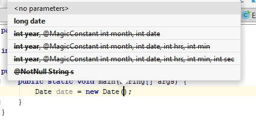

## Add advanced data types:
### Primitive wrappers
We have already discussed the primitive types, as well as common built-in types like the String class.

There are several other common types you should be aware of.

First, all of the primitives have corresponding "wrapper" types. Primitives are not objects, but sometimes you wish they were. For example, we will learn later about collections, which are containers for arbitrary quantities of Objects. The problem is that collections can only collect objects; they cannot _collect_ primitives.

Also, primitives can never be null, and will always be 0 by default (or false, in the case of booleans.) But very often you want to be able to set a variable to null to indicate that it has not been set yet. There is a big difference between 0 and null; 0 means it has been set to a value of 0, whereas null means no value has been set.

Finally, since primitives are not objects, they don't have methods attached to them. Wouldn't it be great if they were objects, so that we could have built-in methods for conversion between radix (say base 16 instead of base 10), or special operations like reversing the characters in a number?

For just these kinds of cases, Java provides the number wrapper classes. These are immutable objects that represent primitives.

|Primitive Type|Number Wrapper|
|---|---|
|int        |Integer|
|long       |Long   |
|float      |Float  |
|double     |Double |
|char       |Character  |
|byte       |Byte   |
|short      |Short  |
|boolean    |Boolean|

So it is now correct to say:
````java
Boolean b  = null;
````

There are a number of ways to set a value to a wrapper, for example, all of the following are correct:
```java
Integer counter1 = new Integer(10);
Integer counter2 = Integer.valueOf(10);
```

However the following method is probably the easiest, and nowadays the most common:
```java
Integer counter3 = 10;
```
This is an example of _autoboxing_.

### Autoboxing
Autoboxing is a feature that allows Java to implicitly convert between primitives and their wrapper types.

For example, Java understands the + operator on numbers and Strings, but let's say you have two arbitrary objects, say `object1` and `object2`. It would be an error to say ```object1 + object2```

Java just does not know what to do with that plus sign!

However if the objects are number wrappers, Java will automatically _unbox_ the wrappers (unbox means it will convert a wrapper to the corresponding primitive) and will _box_ primitives back to their number wrapper equivalent as needed.

So the following code compiles correctly:
```java
Integer myAge = null;       // sets myAge to null. This is fine since myAge is an Object not a primitive
int mySistersAge = 23;      // sets mySistersAge to 23. This is a primitive.
myAge = mySistersAge + 3;   // unboxes mySistersAge to the primitive 23, then adds 3 then re-boxes the result and assigns it to myAge
Integer myBrothersAge = 30;
int ageDelta = myBrothersAge - myAge;    // unboxes the two wrappers, performs the subtraction, and assigns it to the primitive
```
All that works fine. But if we try:
```java
mySistersAge = null;
```
that has an unhappy ending, since mySisters age is a primitive, it cannot be null.

### Date
When Java was first introduced, it had limited support for date and time operations.

With the advent of Java 8, a new set of Date and Time classes were introduced that provided a robust set of date and time arithmetic, formatting, and conversions. However there is still a vast amount of code using the legacy Date class, in the java.util package.

We will mention those briefly, just so that you are aware of them. But genererally you should be using the java.time package for date and time related work, such as time zone conversions, date arithmetic, and output formatting.

As you can see, most of the constructors in the Date class have a strikethrough font, indicating they are deprecated (which means they could theoretically be removed in a future releae of Java, although this is highly unlikely to happen, given Java's undying respect for backward compatibility.)



### Time API
## todo: discuss null in the section on types and variables
