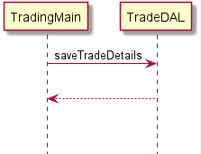
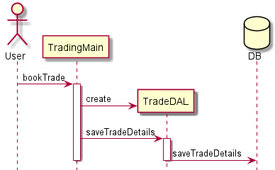
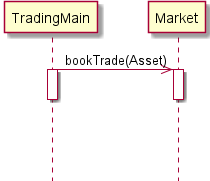
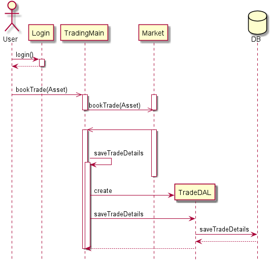

# UML Sequence Diagrams
Where class diagrams provide a high level view of the structure of classes and their relationships, sequence diagrams provide a view into their interactions.

A sequence diagram consists of a series of parallel vertical "lifelines", topped with a rectangle or other image, representing the classes or other processes comprising the interactions of the system. Method calls or "messages" are represented as horizontal lines connecting the caller to the called object. The message line is usually annotated with the method name, and optionally the call parameters and return type. The messages indicate the flow of messages through the program, in time-sequence.

For example:  
  
In this sequence, an instance of the class TradingMain is making a call to the method `saveTradeDetails` on an instance of the class TradeDAL (DAL stands for "Data Access Layer", a common programming paradigm for making database calls.) Then the methods returns, as indicated by the return arrow. The return arrow is frequently omitted, as it is usually clear from the context where the method returns.

Activation boxes can be added to the lifelines, to indicate the scope of a process.
    
In this diagram, the user makes a call to the `bookTrade` method on a TradingMain instance. That call, in the same process, creates a new TradeDAL, then calls `saveTradeDetails` on the TradeDAL, which in turn saves the trade to the database. Note the special symbols used to indicate the user and the database.

Also observe that the head of the TradeDAL object is lower than the rest, indicating the position of its creation. 

## Asynchronous calls
Sometimes you make a call that "fires and forgets". In other words, you call a method that launches a different thread and returns, in an asynchrounous fashion. To indicate an asynchronous call, we use an _open arrow_. 

Compare the arrow in this call:
  
For asynchronous calls, it is most common to omit the return message.

## Student Activity
As an activity, let's complete our trading system implementation, by using the classes we generated in the uml classes lesson, and applying the interactions from the following sequence diagram:
  

 

